# AI Workflow 技术手册

> 版本：v2.0  
> 最后更新：2026-06-17  
> 适用代码：`D:\openworkspace\aiworkflow` 当前主目录实现  
> 定位：研发、实施、运维和二次集成人员的技术参考

---

## 1. 平台概览

AI Workflow 是一个基于 Java Spring Boot 和 React 的企业级 AI 应用平台。当前实现已经覆盖工作流编排、知识库 RAG、模型管理、智能体 Bot、多轮对话、连接器、智能编研、开放 API、租户组织、资产授权、审计日志和存储路径配置。


上图是当前管理端工作台入口，用于展示平台运行概览、核心资产和快捷入口。技术上，工作台由 `web/apps/admin/src/pages/DashboardPage.tsx` 实现，后端数据来自工作流、模型、知识库和运行记录等业务 API。

平台支持两种主要落地方式：

- 独立部署 AGI 平台，通过管理端配置工作流、知识库、模型和智能体。
- 作为能力组件被数字档案馆、OA、门户等业务系统集成，通过开放 API、Java Feign Client、嵌入式 Chat 页面或前端工作流设计器组件复用 AI 能力。

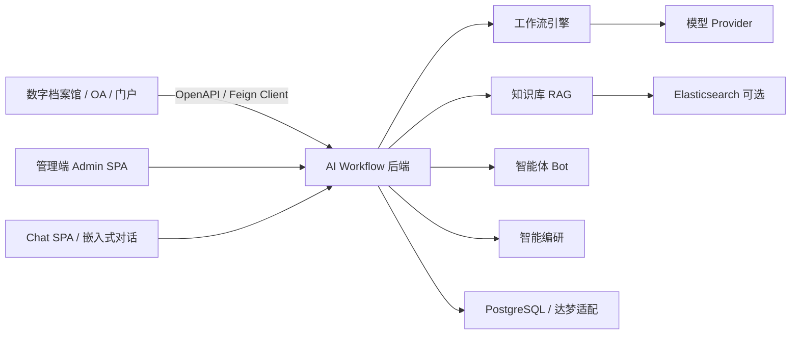

---

## 2. 技术栈

### 2.1 后端

| 层级 | 技术 | 当前实现 |
|---|---|---|
| 运行时 | Java 17 | `maven-compiler` 使用 Spring Boot 父工程配置，代码面向 JDK 17 |
| Web 框架 | Spring Boot 3.3.5 | REST API、文件上传、SSE 流式输出 |
| ORM | MyBatis-Plus 3.5.9 | 管理业务表、工作流、知识库、Bot、编研模板等 |
| 数据迁移 | Flyway | PostgreSQL 迁移脚本位于 `server/src/main/resources/db/migration/postgresql` |
| 数据库 | PostgreSQL 为主 | 已保留达梦适配设计和迁移测试基础 |
| API 文档 | SpringDoc OpenAPI 2.6.0 | `/v3/api-docs`、`/swagger-ui.html` |
| 安全 | Spring Security | 当前全局放行，保留 Token、第三方应用、租户上下文能力 |
| 微服务能力 | OpenFeign、Nacos Discovery | 支持接入组织机构、认证等第三方微服务；Nacos 可选启用 |
| 文档解析 | Apache Tika、Apache POI | 支持 PDF、DOCX、PPTX、XLSX、HTML、MD、TXT 等文本提取 |

### 2.2 前端

| 层级 | 技术 | 当前实现 |
|---|---|---|
| 管理端 | React 18、TypeScript、Vite | `web/apps/admin` |
| Chat 端 | React 18、Ant Design X、Vite | `web/apps/chat`，端口默认 5174 |
| UI 组件 | Ant Design 5 | 管理端页面、Drawer、表格、表单、步骤向导 |
| 数据请求 | TanStack React Query | API 请求缓存、加载状态、错误态 |
| 工作流组件 | 自研轻量设计器 | `workflow-designer-core/react/vue/wc` 多包封装 |
| 包管理 | pnpm workspace | `web/package.json` 管理多应用与组件包 |

### 2.3 工程结构

```text
aiworkflow/
  server/                         Spring Boot 后端
  web/
    apps/admin/                   管理端
    apps/chat/                    独立 Chat 前端
    packages/workflow-schema/     工作流类型和前端校验
    packages/workflow-designer-core/
    packages/workflow-designer-react/
    packages/workflow-designer-vue/
    packages/workflow-designer-wc/
  client/aiworkflow-open-api-client/ Java OpenAPI Feign 客户端
  docs/                           设计、手册、白皮书、集成文档
```

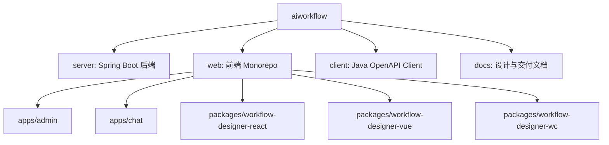

---

## 3. 后端架构

### 3.1 分层约定

后端包位于 `server/src/main/java/com/mw/ai/agi`，按业务域划分：

| 包 | 职责 |
|---|---|
| `workflow` | DAG 定义、草稿、发布、执行、节点执行器、运行记录 |
| `knowledge` | 知识库、文档、切片、向量、数据集、检索 |
| `model` | 模型提供商、Chat/Embedding 调用客户端 |
| `bot` | 智能体、会话、消息、能力插件、工作流路由 |
| `chat` | 独立 Chat 端、SSE、嵌入票据、人工确认 |
| `generation` | 智能编研、模板、任务、成果、DOCX 导出 |
| `connector` | 连接器和操作配置 |
| `auth` | 登录、租户、组织、用户、角色、第三方应用 |
| `asset` | 资产授权 |
| `system` | 菜单、字典、审计日志、存储路径配置 |
| `integration` | 第三方认证、组织机构 Feign Client |
| `config` | OpenAPI、安全、SPA、Store、存储配置 |

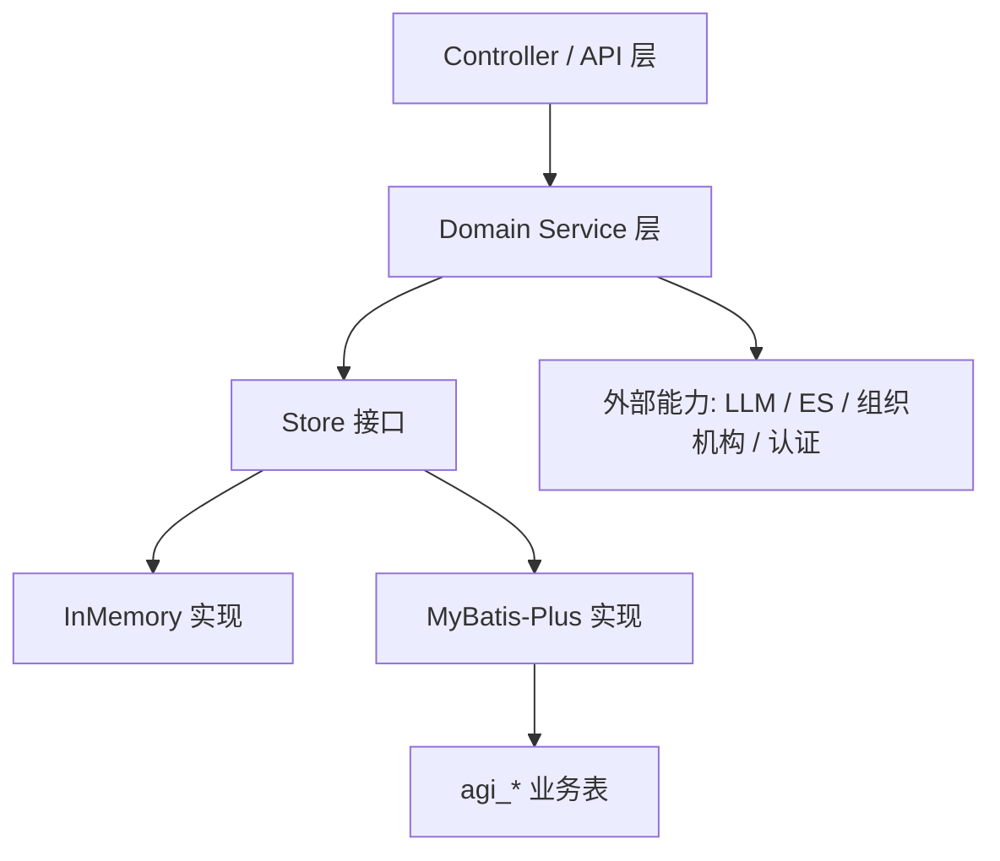

### 3.2 Store 模式

平台大量业务采用 `Store` 接口隔离持久化，例如：

- `WorkflowStore` / `MybatisWorkflowStore` / `InMemoryWorkflowStore`
- `WorkflowExecutionStore`
- `KnowledgeStore`
- `BotStore`
- `GenerationTemplateStore`

这种设计允许：

- 单元测试中使用内存实现。
- 标准部署使用 MyBatis-Plus。
- 后续拆分微服务时保留业务服务层接口不变。

### 3.3 数据库与表前缀

业务表已统一按 `agi_` 前缀演进，Flyway PostgreSQL 脚本从 `V1` 到当前 `V44`，覆盖：

- 基础工作流和 AI Studio 表。
- 知识库、向量、文档元数据、数据集。
- 模型、Bot、会话、能力插件。
- 租户组织、第三方应用、资产授权、审计。
- 智能编研模板、任务、输出、DOCX。
- 系统菜单、字典、存储路径配置。

默认配置：

```yaml
spring:
  datasource:
    url: ${POSTGRES_JDBC_URL:jdbc:postgresql://localhost:5432/aiworkflow}
    username: ${POSTGRES_USERNAME:aiworkflow}
    password: ${POSTGRES_PASSWORD:aiworkflow}
  flyway:
    locations: ${FLYWAY_LOCATIONS:classpath:db/migration/postgresql}
```

---

## 4. 工作流引擎

### 4.1 定义模型


工作流设计器是平台的核心技术界面。它把后端 `WorkflowDefinition` 映射为可视化画布，用户可以拖拽节点、连接端口、选择连线、配置节点属性并发布版本。

工作流核心类型：

- `WorkflowDefinition`：节点、连线、变量集合。
- `WorkflowNode`：`id`、`type`、`name`、`config`。
- `WorkflowEdge`：`sourceNodeId`、`targetNodeId`、`condition`。
- `WorkflowVersion`：发布后的不可变定义快照。
- `WorkflowExecution` / `NodeExecution`：运行记录和节点明细。

前端 schema 位于 `web/packages/workflow-schema/src/index.ts`，后端 domain 位于 `server/src/main/java/com/mw/ai/agi/workflow/domain`。

### 4.2 节点类型

当前后端枚举 `WorkflowNodeType` 包含 11 类节点：

| 类型 | 说明 | 执行器 |
|---|---|---|
| `START` | 入口节点，将请求输入写入上下文 | `StartNodeExecutor` |
| `END` | 结束节点，输出最终结果 | `EndNodeExecutor` |
| `LLM` | 调用模型提供商 | `LlmNodeExecutor` |
| `QUESTION_CLASSIFIER` | 问题分类，输出分类结果 | `QuestionClassifierNodeExecutor` |
| `PROMPT` | Prompt 模板渲染 | `PromptNodeExecutor` |
| `KNOWLEDGE_RETRIEVAL` | 知识库检索 | `KnowledgeRetrievalNodeExecutor` |
| `HTTP_TOOL` | 调用外部 HTTP 接口 | `HttpToolNodeExecutor` |
| `CONDITION` | 条件判断 | `ConditionNodeExecutor` |
| `TEXT_TRANSFORM` | 文本转换 | `TextTransformNodeExecutor` |
| `CONTENT_TEMPLATE` | 内容模板/JSON 组装 | `ContentTemplateNodeExecutor` |
| `LOOP` | 循环处理数组输入 | `LoopNodeExecutor` |

### 4.3 执行流程

`WorkflowExecutionService` 从已发布版本中找到 `START` 节点，然后按边关系逐个执行：

1. 初始化上下文为请求输入。
2. 注入系统变量：用户、单位、会话、追踪 ID 等。
3. 调用对应 `WorkflowNodeExecutor`。
4. 将节点输出合并到全局上下文，并保存节点执行记录。
5. 根据节点指定的 `nextNodeId` 或出边条件选择下一个节点。
6. 遇到 `END` 时保存最终输出。
7. 异常时记录失败；人工确认场景进入 `WAITING_CONFIRM`。

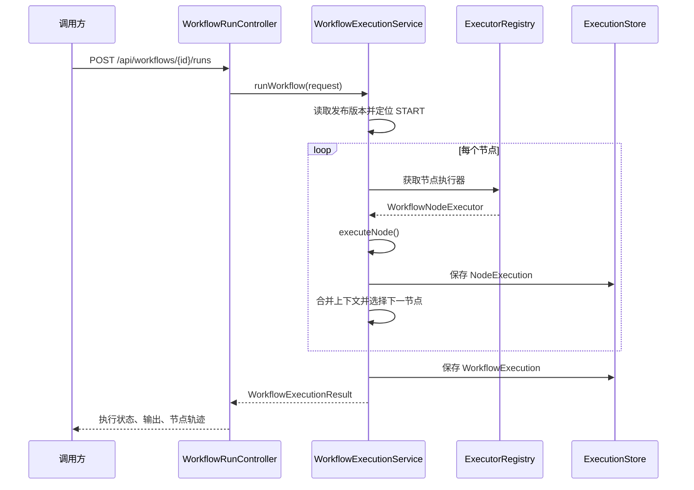

### 4.4 模板渲染

统一模板渲染器为 `TemplateRenderer`，支持：

```text
{{input}}
{{start.input}}
${input}
${start.input}
```

LLM、知识库、HTTP、内容模板等节点均可使用上下文变量。前端显示“开始.input”时，实际保存为后端可识别的 `start.input`。

### 4.5 设计器能力

当前工作流设计器位于 `web/packages/workflow-designer-react`，管理端页面为 `WorkflowDesignerPage`。已实现：

- 左侧节点库拖拽到画布。
- 节点移动、复制、删除。
- 拖拽端口连线。
- 连线选中与条件配置。
- 画布缩放、适配视图、自动布局。
- 点击节点打开属性，点击空白画布打开工作流属性。
- 运行状态叠加显示。
- 右侧属性 Drawer 与画布选中联动。

---

## 5. 关键节点配置

### 5.1 开始节点

用于定义输入参数、默认输入 JSON。运行时会将输入放入上下文，后续节点可通过 `start.input`、`message` 等变量引用。

### 5.2 知识库检索节点

核心配置：

| 字段 | 说明 |
|---|---|
| `inputParams` | 变量输入映射，如 `search_key = start.input` |
| `knowledgeBaseId` | 绑定知识库 |
| `queryText` | 查询文本，支持 `${search_key}` |
| `fetchCount` / `topK` | 检索数量 |
| `similarityThreshold` | 相似度阈值 |

标准输出：

- `content`：命中文档片段正文拼接。
- `sources`：命中来源数组。
- `query`：实际查询文本。

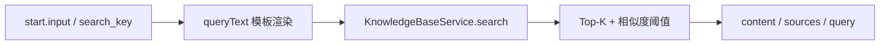

### 5.3 大模型节点

核心配置：

| 字段 | 说明 |
|---|---|
| `providerId` | 模型提供商 ID |
| `model` | 模型名称，可随 provider 自动回填 |
| `systemMessage` | 系统消息 |
| `userMessage` | 用户消息，支持 `${input}` |
| `responseFormat` | `TEXT`、`JSON`、`CODE` |
| `streaming` | 是否开启流式输出 |
| `temperature`、`topP`、`topK`、`maxTokens` | 采样参数 |

标准输出：

- `content`
- `reasoning_content`

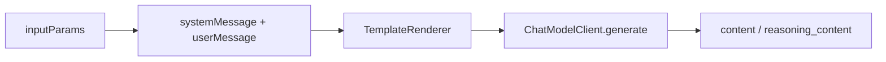

### 5.4 问题分类节点

用于将用户输入按分类配置输出类别，配合条件边或条件节点实现分支路由。典型用途是客服意图分流、问题类型识别、档案咨询分类。

### 5.5 HTTP 请求节点

支持外部 REST API 调用，配置 URL、Method、Headers、Body、BodyType、输出字段和人工确认策略。适用于组织机构、业务系统、档案系统接口调用。

### 5.6 结束节点

用于从上下文读取最终输出，并返回给调试台、Bot、OpenAPI 或智能编研任务。

---

## 6. 知识库系统

### 6.1 核心模型


知识库管理页用于创建知识库、维护文档、进入上传向导、查看切片和进行检索测试。当前实现还加入了数据集与来源索引，便于数字档案馆专题资料接入。

| 模型 | 说明 |
|---|---|
| `KnowledgeBase` | 知识库主表，包含嵌入模型、向量库、分段策略、检索策略、数据集模式 |
| `KnowledgeDataset` | 数据集，可按专题、业务域、来源系统组织知识 |
| `KnowledgeDocument` | 文档，保存解析状态、来源、存储路径、数据集和元数据 |
| `KnowledgeChunk` | 文档切片，保存正文、引用、来源位置、安全等级 |
| `KnowledgeSourceIndex` | 外部来源索引，用于数字档案馆专题库同步 |

### 6.2 文档处理

知识库支持：

- 手动录入。
- 普通文件上传。
- 文本文档上传。
- 表格文档上传。
- 上传预览。
- 文档重解析。
- 切片编辑、启停。
- Embedding 回填。

文件解析由 `DocumentTextExtractor` 基于 Apache Tika 完成，表格解析由 `TableDocumentParser` 处理。

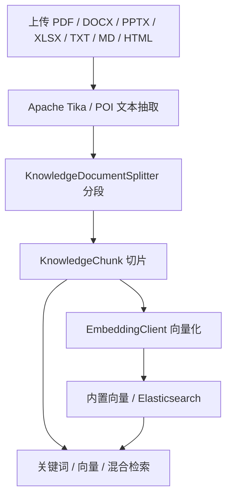

### 6.3 分段与检索

默认配置：

- `splitterType = SIMPLE_TEXT`
- `chunkSize = 500`
- `chunkOverlap = 50`
- `retrievalMode = HYBRID`
- `topK = 3`
- `vectorDimension = 1536`

检索实现包括关键词、向量和混合检索。向量客户端支持本地哈希嵌入和模型 Provider Embedding，向量库支持内置存储和 Elasticsearch 配置。

### 6.4 数据集化能力

当前新增了面向数字档案馆和专题编研的数据集能力：

- 一个知识库可采用 `SINGLE` 或 `MULTI` 数据集模式。
- `ARCHIVE_TOPIC` / `ARCHIVE_TOPIC_COMPILE` 知识库可按专题生成数据集。
- 数据集保存专题 ID、题名、保管期限、密级、来源系统、同步版本等信息。
- `KnowledgeDatasetController` 提供数据集列表、来源列表、专题同步、重新索引接口。

---

## 7. 模型管理

模型提供商由 `ModelProviderService` 管理。核心字段包括：


- 名称、类型、用途。
- Base URL、模型名、API Key 引用。
- 是否视觉支持。
- 百万 Token 价格。
- 是否启用。

模型用途区分：

- `CHAT`：工作流 LLM 节点、Bot 直连对话。
- `EMBEDDING`：知识库向量化。

当前 Chat Client 包括 OpenAI 兼容调用和 Stub 实现，便于本地无真实模型时测试流程。

---

## 8. 智能体与终端用户应用

### 8.1 Bot 模式


Bot 可通过三种方式运行：

1. 绑定工作流：消息被封装为工作流输入，执行已发布工作流。
2. 绑定模型：直接调用模型 Provider。
3. 绑定知识库：先检索知识库，再把片段作为上下文交给模型；没有模型时可直接返回命中片段。

Bot 支持：

- 多轮会话。
- 会话标题自动生成。
- 置顶会话。
- 开场白、系统提示词、建议问题。
- 多知识库绑定。
- 能力插件 `BotCapability`。
- SSE 流式输出。
- 命中引用消息和编研任务消息。

### 8.2 面向终端用户的智能体应用

除了管理端中的 Bot 配置页，平台还提供独立的终端用户 Chat 应用：`web/apps/chat`。它面向普通业务用户，而不是平台管理员，典型入口是数字档案馆、OA、门户或知识服务页面中的“AI 助手”。

终端用户智能体应用的核心体验：

| 能力 | 说明 |
|---|---|
| 智能体列表 | 展示当前用户可用的 Bot，支持按业务入口进入指定智能体 |
| 会话管理 | 支持新建会话、历史会话、会话标题、置顶和删除 |
| 多轮对话 | 保留上下文历史，后续提问可结合前文 |
| 流式回答 | 通过 SSE 增量返回大模型内容，降低等待感 |
| 知识引用 | Bot 命中知识库时可产生引用/来源消息，便于用户追溯 |
| 工作流结果 | 绑定工作流的 Bot 可返回流程执行结果、编研任务或业务结构化结果 |
| 人工确认 | 当工作流进入确认节点时，Chat 端可承接确认/拒绝操作 |
| 嵌入访问 | 第三方系统可用嵌入票据打开指定 Bot 会话 |

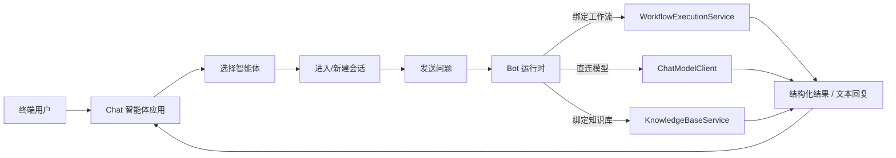

终端用户应用与管理端的区别：

| 维度 | 管理端 Bot 页面 | 终端用户 Chat 应用 |
|---|---|---|
| 使用者 | 平台管理员、实施人员、业务配置人员 | 普通业务用户、档案人员、客服人员 |
| 主要目标 | 创建、编辑、调试、授权 Bot | 使用 Bot 完成问答、检索、编研和业务辅助 |
| 路由 | `web/apps/admin` 中 `/bots` | `web/apps/chat` 独立应用 |
| API | `/api/bots/**` 管理接口 | `/api/chat/**` 和 `/api/open/bots/**` |
| 集成方式 | 管理控制台 | 业务系统菜单、iframe、新窗口、嵌入票据 |

### 8.3 Chat 前端技术实现

`web/apps/chat` 是独立 Chat 应用，面向业务系统嵌入和终端用户使用。它通过 `/api/chat/**` 与后端交互，支持 Bot 列表、会话、消息、流式回复和人工确认。

开放嵌入票据接口位于 `/api/open/chat/embed-tickets`。

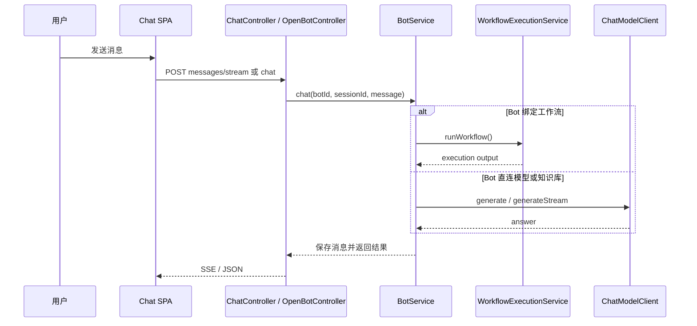

---

## 9. 智能编研

智能编研模块位于 `generation` 包，面向专题汇编、档案编研、长文档生成。


### 9.1 核心对象

| 对象 | 说明 |
|---|---|
| `GenerationTemplate` | 编研模板，包含变量 schema、章节 schema、绑定工作流、DOCX 配置 |
| `GenerationJob` | 编研任务，保存变量、知识库、外部素材、状态和工作流快照 |
| `GenerationOutput` | 编研成果，包含 Markdown、content_json、DOCX 路径、引用 |

### 9.2 执行链路

1. 管理端维护编研模板并绑定发布工作流。
2. 智能编研向导提交主题、受众、知识库和外部素材。
3. `ResearchGenerationService` 构造工作流输入并运行工作流。
4. 从工作流输出中读取大纲、章节、素材和引用。
5. 生成 Markdown 与 content_json。
6. 按模板类型渲染 DOCX 并保存到配置目录。
7. 前端展示 HTML 预览、成果详情、DOCX 下载。

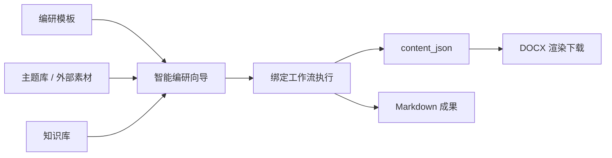

### 9.3 存储路径

存储路径由 `agi.storage` 和系统设置共同控制：

```yaml
agi:
  storage:
    knowledge-document-dir: ./data/knowledge-documents
    research-output-dir: ./data/generation-outputs
    research-docx-master-dir: ./data/generation-docx-masters
```

管理端提供“存储路径配置”页面，对应 `/api/system/storage-settings`。

---

## 10. 认证、租户与资产授权

### 10.1 当前安全边界

当前 `SecurityConfig` 对所有请求放行，仅 Swagger 也显式 permit。也就是说，全局鉴权没有强制拦截；但是业务代码中已经保留：

- 登录、刷新、登出、当前用户接口。
- 租户、组织、角色、用户管理。
- 第三方应用 AppCode / ApiKey。
- OpenAPI 请求上下文。
- 资产授权服务。
- 审计上下文和操作人记录。

后续接入第三方认证服务后，可在安全过滤器层启用统一鉴权。

### 10.2 资产授权

`AssetGrantService` 支持对 Bot、知识库、工作流、模型等资产做 USE 权限控制。授权维度包括：


- 租户。
- 单位/组织。
- 部门。
- 角色。
- 操作人上下文。

当前知识库列表在测试权限时可暂不隐藏无管理权限知识库，运行时仍可通过授权服务做实际访问控制验证。

---

## 11. 开放集成

### 11.1 OpenAPI

开放接口前缀为 `/api/open/**`，主要包括：

- `/api/open/workflows`
- `/api/open/workflows/{id}/runs`
- `/api/open/workflow-runs/{executionId}`
- `/api/open/knowledge-bases`
- `/api/open/knowledge-bases/{id}/search`
- `/api/open/model-providers`
- `/api/open/bots`
- `/api/open/bots/{id}/chat`
- `/api/open/bots/{id}/sessions`
- `/api/open/identity/resolve`
- `/api/open/chat/embed-tickets`

开放 API 使用请求头：

```text
X-AGI-App-Code
X-AGI-Api-Key
X-AGI-User-Id
X-AGI-Unit-Id
X-AGI-Department-Ids
X-AGI-Role-Ids
X-AGI-Trace-Id
```

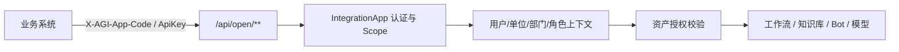

### 11.2 Java Feign Client

`client/aiworkflow-open-api-client` 提供 Spring Boot 自动配置和 Feign Client：

- `AgiOpenWorkflowClient`
- `AgiOpenKnowledgeBaseClient`
- `AgiOpenBotClient`
- `AgiOpenModelProviderClient`
- `AgiOpenIdentityClient`

适合数字档案馆等 Java 系统以 SDK 方式调用 AGI 能力。

### 11.3 前端组件集成

工作流设计器按多技术栈拆分：

- React 包：`@aiworkflow/workflow-designer-react`
- Vue 包：`@aiworkflow/workflow-designer-vue`
- Web Component 包：`@aiworkflow/workflow-designer-wc`
- Core 包：`@aiworkflow/workflow-designer-core`

推荐第三方系统优先集成 Web Component 或 OpenAPI，降低框架耦合。

---

## 12. 本地启动

### 12.1 后端

```powershell
cd D:\openworkspace\aiworkflow\server
mvn spring-boot:run
```

默认端口：`8080`。

常用环境变量：

```powershell
$env:POSTGRES_JDBC_URL="jdbc:postgresql://localhost:5432/aiworkflow"
$env:POSTGRES_USERNAME="aiworkflow"
$env:POSTGRES_PASSWORD="aiworkflow"
$env:NACOS_DISCOVERY_ENABLED="false"
```

### 12.2 管理端

```powershell
cd D:\openworkspace\aiworkflow\web
pnpm install
pnpm --filter @aiworkflow/admin dev
```

默认端口：`5173`。

### 12.3 Chat 端

```powershell
cd D:\openworkspace\aiworkflow\web
pnpm --filter @aiworkflow/chat dev
```

默认端口：`5174`。

---

## 13. 测试与质量

后端测试：

```powershell
cd D:\openworkspace\aiworkflow\server
mvn test
```

前端测试：

```powershell
cd D:\openworkspace\aiworkflow\web
pnpm --filter @aiworkflow/admin test
pnpm --filter @aiworkflow/chat test
```

重点测试覆盖：

- 工作流引擎、节点执行器、运行记录。
- 知识库解析、分段、向量、检索。
- Bot 对话、OpenAPI、SSE。
- 智能编研、DOCX 渲染、content_json。
- 管理端页面和 API 封装。

---

## 14. 二次开发建议

### 14.1 新增工作流节点

1. 后端新增 `WorkflowNodeType` 枚举。
2. 实现 `WorkflowNodeExecutor`。
3. 在前端 schema 中新增类型。
4. 在 `NodePalette` 注册节点。
5. 在 `NodeConfigPanel` 增加属性表单。
6. 增加后端执行器测试和前端配置面板测试。

### 14.2 接入业务系统

优先级建议：

1. 仅使用知识库和大模型：集成 OpenAPI Client 或直接将后端 Jar 作为同进程服务模块。
2. 需要对话入口：集成 Chat 前端或调用 Bot OpenAPI。
3. 需要可视化编排：嵌入工作流设计器 Web Component。
4. 需要统一组织权限：通过 Feign 接入数字档案馆组织机构和认证服务。

### 14.3 生产化注意事项

- 当前全局鉴权未强制拦截，生产启用前需要接入统一认证过滤器。
- 模型 API Key 需要接入密钥管理或加密存储。
- Elasticsearch、PostgreSQL、文件存储目录应按环境分离。
- 大文件解析和批量 Embedding 建议后续异步化。
- 工作流当前以同步执行为主，长耗时任务建议通过智能编研任务或异步编排扩展。
