# AI Workflow 操作手册

## 目录

### 第01章 序言

- [概要说明](#概要说明)
- [登录与工作台](#登录与工作台)

### 第02章 AI 应用

1. [智能体 Bots](#1-智能体-bots)
   - 模块概述
   - 操作使用
   - 常见问题

2. [工作流](#2-工作流)
   - 模块概述
   - 操作使用-工作流创建
   - 操作使用-流程编排
   - 操作使用-调试发布
   - 操作使用-归档与恢复
   - 常见问题

3. [运行监控](#3-运行监控)
   - 模块概述
   - 操作使用
   - 常见问题

4. [编研模板](#4-编研模板)
   - 模块概述
   - 操作使用
   - 常见问题

5. [智能编研](#5-智能编研)
   - 模块概述
   - 操作使用
   - 常见问题

### 第03章 AI 工具

1. [知识库](#1-知识库)
   - 模块概述
   - 操作使用-知识库创建
   - 操作使用-向量库配置
   - 操作使用-资料上传
   - 操作使用-检索验证
   - 操作使用-流程调用
   - 常见问题

2. [Prompt](#2-prompt)
   - 模块概述
   - 操作使用
   - 常见问题

3. [模型配置](#3-模型配置)
   - 模块概述
   - 操作使用
   - 常见问题

### 第04章 系统管理

1. [租户管理](#1-租户管理)
2. [组织用户](#2-组织用户)
3. [资产授权](#3-资产授权)
4. [第三方应用](#4-第三方应用)
5. [开放 API 文档](#5-开放-api-文档)
6. [菜单管理](#6-菜单管理)
7. [数据字典](#7-数据字典)
8. [日志管理](#8-日志管理)

### 第05章 典型流程

- [搭建知识库问答智能体](#搭建知识库问答智能体)
- [搭建 HTTP 工具调用流程](#搭建-http-工具调用流程)
- [搭建问题分类分流流程](#搭建问题分类分流流程)
- [完成一次智能编研任务](#完成一次智能编研任务)

### 附录

- [建设中模块](#附录建设中模块)

---

## 第01章 序言

### 概要说明

AI Workflow 是面向企业 AI 应用搭建的管理平台，提供模型配置、Prompt 管理、知识库管理、工作流编排、智能体封装、运行监控、智能编研、资产授权和多租户组织权限管理能力。

平台核心使用路径：

1. 在模型配置中接入对话模型与嵌入模型。
2. 在知识库中创建知识库、配置向量库并导入资料。
3. 在 Prompt 中维护可复用提示词模板（也可在工作流设计器中直接引用）。
4. 在工作流中编排开始、知识库、大模型、问题分类、HTTP 请求、循环、结束等节点。
5. 发布工作流后，在智能体 Bots 中绑定工作流或直连模型进行对话测试。
6. 在编研模板中维护章节结构，通过智能编研向导生成专题成果。
7. 在运行监控中查看执行结果、节点输入输出和错误信息。
8. 在系统管理中配置组织、资产授权、第三方应用接入与审计日志。

### 登录与工作台

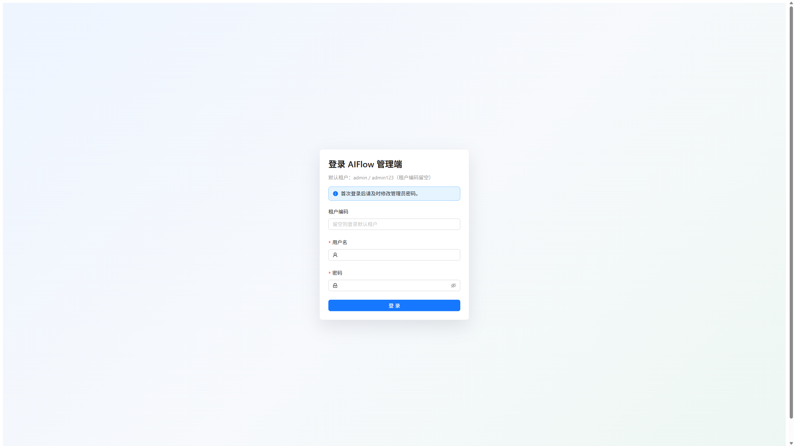

进入系统后，使用账号登录后台（默认账号 `admin` / `admin123`，租户编码留空）。登录成功后默认进入工作台。

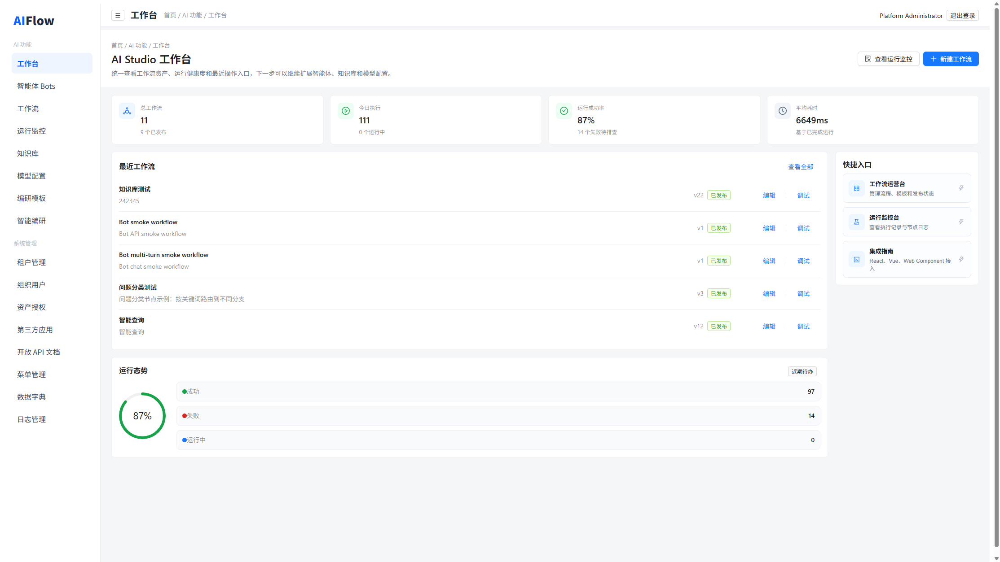

工作台展示以下信息：

- 总工作流数量
- 今日执行次数
- 运行成功率
- 平均耗时
- 最近工作流
- 运行态势
- 快捷入口

常用入口：

- 新建工作流：进入工作流设计器。
- 查看运行监控：查看工作流运行历史。
- 最近工作流：快速进入已有流程编辑和调试。

---

## 第02章 AI 应用

## 1. 智能体 Bots

### 模块概述

智能体 Bots 用于把模型、知识库或已发布工作流包装成可运行的对话式应用。适合客服问答、知识助手、流程助手、业务咨询、档案编研助手等场景。

智能体支持：

- 新增、编辑、删除智能体
- 绑定已发布工作流
- 直连模型，并可选绑定多个知识库
- 配置系统提示词与开场白
- 启用或停用智能体
- 多轮对话与会话记录
- 配置归属组织，用于资产授权控制

### 操作使用

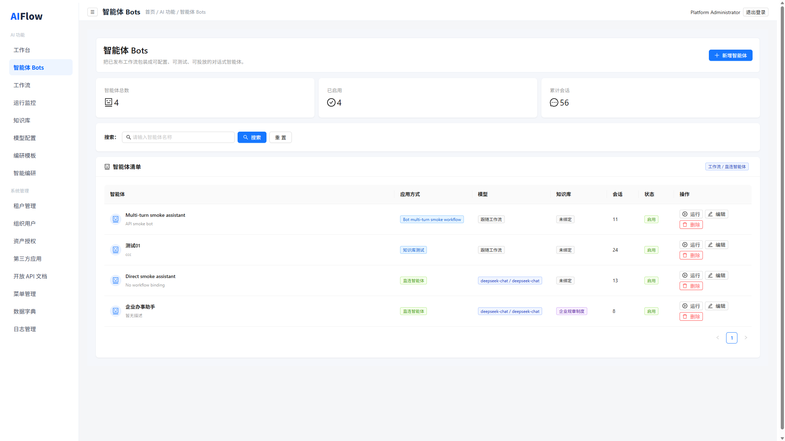

1. 进入 **AI 功能 > 智能体 Bots**。
2. 点击 **新增智能体**。
3. 填写智能体名称、描述、头像、开场白。
4. 选择应用方式：
   - **绑定工作流**：选择一个已发布工作流。
   - **直连智能体**：选择模型配置，可选绑定一个或多个知识库。
5. 填写系统提示词。
6. 设置状态为 **启用**。
7. 保存后在列表中点击 **运行** 或 **对话**。
8. 输入消息；如需要额外上下文，填写运行参数 JSON。
9. 查看模型回复、会话历史和本次执行详情。

### 常见问题

**为什么工作流下拉框为空？**

需要先创建并发布工作流，草稿或已归档工作流不会出现在绑定列表中。

**为什么运行失败？**

检查智能体绑定的模型、知识库、工作流是否有效；若绑定工作流，进入运行监控查看失败节点。

**直连智能体和工作流智能体有什么区别？**

直连智能体适合简单对话；工作流智能体适合需要知识检索、分类分流、HTTP 调用、循环生成等复杂流程的场景。

---

## 2. 工作流

### 模块概述

工作流用于通过可视化节点编排 AI 自动化流程。系统支持从空白 DAG 开始搭建流程，并支持保存草稿、发布、运行调试、归档、恢复发布和查看运行记录。

当前支持的核心节点：

| 节点 | 说明 |
| --- | --- |
| 开始 | 接收调试、API 或智能体输入 |
| 知识库 | 根据输入变量检索知识片段 |
| 大模型 | 调用模型生成文本、JSON 等内容 |
| 问题分类 | 按关键词或模型分类把问题路由到不同分支 |
| HTTP 请求 | 调用外部 API |
| Prompt 模板 | 引用已保存 Prompt 或渲染提示词 |
| 内容模板 | 在工作流步骤内做变量渲染 |
| 条件分支 | 按上下文变量选择后续节点 |
| 循环 | 遍历数组并执行循环体步骤 |
| 文本处理 | 兼容旧版模板渲染节点 |
| 结束 | 整理最终输出 |

工作流列表支持按 **全部 / 草稿 / 已发布 / 已归档** 筛选，名称搜索会实时过滤结果。

### 操作使用-工作流创建

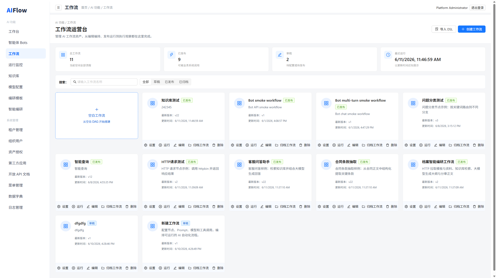

1. 进入 **AI 功能 > 工作流**。
2. 点击 **创建工作流** 或 **空白工作流**。
3. 进入工作流设计器。
4. 设置工作流名称和描述。
5. 从左侧节点库拖拽节点到画布，或点击节点快速添加。
6. 使用节点端口连线。
7. 点击节点打开属性面板，填写节点配置。
8. 点击 **保存草稿**。

### 操作使用-流程编排

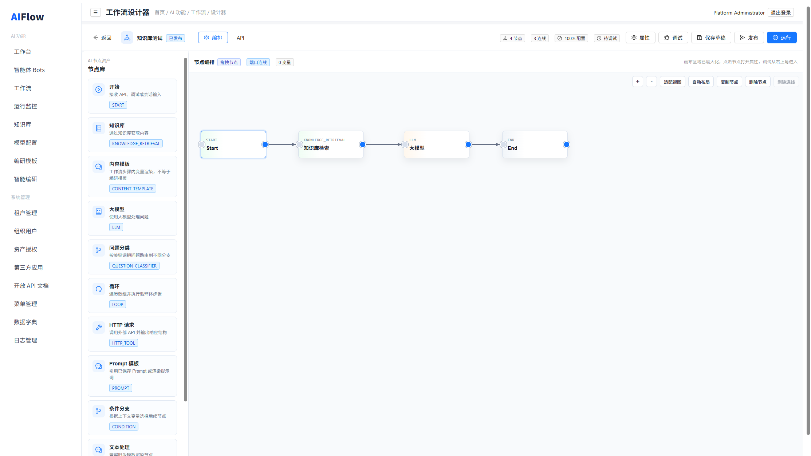

**基础问答流程：**

1. 开始节点接收 `question` 或自定义输入参数。
2. 知识库节点选择知识库，查询文本填写 `{input}` 或 `{{question}}`。
3. 大模型节点选择模型，在用户消息中引用知识库输出 `content`。
4. 结束节点配置输出变量。
5. 连线顺序：开始 → 知识库 → 大模型 → 结束。

**问题分类流程：**

1. 开始节点接收用户问题。
2. 问题分类节点配置分类项、关键词和匹配方式。
3. 为不同分类配置后续节点，或在连线上填写条件。
4. 未命中时可配置默认跳转节点。

**HTTP 请求流程：**

1. 添加 HTTP 请求节点。
2. 配置请求方法、地址、Params、Headers。
3. 配置 Body 类型（JSON / Raw / Form Data / None）。
4. 在 Body 中使用上下文变量，例如 `{"question":"{{question}}"}`。
5. 设置输出变量，例如 `httpResult`。
6. 后续节点可引用 `httpResult.statusCode`、`httpResult.body` 等字段。

**循环生成流程：**

1. 添加循环节点，配置循环数组变量与循环体步骤。
2. 循环体内可使用内容模板或大模型节点逐条处理。
3. 循环结束后将 `loopResults` 传给结束节点。

### 操作使用-调试发布

1. 在设计器右上角点击 **调试**。
2. 输入调试 JSON，例如：

```json
{
  "question": "请介绍退款政策"
}
```

3. 点击 **运行**，查看整体状态和各节点输入输出。
4. 确认流程无误后点击 **保存草稿**。
5. 点击 **发布**。
6. 发布后可被智能体、智能编研工作流或开放接口调用。

### 操作使用-归档与恢复

1. 在工作流卡片操作区点击 **归档工作流**，流程会进入 **已归档** 列表。
2. 归档不会删除版本和执行记录，只是从常规发布列表中隐藏。
3. 若误操作归档，在 **已归档** 筛选下找到对应卡片，点击 **恢复发布**。
4. 若工作流曾经发布过，恢复后回到 **已发布**；若从未发布，恢复后回到 **草稿**。

### 常见问题

**为什么发布失败？**

工作流必须有且只有一个开始节点，至少一个结束节点，连线不能引用不存在的节点，流程不能成环。

**为什么大模型节点没有可选模型？**

需要先在模型配置中新增并启用用途为 **对话** 的模型。

**为什么知识库节点没有可选知识库？**

需要先创建知识库并导入资料；若启用了资产授权，还需确认当前用户组织有使用权限。

**误归档后如何回到已发布？**

进入 **已归档** tab，点击 **恢复发布** 即可。

---

## 3. 运行监控

### 模块概述

运行监控用于查看所有工作流执行记录，包括运行状态、输入、输出、错误信息和节点级执行明细。

运行状态：

- **RUNNING**：运行中
- **SUCCEEDED**：运行成功
- **FAILED**：运行失败

节点状态：

- **RUNNING**
- **SUCCEEDED**
- **FAILED**
- **SKIPPED**

### 操作使用

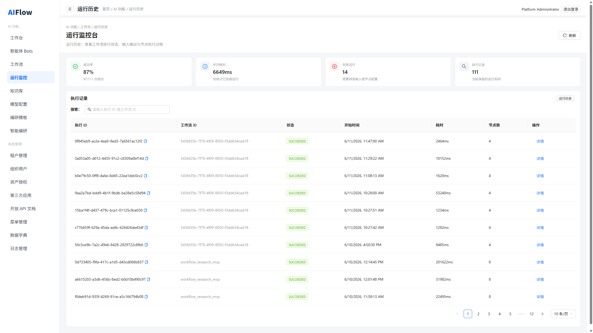

1. 进入 **AI 功能 > 运行监控**。
2. 查看运行列表。
3. 点击某条记录进入执行详情。
4. 查看工作流输入、最终输出和错误信息。
5. 查看每个节点的输入、输出、状态、开始时间和结束时间。
6. 若运行失败，定位失败节点并返回工作流设计器修改配置。

### 常见问题

**如何排查 HTTP 请求失败？**

查看 HTTP 节点的请求地址、Header、Body 和错误信息。

**如何排查大模型调用失败？**

检查模型配置是否启用，API Key、Base URL 和模型名称是否正确。

**如何排查流程没有进入预期分支？**

查看问题分类或条件分支节点输出，并确认连线条件是否与输出变量一致。

---

## 4. 编研模板

### 模块概述

编研模板用于定义专题编研成果的章节结构、变量字段、资料来源要求和绑定工作流。智能编研向导会读取模板 schema 并按章节生成大纲与正文。

支持能力：

- 新增、编辑、删除编研模板
- 维护模板变量与章节 instruction
- 绑定工作流及工作流快照
- 预览模板结构与运行时视图
- 支持 Markdown、DOCX 等输出类型配置

### 操作使用

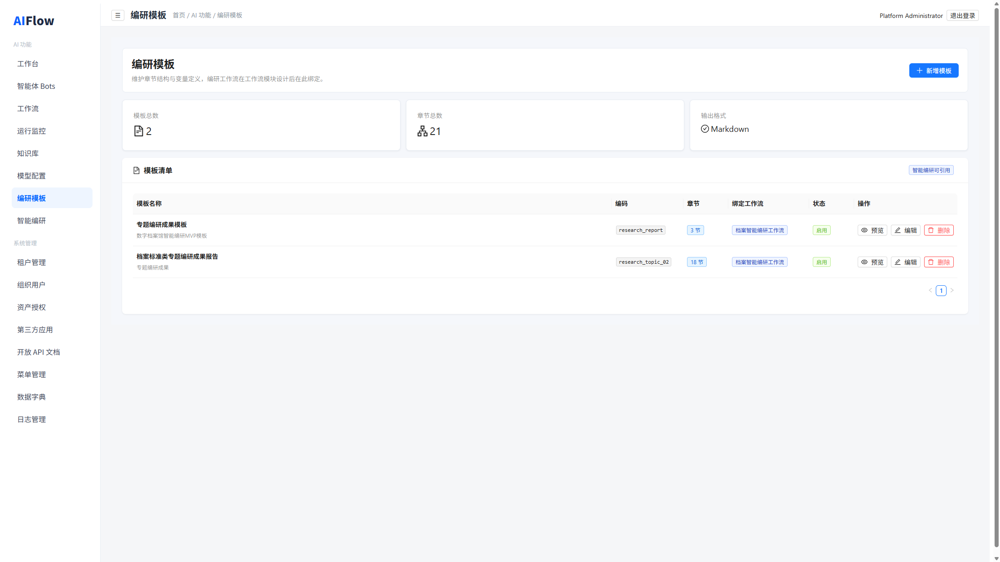

1. 进入 **AI 功能 > 编研模板**。
2. 点击 **新增模板**。
3. 填写模板名称、编码、分类、描述和输出类型。
4. 在模板 schema 中维护：
   - 变量字段（如 `topic`、`audience`）
   - 章节列表（标题、写作指令、引用要求、输出格式）
5. 选择绑定工作流；保存时系统会同步工作流快照。
6. 保存后可预览章节结构、绑定节点和运行时视图。
7. 模板启用后，可在 **智能编研** 向导中被选择。

### 常见问题

**模板和工作流里的“内容模板”节点有什么区别？**

编研模板是业务成果结构定义；工作流中的内容模板节点只是单次步骤内的变量渲染。

**为什么要保存工作流快照？**

即使工作流后续调整，已绑定模板仍保留发布时的节点结构，便于编研任务稳定复现。

**模板编码有什么要求？**

建议使用英文、数字和下划线，便于 API 和开放接口引用。

---

## 5. 智能编研

### 模块概述

智能编研是基于编研模板、主题库、知识库和绑定工作流的一键编研能力。用户通过五步向导提交任务，系统按模板章节生成大纲、分节正文和最终 Markdown 成果，并支持导出 DOCX。

向导步骤：

1. 编研主题
2. 主题库
3. 知识库
4. 编研模板
5. 生成成果

### 操作使用

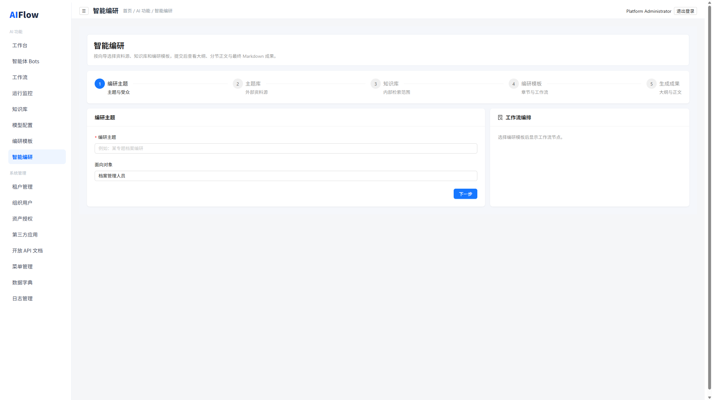

1. 进入 **AI 功能 > 智能编研**。
2. **步骤 1**：填写编研主题和面向对象。
3. **步骤 2**：选择主题库（外部资料源）。
4. **步骤 3**：勾选一个或多个知识库作为内部检索范围。
5. **步骤 4**：选择编研模板，确认绑定工作流和章节结构。
6. 点击提交任务，等待工作流执行完成。
7. 在 **步骤 5** 查看任务状态、章节大纲、正文内容和引用关系。
8. 如需 Word 文档，点击 **下载 DOCX**。

### 常见问题

**提交后长时间无结果？**

进入运行监控查看绑定工作流的执行详情，重点检查 HTTP、知识库、大模型节点是否失败。

**为什么可选模板很少？**

需要先在编研模板中创建并启用模板，且模板必须绑定有效工作流。

**生成内容不符合预期怎么办？**

优先调整编研模板章节 instruction、知识库资料质量，以及绑定工作流中的检索和模型节点配置。

---

## 第03章 AI 工具

## 1. 知识库

### 模块概述

知识库用于管理企业资料，并支持在工作流和智能编研中进行检索增强生成。适合制度问答、产品说明、业务知识、FAQ、表格资料、档案标准资料等场景。

支持能力：

- 创建知识库
- 配置 Elasticsearch 等向量库
- 选择嵌入模型
- 上传文本文档、表格文档
- 手动录入数据集
- 预览分段结果
- 编辑知识切片
- 搜索验证
- 在工作流中通过知识库节点调用

### 操作使用-知识库创建

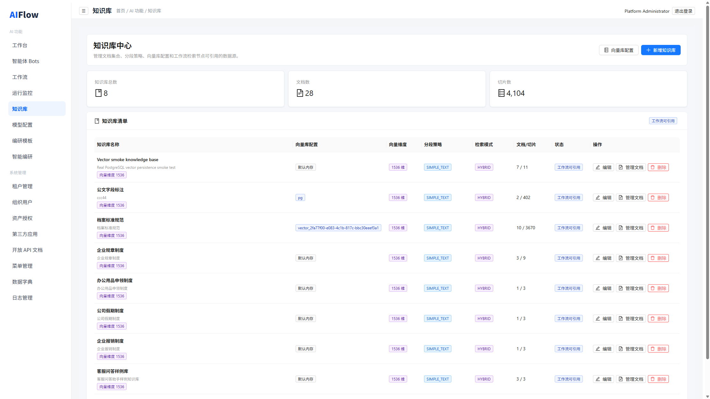

1. 进入 **AI 功能 > 知识库**。
2. 点击 **新建知识库**。
3. 填写知识库名称、描述、归属组织。
4. 选择嵌入模型和向量库配置。
5. 设置向量维度、分段策略、chunk 大小与重叠长度。
6. 设置检索模式：**关键词 / 向量 / 混合检索**。
7. 保存知识库。

### 操作使用-向量库配置

1. 在知识库页面进入 **向量库配置** 区域。
2. 点击 **新增向量库**。
3. 填写名称、类型（如 Elasticsearch）、Endpoint、索引名、认证信息。
4. 设置超时、批量大小和启用状态。
5. 保存后在创建知识库时选择该配置。

### 操作使用-资料上传

资料上传方式：

- **手动数据集**：逐条填写标题、内容、标签、分类、来源。
- **文本文档**：上传文本类文件并配置分段。
- **表格文档**：上传表格资料并配置处理参数。

上传步骤：

1. 进入某个知识库详情或文档管理页。
2. 点击 **新增文档**。
3. 选择上传方式。
4. 配置分段参数并预览分段结果。
5. 确认上传。
6. 在文档列表查看处理状态，必要时重新解析或编辑切片。

### 操作使用-检索验证

1. 进入知识库详情。
2. 使用搜索功能输入测试问题。
3. 设置 Top-K。
4. 查看返回片段和相似度。
5. 若结果不理想，调整分段策略、chunk 参数或检索模式。

### 操作使用-流程调用

1. 在工作流设计器添加 **知识库** 节点。
2. 选择目标知识库，可支持多库检索。
3. 配置查询文本、Top-K、超时和错误策略。
4. 使用输出变量：
   - `content`：拼接后的知识内容
   - `sources`：原始检索结果
   - `query`：实际查询文本
5. 在大模型节点中引用 `content` 作为上下文。

### 常见问题

**知识库搜索不到内容？**

检查文档是否上传成功、切片是否启用、检索模式是否合适、查询词是否与资料内容相关。

**知识库节点输出为空？**

检查查询文本是否为空、知识库 ID 是否正确、当前组织是否有资产授权。

**表格文档怎么处理？**

使用表格文档上传入口，先预览处理结果，再确认上传。

---

## 2. Prompt

### 模块概述

Prompt 模块用于集中管理提示词模板。模板可被工作流中的 Prompt 节点引用，避免在多个流程中重复维护提示词。

> 说明：默认侧边栏未单独展示 Prompt 菜单时，可通过地址 `/prompts` 访问，或直接在工作流设计器的 Prompt 节点中维护模板内容。

支持能力：

- 新增、编辑、删除 Prompt 模板
- 自动识别模板变量
- 在工作流节点中引用模板

### 操作使用

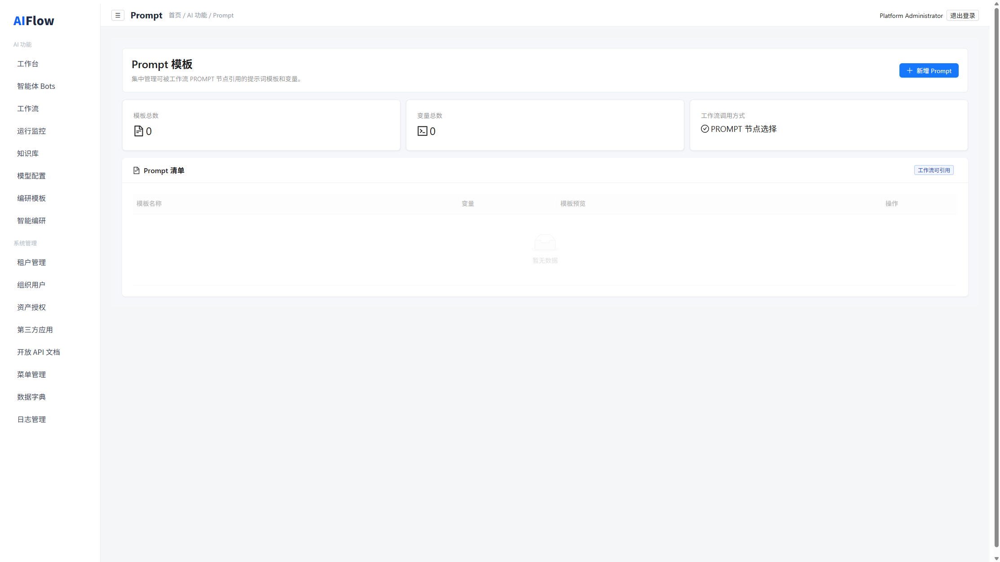

1. 进入 Prompt 管理页（`/prompts`）。
2. 点击 **新增 Prompt**。
3. 填写模板名称和描述。
4. 编写模板内容，例如：

```text
请根据以下用户问题生成专业回复：
{{question}}
```

5. 保存模板。
6. 在工作流设计器中添加 **Prompt 模板** 节点。
7. 选择已保存 Prompt 或填写内联模板。
8. 设置输出变量。

### 常见问题

**变量怎么写？**

使用 `{{变量名}}` 或 `${变量名}` 引用上下文变量。

**模板变量没有值怎么办？**

检查上游节点是否输出了对应变量，或开始节点输入 JSON 是否包含该字段。

---

## 3. 模型配置

### 模块概述

模型配置用于接入第三方或自定义大模型服务。工作流的大模型节点、知识库嵌入处理、智能体运行和智能编研都依赖模型配置。

支持模型类型：

DeepSeek、OpenAI、Anthropic、Zhipu、Moonshot、Qwen、MiniMax、VolcEngine、SiliconFlow、Ollama、Custom

支持用途：

- **对话**
- **嵌入**
- **重排**
- **多模态**

### 操作使用

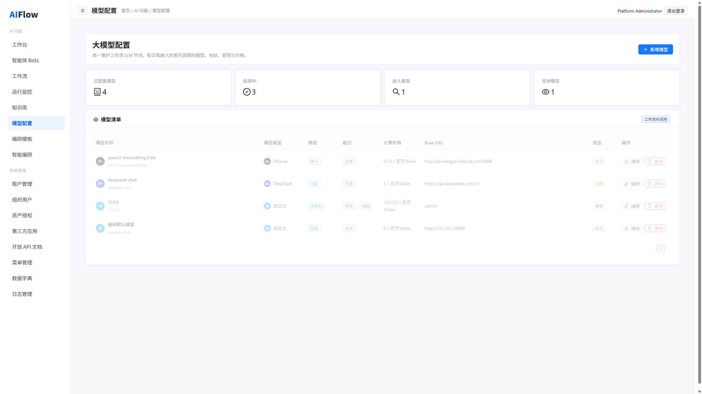

1. 进入 **AI 功能 > 模型配置**。
2. 点击 **新增模型**。
3. 选择模型类型和用途。
4. 填写模型名称、Base URL、模型标识。
5. 填写 API Key。
6. 配置是否支持视觉、百万 Token 价格（可选）。
7. 设置启用状态并保存。

### 常见问题

**工作流大模型节点应该选择什么用途？**

选择用途为 **对话** 的模型。

**知识库嵌入模型应该选择什么用途？**

选择用途为 **嵌入** 的模型。

**模型配置保存后无法调用怎么办？**

检查 Base URL、模型名称、API Key、启用状态和网络连通性。

---

## 第04章 系统管理

## 1. 租户管理

### 模块概述

租户管理用于平台级多租户隔离，适合 SaaS 部署或集团多实例场景。该菜单通常仅平台管理员可见。

### 操作使用

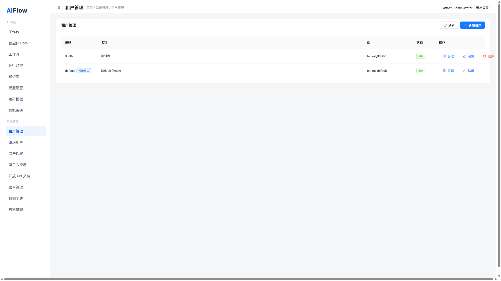

1. 进入 **系统管理 > 租户管理**。
2. 查看租户列表。
3. 新增租户，填写编码、名称和状态。
4. 进入租户工作台，分别维护该租户下的组织、用户、角色和第三方应用。

---

## 2. 组织用户

### 模块概述

组织用户模块用于管理组织架构、用户、角色。适合多组织、多角色、多系统集成的后台管理场景。

### 操作使用-组织管理

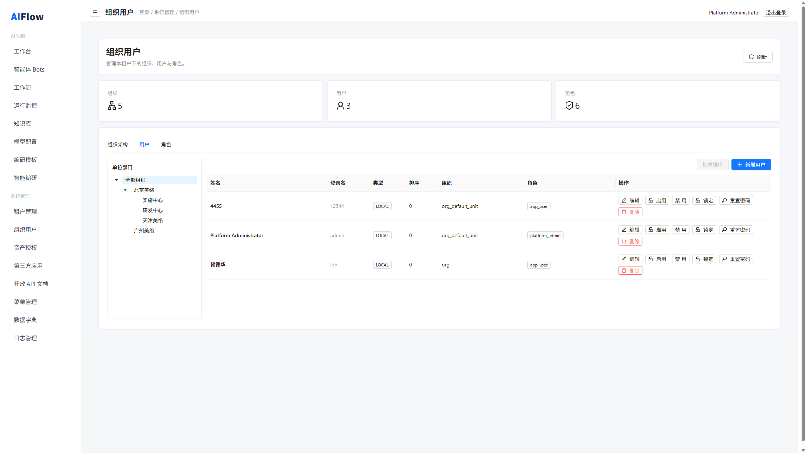

1. 进入 **系统管理 > 组织用户**。
2. 切换到 **组织架构**。
3. 新增组织，填写名称、编码、组织类型、外部标识。
4. 设置状态并保存。

### 操作使用-用户管理

1. 切换到 **用户**。
2. 新增用户，填写姓名、登录名、密码、用户类型。
3. 选择所属组织和角色。
4. 设置排序并保存。
5. 后续可启用、禁用、锁定、重置密码或删除用户。

### 操作使用-角色管理

1. 切换到 **角色**。
2. 新增角色，填写角色名称、编码、角色类型。
3. 保存后将角色分配给用户。

### 常见问题

**用户无法登录怎么办？**

检查用户状态是否为启用，密码是否正确，账号是否被锁定。

---

## 3. 资产授权

### 模块概述

资产授权用于控制组织、部门、角色对智能体、知识库、工作流、大模型等资产的使用权限，实现“创建可共享、使用受控”。

支持资产类型：

- 智能体
- 知识库
- 工作流
- 大模型

### 操作使用

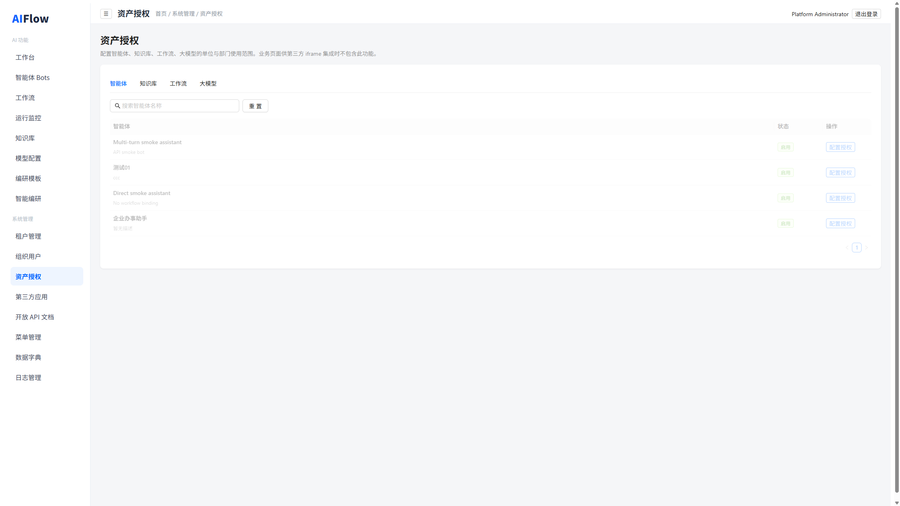

1. 进入 **系统管理 > 资产授权**。
2. 按资产类型切换 Tab。
3. 搜索目标资产。
4. 点击 **授权管理**，为组织、部门、角色或本人配置 **USE** 等权限。
5. 保存后，对应用户在工作流、智能体、知识库调用时会按授权范围过滤可见资产。

### 常见问题

**为什么列表里看不到某个知识库或 Bot？**

可能是当前登录用户所属组织未被授权，需联系管理员在资产授权中补充。

---

## 4. 第三方应用

### 模块概述

第三方应用用于外部业务系统通过 API Key 接入平台，可按组织、智能体、知识库、工作流、模型等范围授权。

### 操作使用

1. 进入 **系统管理 > 第三方应用**。
2. 新增应用，填写编码、名称、应用类型、认证方式。
3. 创建 API Key。
4. 配置授权范围与权限。
5. 外部系统携带 Key 调用开放接口。

### 常见问题

**第三方应用调用失败怎么办？**

检查应用状态、Key 是否有效、授权范围和权限配置是否正确。

---

## 5. 开放 API 文档

### 模块概述

开放 API 文档页面汇总平台对外接口说明，便于集成开发时查阅工作流、智能体、知识库、模型等开放能力。

### 操作使用

1. 进入 **系统管理 > 开放 API 文档**。
2. 查看接口分组与请求示例。
3. 结合第三方应用 Key 进行联调。

---

## 6. 菜单管理

### 模块概述

菜单管理用于维护后台侧边栏菜单分组、标题、路径、排序、可见性和平台专属标记。修改后会同步影响导航加载结果。

### 操作使用

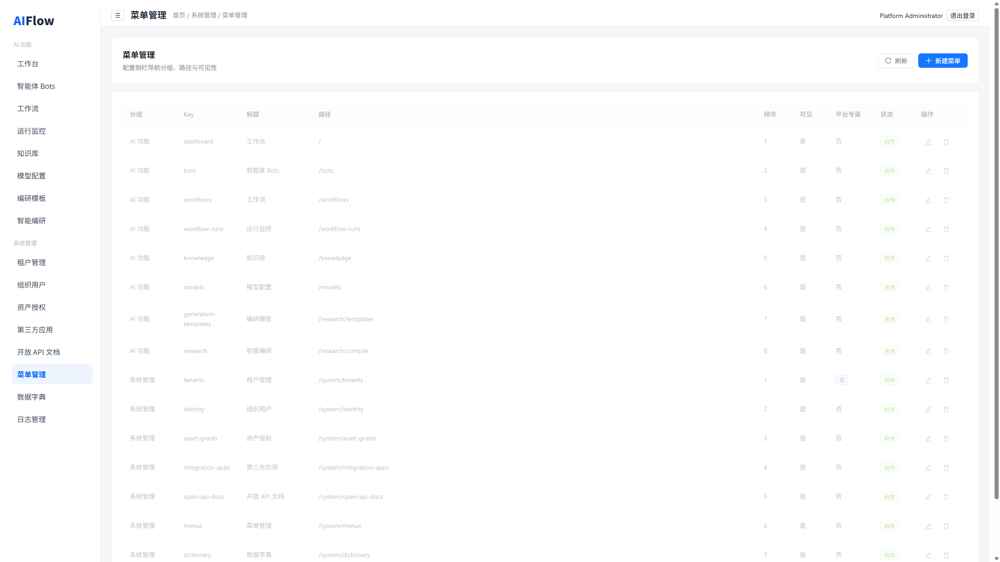

1. 进入 **系统管理 > 菜单管理**。
2. 查看当前菜单列表。
3. 点击 **新增菜单**，填写分组标题、菜单 Key、显示名称、路径。
4. 设置排序、是否可见、是否仅平台可见、状态。
5. 保存后刷新页面即可看到导航变化。
6. 可对已有菜单编辑或删除。

### 常见问题

**菜单 Key 有什么要求？**

仅支持小写字母、数字和连字符，例如 `workflow-runs`。

**路径格式有什么要求？**

必须以 `/` 开头，例如 `/workflows`。

---

## 7. 数据字典

### 模块概述

数据字典用于维护系统内通用枚举和配置项，例如通用状态、第三方应用类型、智能体状态等，供前后端统一引用。

### 操作使用

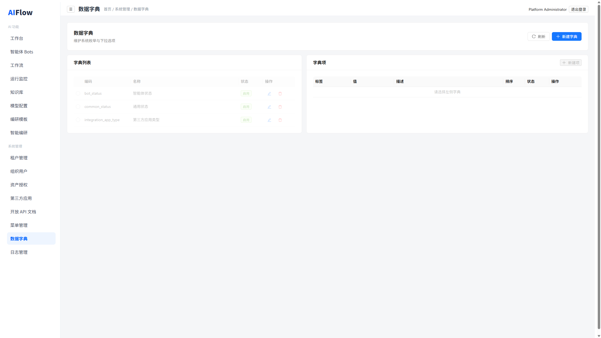

1. 进入 **系统管理 > 数据字典**。
2. 在左侧字典列表中新增字典，填写编码、名称、描述、状态。
3. 选中某个字典后，在右侧维护字典项。
4. 为字典项填写显示名称、值、排序和状态。
5. 保存后可被业务模块引用。

### 常见问题

**字典编码有什么要求？**

建议使用小写字母、数字和下划线，例如 `common_status`。

**字典项值重复怎么办？**

同一字典下项值必须唯一，请修改后再保存。

---

## 8. 日志管理

### 模块概述

日志管理用于查询登录、鉴权、系统配置等审计事件，支持按事件类型、用户、结果和时间范围检索。

### 操作使用

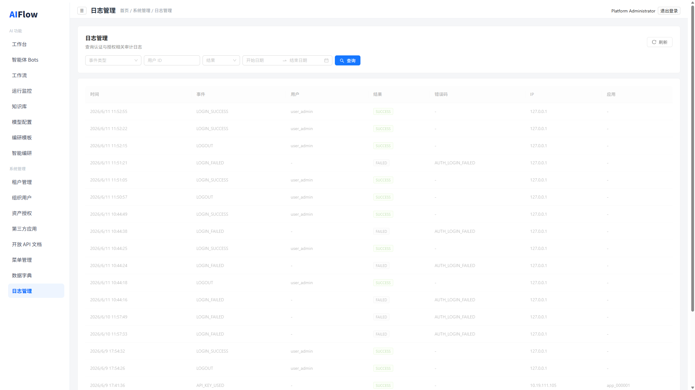

1. 进入 **系统管理 > 日志管理**。
2. 默认展示近 7 天日志。
3. 可按事件类型、用户 ID、结果（成功/失败）和时间范围筛选。
4. 点击 **查询** 刷新结果。
5. 点击 **重置** 恢复默认筛选条件。
6. 在列表中查看事件时间、事件类型、用户、结果、目标对象和 IP 等信息。

### 常见问题

**为什么刚进入页面数据较少？**

系统默认只查近 7 天，如需更早记录请扩大时间范围。

**如何排查登录失败？**

将结果筛选为 **FAILED**，并结合用户 ID、事件类型查看详情。

---

## 第05章 典型流程

### 搭建知识库问答智能体

1. 在模型配置中新增对话模型和嵌入模型。
2. 在知识库中创建知识库并上传文档。
3. 在工作流中新建流程：开始 → 知识库 → 大模型 → 结束。
4. 调试通过后发布工作流。
5. 在智能体 Bots 中新增智能体并绑定该工作流。
6. 运行智能体测试问答效果。

### 搭建 HTTP 工具调用流程

1. 新建工作流。
2. 编排节点：开始 → HTTP 请求 → 大模型 → 结束。
3. 在 HTTP 请求节点配置接口地址、请求方法、Header 和 Body。
4. 在大模型节点引用 HTTP 输出。
5. 调试成功后发布。

### 搭建问题分类分流流程

1. 新建工作流。
2. 编排节点：开始 → 问题分类。
3. 为售前咨询、售后退款、其他问题等分支分别配置后续节点。
4. 使用不同问题进行调试，确认分流正确。
5. 发布工作流。

### 完成一次智能编研任务

1. 在模型配置、知识库、编研模板和工作流准备就绪。
2. 进入 **智能编研** 向导。
3. 填写主题与受众，选择主题库、知识库和编研模板。
4. 提交任务并等待执行完成。
5. 查看章节大纲、正文和引用关系。
6. 下载 DOCX 或复制 Markdown 成果。

---

## 附录：建设中模块

以下菜单入口当前仍为占位页，后续版本会继续补充：

- 工具插件
- 模型市场
- 定时任务

如需使用上述能力，请关注后续版本说明。
