# AI Workflow 企业 AI 应用平台白皮书

> 版本：v2.0  
> 日期：2026-06-17  
> 面向对象：业务负责人、信息化负责人、架构师、实施团队

---

## 1. 摘要

AI Workflow 是面向企业和政务场景的 AI 应用编排平台。它把大模型、知识库、业务接口、工作流、智能体和智能编研能力整合在一个可治理、可审计、可集成的平台中，帮助组织把 AI 从演示工具推进到真实业务系统。


上图展示了 AI Workflow 管理端的工作台。它不是一个单点聊天页面，而是企业 AI 资产、运行状态和应用入口的统一控制台。

平台当前已经实现：

- 企业知识库和 RAG 检索。
- 可视化 AI 工作流编排。
- 大模型和嵌入模型统一配置。
- 多轮对话智能体。
- 独立 Chat 前端和开放 API。
- 面向数字档案馆的专题知识库数据集和智能编研。
- 租户、组织、第三方应用、资产授权和审计基础。

AI Workflow 的核心定位是：企业现有系统的 AI 能力层，而不是替代现有业务系统。

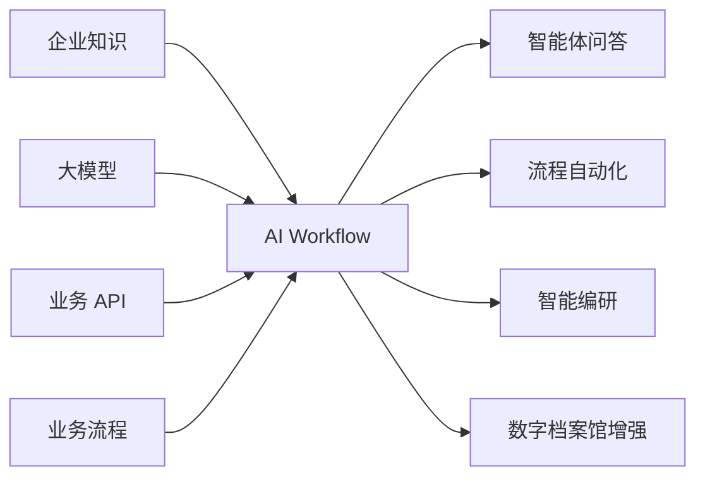

---

## 2. 为什么需要 AI Workflow

大模型已经具备强大的自然语言理解和生成能力，但企业真正落地时通常遇到五类问题：

| 问题 | 表现 |
|---|---|
| 知识不可控 | 模型不知道企业内部制度、档案、手册和业务材料 |
| 流程不可控 | 单轮对话难以完成检索、判断、调用接口、生成文档等多步骤任务 |
| 权限不可控 | 不同部门、角色、系统应看到不同知识库和智能体 |
| 集成成本高 | 每个业务系统单独接模型、向量库和 Prompt，重复建设 |
| 审计困难 | 无法追踪一次回答用了哪些知识、哪个模型、哪个流程节点 |

AI Workflow 用“知识库 + 工作流 + 智能体 + 开放集成”的方式解决这些问题。

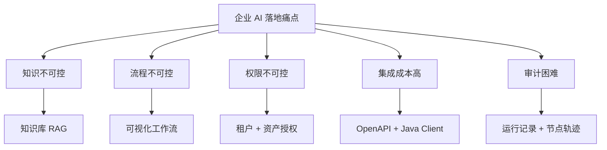

---

## 3. 产品定位

AI Workflow 可作为三类平台使用：

### 3.1 企业 AI 应用工厂

业务人员和技术人员通过可视化方式创建 AI 应用，将知识库、大模型、HTTP 接口、问题分类和条件分支组合成可运行流程。


### 3.2 企业知识智能中台

将 PDF、Word、Excel、Markdown、HTML、PPT 等资料统一接入知识库，形成可检索、可引用、可授权的知识资产。


### 3.3 业务系统 AI 组件

通过 OpenAPI、Java Feign Client、嵌入式 Chat 和工作流设计器组件，将 AI 能力接入数字档案馆、OA、门户、客服、知识管理等系统。

---

## 4. 核心能力

### 4.1 可视化工作流编排

平台提供轻量 DAG 工作流引擎，聚焦 AI 应用最常用的编排能力，而不是复杂 BPMN 审批。

当前支持节点：

- 开始
- 结束
- 大模型
- 知识库检索
- 问题分类
- HTTP 请求
- Prompt 模板
- 条件
- 文本转换
- 内容模板
- 循环

典型流程：

```text
开始 → 知识库检索 → 大模型回答 → 结束
开始 → 问题分类 → 条件分支 → HTTP 请求/知识库/大模型 → 结束
开始 → 读取专题素材 → 生成大纲 → 循环生成章节 → 输出 DOCX
```

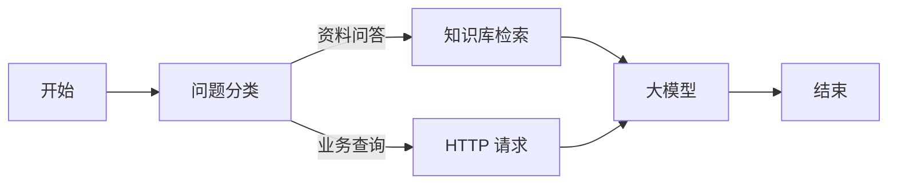

价值：

- 降低 AI 应用开发成本。
- 支持业务流程透明化。
- 每次运行可追踪到节点级输入输出。
- 发布版本可管控，避免直接改生产流程。

### 4.2 企业知识库

知识库是平台的核心资产层。它支持多格式文档解析、分段、向量化和混合检索。

能力包括：

- 文档上传和原始文件保存。
- 文本抽取和切片预览。
- 切片编辑、启停和重新解析。
- 嵌入模型配置。
- 向量维度配置。
- Elasticsearch 向量库配置。
- 关键词、向量、混合检索。
- 多数据集模式。

面向数字档案馆的增强能力：

- 专题型知识库。
- 专题数据集。
- 来源索引。
- 档案题名、密级、保管期限、来源系统等元数据。
- 支持按专题同步和重新索引。

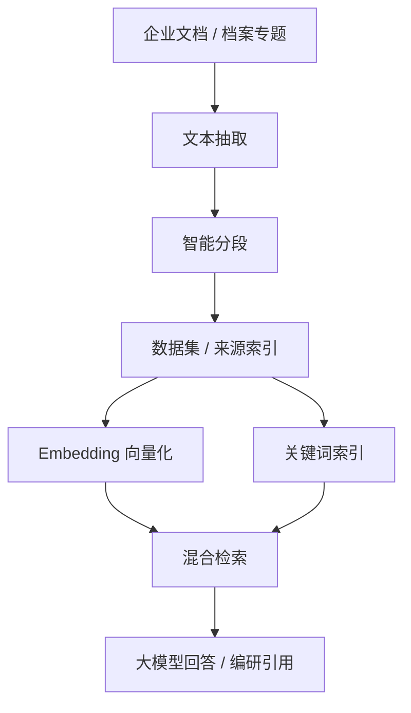

### 4.3 大模型统一管理

平台将模型 Provider 作为统一资源管理。支持对话模型和嵌入模型，适配公有云 API 和本地私有化模型。


可管理字段：

- 模型类型。
- 模型用途。
- Base URL。
- 模型名称。
- API Key。
- 价格。
- 视觉支持。
- 启用状态。

这使企业可以在不改业务流程的情况下替换模型供应商。

### 4.4 智能体 Bot

智能体是面向最终用户的对话入口。一个 Bot 可以绑定工作流、模型、知识库，也可以只绑定模型或知识库。


运行模式：

| 模式 | 说明 |
|---|---|
| 工作流模式 | 适合多步骤任务，如检索、分类、调用接口、生成结果 |
| 模型模式 | 适合通用问答和轻量助手 |
| RAG 模式 | 适合基于指定知识库问答 |

Bot 支持多轮会话、流式输出、建议问题、开场白、能力插件和会话历史。

### 4.5 面向终端用户的智能体应用

AI Workflow 不只提供后台配置能力，还提供面向终端用户的独立智能体应用。普通用户进入业务系统后，可以像使用企业内部助手一样选择智能体、发起会话、追问问题、查看知识来源，并在需要时触发工作流或智能编研任务。

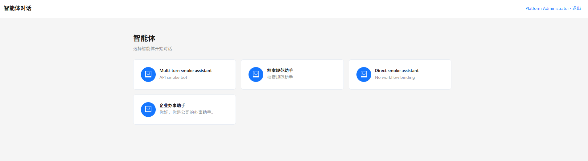

Chat 端首先呈现“智能体列表”页面。终端用户不需要进入管理后台，也不需要理解工作流、模型 Provider 或知识库配置，只需要选择一个业务智能体即可开始对话。这个页面适合嵌入到数字档案馆、OA 门户或知识服务首页中，作为统一的 AI 助手入口。

终端用户智能体应用适合放在：

- 数字档案馆首页或专题页面。
- OA 门户知识助手。
- 客服工作台。
- 内部制度问答入口。
- 档案编研助手入口。

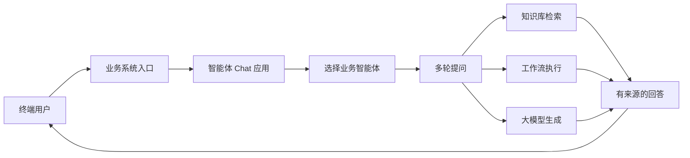

与管理端相比，终端用户智能体应用更关注“直接使用”：

| 能力 | 用户价值 |
|---|---|
| 智能体列表 | 用户只看到被授权或业务入口指定的助手 |
| 会话历史 | 可以延续上下文，不必重复描述问题 |
| 流式回复 | 大模型边生成边展示，体验更接近实时对话 |
| 知识引用 | 回答可追溯到制度、档案或知识片段 |
| 工作流触发 | 一句话触发检索、分类、接口查询、材料生成 |
| 嵌入式访问 | 不离开原业务系统即可使用 AI 能力 |

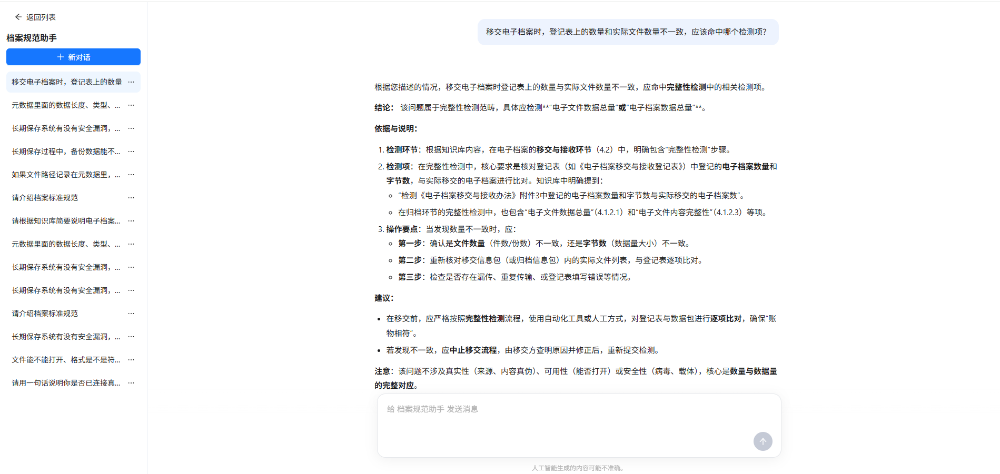

对话页面采用左侧会话列表、右侧内容区的布局。用户可以查看历史问题、继续追问，也可以围绕档案规范、制度条款、业务流程等主题进行连续咨询。对于绑定知识库或工作流的智能体，回答可以基于知识片段、流程节点和外部接口结果生成，适合承担“档案规范助手”“专题编研助手”“业务办理助手”等角色。

对于数字档案馆，终端用户智能体应用可以成为“档案 AI 助手”：用户在档案检索、专题浏览、编研任务页面中直接提问，系统基于专题知识库、档案元数据和工作流给出回答或生成材料。

### 4.6 智能编研

智能编研面向档案馆、资料室、研究部门和报告生成场景。


它将“主题、资料、知识库、模板、工作流、DOCX 输出”串成完整链路：

1. 选择或维护编研模板。
2. 选择专题库和知识库。
3. 输入编研主题和变量。
4. 后台执行绑定工作流。
5. 生成大纲、章节正文、引用关系。
6. 输出 Markdown、content_json 和 DOCX。

适用场景：

- 档案专题汇编。
- 大事记。
- 年鉴材料。
- 政策研究材料。
- 企业制度汇编。

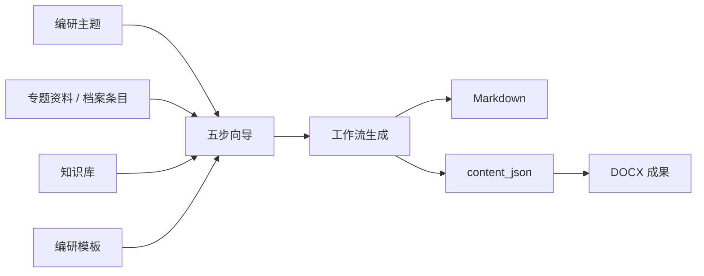

### 4.7 开放集成

AI Workflow 不要求业务系统全部迁移到 AGI 平台。

集成方式包括：

- OpenAPI：业务系统按 HTTP 调用工作流、知识库、Bot。
- Java Feign Client：Spring 系统快速集成。
- Chat 嵌入：业务系统打开独立 Chat 前端。
- 工作流设计器组件：React、Vue、Web Component 多形态集成。
- Nacos 服务注册：后端作为微服务被调用。

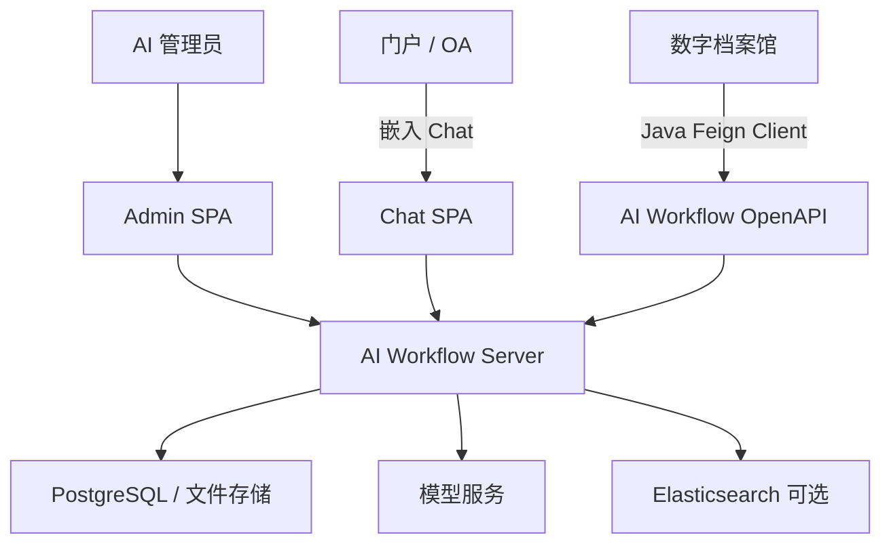

---

## 5. 面向数字档案馆的落地模式

如果数字档案馆系统只需要知识库和大模型应用，不一定要独立部署完整 AGI 平台。推荐按需求分三档集成。

### 5.1 轻量集成：Jar/模块嵌入

适合：

- 不想单独部署 AGI 平台。
- 安检、代码审查流程希望统一走数字档案馆系统。
- 只使用知识库、模型、少量 Bot 或工作流能力。

做法：

- 将后端能力打包为 Jar 或内部模块。
- 数字档案馆系统共用数据库、认证和组织机构。
- AGI 管理页面可按需嵌入或隐藏。

优点：

- 部署链路短。
- 安检范围集中。
- 权限和用户体系更容易统一。

注意：

- 需要明确表结构迁移和 `agi_` 表前缀。
- 需要处理文件存储目录。
- 需要决定是否启用 AGI 自带登录和租户模块。

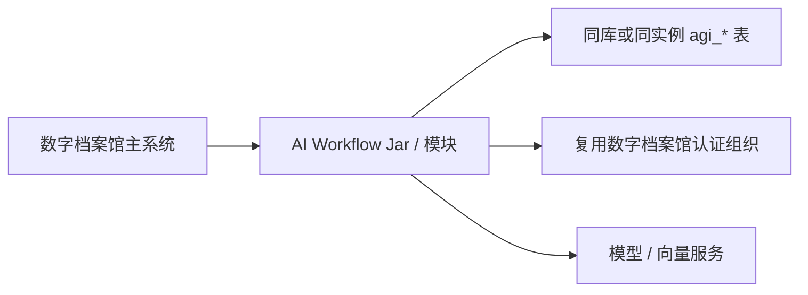

### 5.2 标准集成：独立 AGI 服务

适合：

- 多业务系统共用 AI 能力。
- 需要独立升级、扩容和运维。
- 需要完整管理端、Chat 端和开放 API。

做法：

- AGI 平台独立部署。
- 数字档案馆通过 OpenAPI 或 Feign Client 调用。
- 组织机构和认证通过 Feign 接入。

优点：

- 平台边界清晰。
- 可服务多个系统。
- 便于未来扩展更多 AI 应用。

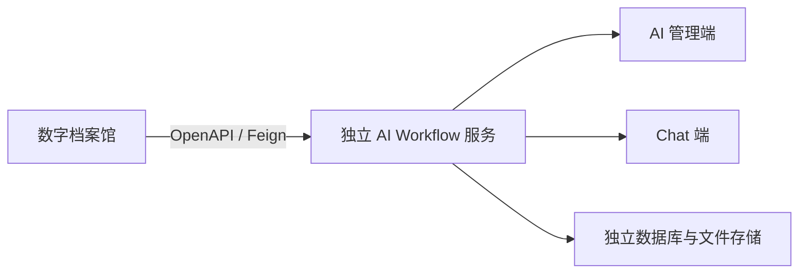

### 5.3 前端嵌入：Chat 或设计器嵌入

适合：

- 数字档案馆希望在原页面内直接使用 AI。
- 不希望用户跳转到另一个平台。

方式：

- 嵌入 Chat 页面。
- 调用 `/api/open/chat/embed-tickets` 生成票据。
- 通过 Web Component 嵌入工作流设计器。

---

## 6. 典型应用场景

### 6.1 档案知识问答

将制度、案卷说明、业务手册和专题材料接入知识库，用户直接提问，系统基于命中片段回答并返回来源。


### 6.2 专题资料汇编

按专题库同步档案来源，形成数据集，基于模板自动生成专题汇编初稿和 DOCX。

### 6.3 智能客服

通过问题分类节点识别咨询类型，再路由到知识库问答、业务接口查询或人工确认。

### 6.4 业务系统智能助手

在数字档案馆页面中嵌入 Chat 助手，支持“查资料、写摘要、生成说明、调用业务 API”。

### 6.5 流程自动化

通过 HTTP 节点连接外部系统，形成“理解用户问题 → 查询业务接口 → 大模型总结 → 输出结果”的自动化链路。

---

## 7. 平台治理能力

### 7.1 多租户和组织

平台内置租户、组织、用户、角色结构，可适配集团、多单位、多部门使用。

### 7.2 资产授权

Bot、知识库、工作流、模型可按组织、部门、角色授权。业务系统通过 OpenAPI Header 传入用户上下文，平台据此过滤或校验可用资产。


### 7.3 第三方应用

第三方系统通过 AppCode 和 ApiKey 调用开放接口，可配置启用状态、密钥和 Scope。

### 7.4 审计和追踪

平台记录：

- 管理操作审计。
- 工作流运行记录。
- 节点执行记录。
- Bot 会话消息。
- 智能编研任务和输出。

这为问题定位、责任追踪和效果评估提供基础。

---

## 8. 技术与国产化适配

### 8.1 技术基础

- Java 17
- Spring Boot 3.3
- MyBatis-Plus
- PostgreSQL
- Flyway
- React 18
- Ant Design 5
- Vite

### 8.2 国产化和私有化

平台已考虑：

- 达梦数据库适配方向。
- Ollama 私有模型。
- 本地文件存储。
- 可选 Elasticsearch。
- Nacos 服务发现。
- OpenFeign 微服务调用。

### 8.3 可扩展性

- 工作流节点可扩展。
- 模型 Provider 可扩展。
- Embedding Client 可扩展。
- 文档解析和分段策略可扩展。
- 前端设计器可多框架集成。

---

## 9. 商业价值

| 价值 | 说明 |
|---|---|
| 缩短交付周期 | 通过配置和编排复用知识库、模型和流程 |
| 降低重复建设 | 多业务系统共用一套 AI 能力底座 |
| 提升知识利用 | 将沉淀文档转化为可问答、可引用、可生成的资产 |
| 支撑合规治理 | 租户、授权、审计、运行记录让 AI 使用可追踪 |
| 保护既有投资 | 通过 OpenAPI 和嵌入方式增强现有系统 |
| 适配私有化 | 可接本地模型、私有数据库和内网部署 |

---

## 10. 建设路线建议

### 阶段一：知识库和模型先行

- 接入模型 Provider。
- 建立核心知识库。
- 完成文档解析、分段、检索测试。
- 通过 Bot 或 OpenAPI 验证问答。

### 阶段二：工作流编排

- 梳理高频业务场景。
- 使用开始、知识库、大模型、问题分类、HTTP、结束节点编排流程。
- 发布流程并纳入运行监控。

### 阶段三：数字档案馆深度集成

- 接入组织用户和认证。
- 建立专题型知识库和数据集。
- 嵌入 Chat 页面。
- 将专题库、档案条目和 AGI 数据集打通。

### 阶段四：智能编研产品化

- 建立编研模板库。
- 完善 DOCX 母版和 content_json 规范。
- 形成专题汇编、大事记、年鉴等标准输出模板。

### 阶段五：治理和规模化

- 启用强制鉴权。
- 完善资产授权。
- 接入统一日志和监控。
- 引入异步任务、队列和更完善的模型调用网关。

---

## 11. 结语

AI Workflow 的价值不在于单个聊天窗口，而在于把企业的知识、模型、流程和业务系统组织成可治理的 AI 应用体系。对于数字档案馆这类已有成熟业务系统的项目，AI Workflow 可以先作为知识库和大模型能力组件集成，再逐步扩展到工作流编排、智能体和智能编研，从而降低建设风险，也避免重复开发。
