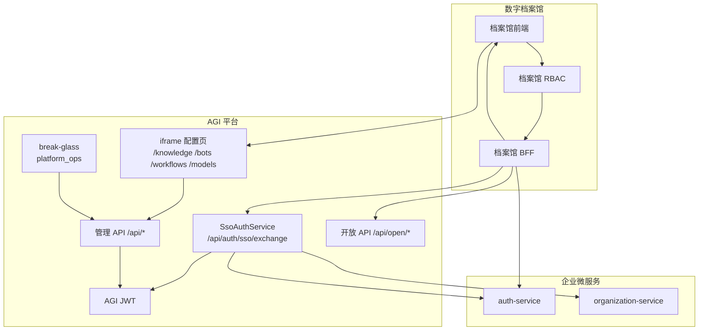
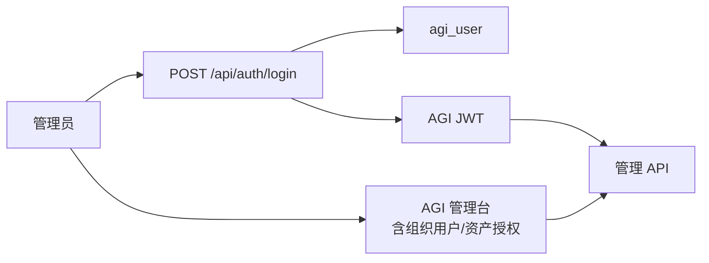
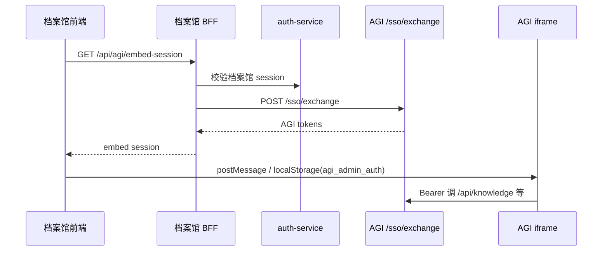

# AGI 混合身份认证设计方案

| 项目 | 说明 |
|------|------|
| 文档版本 | v1.1 |
| 日期 | 2026-06-10 |
| 状态 | 设计稿 |
| 关联文档 | [数字档案馆集成设计](./digital-archive-integration-design.md)、[身份组织认证设计](../superpowers/specs/2026-06-05-identity-organization-auth-design.md)、[企业 Web 智能体服务设计](../superpowers/specs/2026-06-10-enterprise-agent-web-service-design.md) |

---

## 目录

1. [背景与目标](#1-背景与目标)
2. [设计原则](#2-设计原则)
3. [混合模式总览](#3-混合模式总览)
4. [职责边界](#4-职责边界)
5. [总体架构](#5-总体架构)
6. [认证链路](#6-认证链路)
7. [租户与组织策略](#7-租户与组织策略)
8. [API 鉴权分层](#8-api-鉴权分层)
9. [前端与管理台](#9-前端与管理台)
10. [配置项](#10-配置项)
11. [数据模型与兼容](#11-数据模型与兼容)
12. [部署与运维](#12-部署与运维)
13. [实施任务与验收](#13-实施任务与验收)
14. [风险与演进](#14-风险与演进)
15. [附录](#15-附录)
16. [与企业 Web 智能体服务设计的衔接](#16-与企业-web-智能体服务设计的衔接)
17. [管理资产操作人审计](#17-管理资产操作人审计)

---

## 1. 背景与目标

AGI 平台当前具备本地身份体系（`agi_user`、`agi_organization`、本地 JWT 登录），并已预留外部 `auth-service`、`organization-service` 的 Feign 客户端，但尚未接入主认证链路。

业务上存在两类部署场景：

| 场景 | 说明 |
|------|------|
| **独立部署** | 直接使用 AGI 管理台，组织用户在平台内维护 |
| **档案馆集成** | 用户只登录档案馆；组织/用户在独立微服务维护；AGI 以 iframe + Open API 提供 AI 能力 |

本方案引入 **混合模式（Hybrid Identity）**：通过配置切换 `local` / `remote`，同一套代码同时支持两种场景，互不破坏。

### 1.1 目标

- 支持 `local` 模式：无外部微服务时可独立运行。
- 支持 `remote` 模式：认证与组织主数据外置，AGI 固定使用 `tenant_default`。
- 档案馆集成场景下，业务人员**无需进入 AGI 独立管理台**。
- 平台运维仍可通过 **break-glass 本地账号** 或 **SSO 映射平台管理员** 进入 AGI。
- 管理 API 强制 JWT；Open API 继续 API Key；配置与运行通道分离。
- 管理类资产（知识库、智能体、工作流、模型等）**记录真实操作人**（`created_by` / `updated_by`），支撑档案馆集成后的责任追溯。

### 1.2 非目标（本阶段不做）

- 完整 OIDC/SAML 客户端（可 Phase 2 演进）。
- 组织/用户全量同步进 AGI 表。
- 多租户 SaaS 运营（remote 模式固定单租户）。
- 替换 Open API 现有 API Key 机制。

---

## 2. 设计原则

1. **Identity 可切换，业务不感知**：知识库、智能体、工作流等业务模块只依赖 `RuntimeIdentityContext`，不直接依赖 local/remote。
2. **组织主数据单一来源**：remote 模式下，组织/用户以 `organization-service` 为准，AGI 不双维护。
3. **租户语义分层**：remote 模式下 `tenant_default` 表示 AGI 实例边界；组织边界由外部服务承担。
4. **本地能力保留**：`local` 模式下现有登录、组织用户、资产授权行为不变。
5. **最小 break-glass**：remote 模式保留少量 LOCAL 平台运维账号，仅内网使用。
6. **配置与运行分离**：iframe 配置走 JWT；终端运行走 `/api/open/*` + API Key。
7. **操作可追溯**：管理类资产写入 `created_by` / `updated_by`，禁止 `"system"` 硬编码冒充操作人。

---

## 3. 混合模式总览

```text
agi.identity.mode = local | remote
```

| 维度 | local 模式 | remote 模式 |
|------|-------------|-------------|
| 登录入口 | AGI 本地登录页 | 档案馆 SSO / embed 换票；运维 break-glass 本地登录 |
| 认证来源 | `agi_user` + 密码 | `auth-service` Token Introspection（Phase 2 可 OIDC） |
| 组织来源 | `agi_organization` 等本地表 | `organization-service`（按需查询，不同步） |
| 租户 | 可多租户 | 固定 `tenant_default` |
| 组织用户管理页 | 可用 | 隐藏/禁用 |
| 资产授权页 | 可用 | 隐藏/禁用（档案馆 RBAC 负责） |
| 第三方应用/API Key | 可用 | 可用（运维配置） |
| 无外部微服务 | ✅ 可运行 | ❌ 不可用 |

---

## 4. 职责边界

### 4.1 服务职责

| 服务 | local | remote |
|------|-------|--------|
| **auth-service** | 不使用 | 登录、验 token、SSO 源 |
| **organization-service** | 不使用 | 用户/单位/部门/角色主数据 |
| **档案馆 BFF** | 不使用 | 业务 RBAC、embed 会话、Open API 代调 |
| **AGI** | 身份 + AI 资产 + Open API | AI 资产 + Open API + 平台 JWT 签发 |

### 4.2 AGI 保留能力（两种模式共有）

- 租户（local 多租户；remote 仅 `tenant_default`）
- 第三方应用、API Key、资产白名单
- 知识库 / 智能体 / 工作流 / 模型 / 编研
- 平台 JWT、`RuntimeIdentityContext`
- 审计日志

### 4.3 remote 模式下 AGI 不再承担

- 档案馆组织树维护
- 档案馆业务用户密码认证
- 单位/部门级「资产授权」UI 逻辑（档案馆 RBAC 替代）

---

## 5. 总体架构

### 5.1 remote 模式（档案馆集成）



### 5.2 local 模式（独立部署）



---

## 6. 认证链路

### 6.1 local 模式：本地登录（保持现状）

```http
POST /api/auth/login
Content-Type: application/json

{
  "username": "admin",
  "password": "admin123",
  "tenantCode": "default"
}
```

响应：`accessToken`、`refreshToken`、`user`（含 `tenantId`、`roleIds` 等）。

**验收：** 与现有行为一致；`identity.mode=local` 时不调用外部 Feign。

### 6.2 remote 模式：SSO 换票（新增）

档案馆 BFF 在确认用户已登录档案馆且具备配置权限后，调用 AGI：

```http
POST /api/auth/sso/exchange
Content-Type: application/json

{
  "externalToken": "<auth-service-access-token>"
}
```

AGI 内部流程：

```text
1. 调用 auth-service POST /api/auth/tokens/introspect
2. 若 inactive → 401
3. （可选）调用 organization-service 补全 unitId / departmentIds
4. 外部 roles 经 role-mapping 映射为 AGI roleIds
5. tenantId 强制写入 fixed-tenant-id（tenant_default）
6. （可选）shadow user provisioning（external_user_id）
7. 签发 AGI accessToken + refreshToken
```

响应示例：

```json
{
  "accessToken": "eyJ...",
  "refreshToken": "eyJ...",
  "expiresIn": 3600,
  "user": {
    "id": "user_archive_001",
    "username": "zhangsan",
    "tenantId": "tenant_default",
    "displayName": "张三",
    "userType": "EXTERNAL",
    "organizationIds": [],
    "unitIds": ["unit_001"],
    "activeUnitId": "unit_001",
    "departmentIds": ["dept_001"],
    "roleIds": ["asset_manager"]
  }
}
```

### 6.3 remote 模式：iframe 注入



localStorage 键名：`agi_admin_auth`（与现网一致）。

### 6.4 remote 模式：平台运维登录

| 方式 | 账号 | 用途 |
|------|------|------|
| **A. break-glass 本地账号（推荐）** | `platform_ops` / `admin`，`LOCAL`，`platform_admin` | 内网维护第三方应用、API Key、排障 |
| **B. SSO 映射** | 外部账号映射 `platform_admin` | 零本地密码运维 |

**要求：**

- break-glass 账号仅存于 `agi_user`，`userType=LOCAL`。
- 不对档案馆业务人员分发。
- AGI 管理台 URL 仅内网/VPN 可达。

### 6.5 运行通道（两种模式相同）

档案馆 BFF 使用第三方应用 API Key 调用 `/api/open/*`，并透传：

```text
X-AGI-App-Code
X-AGI-Api-Key
+ body/header: userId, unitId, departmentIds, roleIds
```

---

## 7. 租户与组织策略

### 7.1 remote 模式：固定默认租户

| 项 | 值 |
|----|-----|
| AGI 租户 ID | `tenant_default` |
| 租户 code | `default` |
| JWT tenantId | 强制 `tenant_default` |
| AI 资产 tenant_id | 全部 `tenant_default` |

**说明：** 单套 AGI + 单套档案馆部署下，AGI 租户仅表示实例边界；组织隔离由 `organization-service` 的 unit/dept 承担。

### 7.2 local 模式：现有多租户策略不变

- 可创建多个租户。
- 组织用户在租户工作台维护。
- 平台管理员可跨租户（`platform_admin`）。

### 7.3 组织上下文来源

| 模式 | userId | unitId | departmentIds | roleIds |
|------|--------|--------|---------------|---------|
| local | `agi_user.id` | JWT / 用户组织关系 | JWT | JWT |
| remote | introspect + 可选 shadow user | organization-service | organization-service | introspect + role-mapping |
| Open API | 请求体/external | 请求体 | 请求体 | 请求体 |

---

## 8. API 鉴权分层

### 8.1 路由规则

| 路径 | local | remote | 认证方式 |
|------|-------|--------|----------|
| `POST /api/auth/login` | ✅ | ✅（仅 break-glass LOCAL 用户） | 用户名密码 |
| `POST /api/auth/sso/exchange` | 可选禁用 | ✅ | externalToken |
| `POST /api/auth/refresh` | ✅ | ✅ | refreshToken |
| `GET /api/auth/me` | ✅ | ✅ | Bearer |
| `/api/open/**` | ✅ | ✅ | API Key（现有 OpenApiAuthFilter） |
| `/api/auth/admin/**` | ✅ | ⚠️ 仅 platform_admin；remote 下禁用 org/user CRUD |
| `/api/knowledge/**` 等业务 API | ✅ | ✅ | Bearer AGI JWT |

### 8.2 鉴权失败行为

- 无 Bearer 访问管理 API → `401 AUTH_REQUIRED`
- 无效 JWT → `401 AUTH_TOKEN_INVALID`
- 无 API Key 访问 Open API → `401 OPEN_API_AUTH_REQUIRED`
- remote 模式访问已禁用的组织用户 API → `403 IDENTITY_MODE_REMOTE`

### 8.3 TenantContextFilter 行为变更

**改造前：** 无 token 时静默落 `tenant_default`。

**改造后：**

```text
/api/open/**     → OpenApiAuthFilter 设置租户/身份
/api/auth/login|sso|refresh → 跳过
其他 /api/**     → 必须有效 AGI JWT，否则 401
```

---

## 9. 前端与管理台

### 9.1 模式感知

前端读取配置（构建时 env 或 bootstrap API）：

```text
VITE_AGI_IDENTITY_MODE=local|remote
```

### 9.2 local 模式 UI

- 现有登录页。
- 完整菜单：AI 功能 + 系统管理（租户、组织用户、资产授权、第三方应用等）。

### 9.3 remote 模式 UI

| 入口 | 行为 |
|------|------|
| 独立访问 AGI | 仅 break-glass / SSO 平台管理员可登录 |
| `?embed=1` iframe | 跳过登录页；接收 postMessage token |
| 菜单 | 隐藏：租户管理、组织用户、资产授权 |
| 保留 | 知识库、智能体、工作流、模型、编研（按嵌入路由） |
| token 过期 | 向父页发送 `agi:session-expired`，不跳 AGI 登录页 |

### 9.4 档案馆日常是否需要进 AGI

| 角色 | 是否进 AGI 独立管理台 |
|------|----------------------|
| 档案馆业务管理员 | 否（iframe） |
| 档案馆终端用户 | 否（档案馆 + Open API） |
| 平台运维 | 是（低频，break-glass） |

---

## 10. 配置项

### 10.1 后端 application.yml

```yaml
agi:
  auth:
    default-tenant-id: tenant_default
    jwt-secret: ${AGI_JWT_SECRET}
  identity:
    mode: local          # local | remote
    fixed-tenant-id: tenant_default
    auto-provision-shadow-user: true
    role-mapping:
      archive_admin: asset_manager
      archive_config: asset_manager
      archive_user: app_user
    remote:
      disable-local-org-admin: true
      allow-break-glass-login: true

third-party:
  auth:
    service-name: auth-service
    base-url: ${AUTH_SERVICE_BASE_URL:}
  organization:
    service-name: organization-service
    base-url: ${ORGANIZATION_SERVICE_BASE_URL:}
```

### 10.2 Profile 建议

| Profile | mode | 用途 |
|---------|------|------|
| `local` / default dev | `local` | 开发、独立部署 |
| `archive-integrated` | `remote` | 档案馆生产/联调 |

### 10.3 前端 env

```bash
VITE_AGI_IDENTITY_MODE=remote
VITE_AGI_EMBED_ENABLED=true
```

---

## 11. 数据模型与兼容

### 11.1 保留表（不删除）

- `agi_tenant`、`agi_user`、`agi_organization`、`agi_role` 等：local 模式继续使用。
- remote 模式：组织表可为空；不强制同步。

### 11.2 可选：影子用户

remote 模式 SSO 首次登录时：

```text
agi_user
  user_type = EXTERNAL
  external_user_id = <auth-service userId>
  tenant_id = tenant_default
  password_hash = NULL
```

用途：审计 `createdBy`、会话关联；**不是**组织主数据副本。

### 11.3 兼容性要求

- `identity.mode=local` 时，所有现有集成测试通过。
- 切换 mode 不需要数据库结构破坏性变更。
- Open API 客户端（Feign Jar）契约不变。

---

## 12. 部署与运维

### 12.1 remote 模式上线清单

- [ ] auth-service introspect 可用
- [ ] organization-service 用户/部门接口可用
- [ ] 角色映射表确认
- [ ] break-glass 账号创建并托管密码
- [ ] 第三方应用 `digital-archive` + API Key + 白名单
- [ ] 所有 AI 资产在 `tenant_default`
- [ ] AGI 管理台内网访问策略
- [ ] 档案馆 embed 会话接口上线

### 12.2 密钥与轮换

| 密钥 | 保管位置 | 轮换 |
|------|----------|------|
| break-glass 密码 | 配置中心 | 90 天 |
| AGI JWT secret | AGI 配置 | 发版协调 |
| API Key | 档案馆 BFF 配置 | 按需 |
| auth-service 密钥 | auth 平台 | 按企业规范 |

### 12.3 监控与审计

- SSO exchange 成功/失败率
- 管理 API 401/403 计数
- Open API 鉴权失败
- Feign 调用 auth/org 超时
- 管理资产 CRUD 操作人写入成功率（见 [§17](#17-管理资产操作人审计)）

---

## 13. 实施任务与验收

### Phase 1：后端身份与鉴权（1–2 周）

| 任务 | 验收标准 |
|------|----------|
| `SsoAuthService` + `/api/auth/sso/exchange` | 有效 externalToken 返回 AGI JWT；无效 401 |
| `identity.mode` 配置开关 | local/remote 启动正常 |
| Security 分层鉴权 | 无 Bearer 访问 `/api/knowledge-bases` → 401 |
| 修 TenantAdminGuard 静默放行 | 无 token 不再绕过管理校验 |
| fixed tenant | remote JWT 中 `tenantId=tenant_default` |
| role-mapping | 外部角色正确映射进 JWT |
| 集成测试 | SSO + Open API 回归通过 |

### Phase 2：前端 embed 与菜单（1 周）

| 任务 | 验收标准 |
|------|----------|
| embed 模式 | `?embed=1` 无 AGI 登录页，token 注入后可用 |
| remote 菜单裁剪 | 不显示租户/组织用户/资产授权 |
| session 过期通知 | 401 时 postMessage 父页 |
| break-glass 登录 | 非 embed 下运维可本地登录 |

### Phase 3：档案馆联调与上线（1 周）

| 任务 | 验收标准 |
|------|----------|
| 档案馆 embed-session 接口 | 已登录档案馆用户 3s 内 iframe 可用 |
| 权限隔离 | 无权限用户看不到 iframe |
| 配置全流程 | iframe 内完成知识库/Bot/工作流/模型配置 |
| 运行全流程 | Open API 对话/编研正常 |
| local 回归 | `mode=local` 独立部署无回归 |

### Phase 4：管理资产操作人审计（与 P1a 并行，1 周）

| 任务 | 验收标准 |
|------|----------|
| DDL 增加 `created_by` / `updated_by` | 知识库、Bot、模型 Provider 表有字段；工作流补 `updated_by` |
| `OperatorContext` 从 JWT 解析 | 创建/更新/发布时自动写入，去掉 `"system"` 硬编码 |
| remote 模式 userId | 存 external userId 或 shadow user id |
| 管理台列表展示 | 可选列：创建人、更新时间 |
| 集成测试 | 不同用户创建 KB/Bot 后库中 `created_by` 不同 |

详见 [§17](#17-管理资产操作人审计)。

### 整体验收

- [ ] 档案馆业务人员无需 AGI 独立账号与登录
- [ ] 平台运维可 break-glass 登录 AGI
- [ ] `mode=local` 无外部微服务可完整运行
- [ ] `mode=remote` 组织不在 AGI 双维护
- [ ] 管理 API 强制 JWT；Open API 强制 API Key
- [ ] 知识库/Bot/工作流/模型创建后 `created_by` 为真实用户，非 `system`

---

## 14. 风险与演进

### 14.1 风险

| 风险 | 缓解 |
|------|------|
| auth-service 不可用导致无法 embed | BFF 熔断 + 友好错误；运维 break-glass 不受影响 |
| 角色映射不一致 | 映射表版本化 + 联调清单 |
| break-glass 密码泄露 | 内网限制 + 定期轮换 + 审计 |
| local/remote 行为漂移 | 双模式 CI 测试 |

### 14.2 Phase 2 演进

- OIDC Authorization Code 替代 introspect
- organization-service 组织树只读展示（可选）
- Chat Portal SSO / embed ticket
- 审计查询与 SSO 登录联动
- `agi_agent_audit_log` 扩展管理资产 CRUD 事件（对齐 Web 服务设计）

---

## 15. 附录

### 15.1 与现有文档差异说明

| 原文档 | 本方案调整 |
|--------|------------|
| 档案馆对应独立租户 `tenant_archive` | remote 模式统一 `tenant_default` |
| iframe 服务账号代登录 | 优先 SSO exchange；服务账号仅作备用/批任务 |
| 身份设计「不同步组织」 | 保持不变；remote 按需查询，不全量同步 |

### 15.2 外部服务接口契约（最小集）

**auth-service**

```http
POST /api/auth/tokens/introspect
{ "token": "..." }

→ { "active": true, "userId": "...", "username": "...", "roles": ["..."], "permissions": ["..."] }
```

**organization-service**

```http
GET /api/organization/users/{userId}
GET /api/organization/users/{userId}/departments
```

### 15.3 break-glass 账号初始化示例

```text
username: platform_ops
tenant_id: tenant_default
user_type: LOCAL
role: platform_admin
用途: AGI 内网运维，remote 模式第三方应用与 API Key 管理
```

### 15.4 代码改造触点（参考）

| 模块 | 文件/位置 |
|------|-----------|
| SSO | 新增 `SsoAuthService`、`AuthController` exchange 端点 |
| 鉴权 | `SecurityConfig`、`TenantContextFilter`、`TenantAdminGuard` |
| 外部调用 | `RemoteAuthenticationService`、`OrganizationClient` |
| 前端 | `App.tsx`、`menu.ts`、embed bootstrap |
| 配置 | `application.yml`、`application-archive-integrated.yml` |
| 操作人审计 | `OperatorContext`、`created_by`/`updated_by` 写入、Controller/Service 改造 |

---

## 16. 与企业 Web 智能体服务设计的衔接

> 关联文档：[企业 Web 智能体服务设计方案](../superpowers/specs/2026-06-10-enterprise-agent-web-service-design.md)（以下简称「Web 服务设计」）

Web 服务设计面向**终端用户**（Chat Portal、`/api/chat/**`、embed ticket），本混合身份方案面向**身份来源与部署模式**。两者需统一，否则会出现「管理端 SSO 已通、Chat 仍走本地登录」或「remote 禁用 AssetGrant 但 Chat 仍依赖 AssetGrant」等冲突。

### 16.1 三条交付通道（必须同时定义）

| 通道 | 入口 | API | 认证 | 主要用户 |
|------|------|-----|------|----------|
| **A. 管理配置** | admin iframe `/knowledge` 等 | `/api/*`（非 chat/open） | SSO exchange → **AGI JWT** | 档案馆配置员 |
| **B. 终端 Chat** | apps/chat `/chat/{botId}` | `/api/chat/**` | **embed ticket → Chat Session**；standalone 可 SSO | 档案馆业务用户 |
| **C. 服务端运行** | 档案馆 BFF | `/api/open/*` | **API Key + 用户上下文头** | 服务端代调 |

**调整点：** 不可让终端 Chat 与管理配置共用「localStorage + 长期 JWT」；Chat 必须按 Web 服务设计走 **ticket → HttpOnly Session**。

### 16.2 对混合身份方案的调整

| 原方案 | 结合 Web 服务后调整 |
|--------|---------------------|
| remote 仅描述 admin embed | 增加 **Chat Portal remote 登录策略**（见 16.3） |
| SSO exchange 只服务 admin | 抽取公共 **`IdentityResolver`**（introspect + org 补全 + role-mapping），admin 与 ticket 签发共用 |
| remote 禁用 AssetGrant UI | Chat「用户能否访问 Bot」在 remote 下**改判**（见 16.4），不是简单关闭授权 |
| Phase 2 才做 SSO | **P1a** 做 introspect + exchange；**Phase 2** 再做 OIDC/SAML（与 Web 服务设计对齐） |
| 未涉及 apps/chat | 明确 **admin 与 chat 双应用**、双会话（Admin JWT vs Chat Session） |

### 16.3 Chat Portal 在 remote 模式下的登录

Web 服务设计 P1a 写「独立访问 `/chat` 跳平台登录页」——**仅适用于 local 模式**。

remote 模式应调整为：

| 访问方式 | local | remote |
|----------|-------|--------|
| 独立访问 `/chat` | 平台本地登录 → JWT | **SSO 跳转** 或 **禁止公网直达**（仅内网 + SSO） |
| iframe 嵌入 | ticket（P1a） | ticket（不变） |
| 档案馆 BFF 代开 | Open API | Open API（不变） |

**ticket 签发前置（remote）：**

```text
档案馆 BFF 校验档案馆 session
  → auth-service introspect（与 admin SSO 同一套身份解析）
  → POST /api/chat/embed-tickets（Integration App + userId/unitId/deptIds/roleIds）
  → 返回 ticket
  → iframe /chat/{botId}?ticket=xxx
  → Chat Gateway 换 Chat Session
```

**验收：** remote 下终端用户不出现 AGI 本地登录页；ticket 内 `tenantId=tenant_default`，`userId` 为 organization-service 外部 ID。

### 16.4 Bot 可见性：remote 下替代 AssetGrant

Web 服务设计 P1a：**Web 用户访问 Bot 走 AssetGrantService**。

混合身份 remote 模式：**不在 AGI 维护组织树，资产授权 UI 禁用** → 两者冲突。

**remote 模式 Bot 可见性策略（三选一，推荐 B）：**

| 策略 | 说明 |
|------|------|
| A. Bot 全员开关 | `Bot.allowAllInTenant=true`，靠 Integration App Scope 控边界；实现简单，细粒度弱 |
| B. **档案馆 RBAC 驱动（推荐）** | 档案馆 BFF 调 `/api/chat/bots?ids=...` 或 Chat Gateway 读 BFF 下发的 `allowedBotIds` claim；AGI 不做单位树授权 |
| C. 外部用户 Bot 白名单表 | 新增 `agi_bot_user_grant(external_user_id, bot_id)`，登录/ticket 时过滤；不同步组织，仅 Bot 粒度 |

**local 模式：** 保持 Web 服务设计原判——AssetGrant + 全员开关。

**需在 Web 服务设计 §10.3 增补：** `identity.mode=remote` 时 Web 用户 Bot 权限跳过 AssetGrant，走 B/C 策略。

### 16.5 统一身份解析组件

建议后端抽象（admin 与 chat 共用）：

```text
IdentityResolver
  ├── introspect(externalToken)          → auth-service
  ├── enrichOrganization(userId)         → organization-service
  ├── mapRoles(externalRoles)            → agi roleIds
  ├── fixedTenant()                      → tenant_default（remote）
  └── toRuntimeIdentityContext()         → 审计 / 工作流 / 连接器透传
```

下游消费：

| 消费方 | 输出 |
|--------|------|
| `POST /api/auth/sso/exchange` | AGI JWT（admin） |
| `POST /api/chat/embed-tickets` | ticket claims（chat） |
| Chat Gateway / BotService | `RuntimeIdentityContext`（连接器透传 X-User-Id 等） |

### 16.6 API 鉴权矩阵（合并两文档）

| API | local | remote |
|-----|-------|--------|
| `/api/auth/login` | ✅ 本地用户 | ✅ 仅 break-glass LOCAL |
| `/api/auth/sso/exchange` | 可选禁用 | ✅ |
| `/api/chat/**` | JWT / ticket session | **ticket session 优先**；standalone 用 SSO |
| `/api/bots/**` 等管理 API | 管理 JWT | 管理 JWT（admin embed） |
| `/api/open/**` | API Key | API Key |

白名单：`/api/auth/login`、`/api/auth/sso/exchange`、`/api/auth/refresh`、`/api/health`、静态资源、`GET /chat/*?ticket=`（ticket 校验在 Gateway 内完成）。

### 16.7 租户与示例对齐

Web 服务设计示例中的 `tenant_001` 在档案馆 integrated 部署统一改为 **`tenant_default`**，避免与混合身份方案不一致。

### 16.8 实施顺序建议（合并排期）

| 阶段 | 混合身份 | Web 服务 |
|------|----------|----------|
| **P1a-1** | `IdentityResolver` + SSO exchange + 管理 API 鉴权 | — |
| **P1a-2** | remote 菜单/embed admin | Chat Gateway 骨架 + ticket 表 + embed-tickets |
| **P1a-3** | 档案馆 admin embed 联调 | ticket 联调 + Chat Session |
| **P1a-4** | break-glass 运维 + 操作人审计（§17） | Bot 可见性 remote 策略（§16.4-B） |
| **P2** | OIDC/SAML + 管理审计查询 | Web 服务 Phase 2 SSO + `agi_agent_audit_log` |

### 16.9 对 Web 服务设计文档的建议修订清单

| 章节 | 建议修订 |
|------|----------|
| §7.2 P1a 登录 | 区分 `local` / `remote`；remote 独立 Chat 不走本地登录页 |
| §8 embed ticket | 签发前身份来源改为 auth-service introspect（与 SSO 同源） |
| §10.3 Bot 权限 | 增加 `remote` 模式下 AssetGrant 替代策略 |
| §16.2 API 鉴权 | 增加 `/api/auth/sso/exchange` 白名单；明确 `/api/chat/**` 与 `/api/bots/**` 鉴权差异 |
| 全文 tenant 示例 | integrated 部署统一 `tenant_default` |
| §3.2 AssetGrant | 标注「remote + 档案馆集成时不适用 Web 用户单位树授权」 |
| 新增 §17 或等价章节 | 管理资产 `created_by`/`updated_by` 与操作审计 |

---

## 17. 管理资产操作人审计

### 17.1 现状与问题

混合身份改造后，管理 API 将强制 JWT，身份来源可解析到真实用户；但**当前业务表大多未持久化操作人**，无法回答「谁新建/修改了知识库、智能体、工作流、模型」。

| 资产 | `created_by` | `updated_by` | `created_at`/`updated_at` | `owner_unit_id` | 备注 |
|------|:------------:|:--------------:|:-------------------------:|:---------------:|------|
| 知识库 | ❌ | ❌ | ✅ | ✅ | 无操作人字段 |
| 智能体 Bot | ❌ | ❌ | ✅ | ✅ | 无操作人字段 |
| 大模型 Provider | ❌ | ❌ | ✅ | ✅ | 无操作人字段 |
| 工作流 | ⚠️ | ❌ | ✅ | ✅ | 有 `created_by`，Controller 写死 `"system"` |
| 工作流版本发布 | — | — | ✅ | — | 有 `published_by`，同样写死 `"system"` |
| 编研模板 | ⚠️ | ❌ | ✅ | ✅ | 有字段，创建时未从 JWT 自动填充 |
| 资产授权 | ✅ | ❌ | ✅ | — | 仅授权记录有 `created_by` |

其他：

- `agi_auth_audit_log` 仅记录登录/登出/Token/API Key，**不含**知识库/Bot 等业务 CRUD。
- 管理台 UI **不展示**创建人/修改人。
- `owner_unit_id` 表示资产归属单位，**不等于**操作人。

**结论：** 身份改造与操作人审计必须同步建设，否则 SSO 落地后仍无法追溯管理行为。

### 17.2 设计目标

| 目标 | 说明 |
|------|------|
| 记录操作人 | 管理类资产创建、更新、发布、删除时写入操作人 ID |
| 双模式一致 | `local` 写 AGI `userId`；`remote` 写 external userId 或 shadow user id |
| 最小侵入 | 业务 Service 统一从 `OperatorContext` 取当前用户，Controller 不硬编码 |
| 可展示 | 管理台列表/详情可选展示创建人、更新人、时间 |
| 可演进 | P1 字段级审计；P2 扩展 `agi_agent_audit_log` 事件流 |

### 17.3 操作人 ID 规则

```text
OperatorContext.resolve()
  local  → JWT sub（agi_user.id）
  remote → JWT sub（优先 external_user_id / shadow user；与 organization-service userId 一致）
  未登录 → 拒绝写操作（401），禁止 fallback 为 "system"
```

**displayName** 不强制落库；列表展示时可从 JWT / organization-service 按需补全。

### 17.4 数据模型变更

#### 17.4.1 新增/补齐字段

| 表 | 变更 |
|----|------|
| `agi_knowledge_base` | ADD `created_by VARCHAR(64)`, `updated_by VARCHAR(64)` |
| `agi_ai_bot` | ADD `created_by`, `updated_by` |
| `agi_model_provider` | ADD `created_by`, `updated_by` |
| `agi_workflow` | ADD `updated_by`；`created_by` 已有 |
| `agi_generation_template` | ADD `updated_by`；`created_by` 已有 |

工作流版本表保持：

- `published_by`：发布操作人（必须从 `OperatorContext` 写入，禁止 `"system"`）

#### 17.4.2 迁移策略

- 存量数据 `created_by` / `updated_by` 允许 NULL，表示历史未知。
- 新写入数据在鉴权生效后 **NOT NULL**（应用层校验，DB 可先 nullable）。

示例迁移：

```sql
ALTER TABLE agi_knowledge_base ADD COLUMN IF NOT EXISTS created_by VARCHAR(64);
ALTER TABLE agi_knowledge_base ADD COLUMN IF NOT EXISTS updated_by VARCHAR(64);
-- agi_ai_bot、agi_model_provider、agi_workflow、agi_generation_template 同理
ALTER TABLE agi_workflow ADD COLUMN IF NOT EXISTS updated_by VARCHAR(64);
```

### 17.5 后端写入规范

#### 17.5.1 OperatorContext 组件

```text
OperatorContext
  ├── requireUserId()     → 无身份抛 401
  ├── currentUserId()     → Optional
  └── displayName()       → Optional，来自 JWT 或 org 服务
```

所有管理类写操作统一：

```text
create  → created_by = operator, updated_by = operator, updated_at = now
update  → updated_by = operator, updated_at = now
publish → published_by = operator
delete  → （可选）审计日志记录 operator
```

#### 17.5.2 需改造的 Controller / Service

| 模块 | 现状 | 改造 |
|------|------|------|
| `WorkflowController` | `DEFAULT_USER_ID = "system"` | 改为 `OperatorContext.requireUserId()` |
| `KnowledgeBaseService.create/update` | 无操作人 | 写入 created_by/updated_by |
| `BotService.create/update` | 无操作人 | 同上 |
| `ModelProviderService` | 无操作人 | 同上 |
| `GenerationTemplateService` | createdBy 来自请求体 | 改为 JWT 自动填充，忽略客户端伪造 |
| `AssetGrantService` | 已有 createdBy | 改为 JWT 自动填充 |

**安全要求：** 客户端请求体 **不得** 传入 `createdBy`/`updatedBy` 作为可信来源；以服务端 JWT 为准。

### 17.6 前端展示（可选，P1 最小）

| 页面 | 展示 |
|------|------|
| 知识库列表 | 创建人、更新时间 |
| 智能体列表 | 创建人、更新时间 |
| 工作流卡片 | 创建人、最近发布人/时间 |
| 模型 Provider 列表 | 创建人、更新时间 |

remote + embed 模式下：

- 创建人显示 external userId 映射的 displayName（档案馆用户名）。
- 若 shadow user 存在，优先显示 `displayName`。

### 17.7 与 remote / 档案馆集成的关系

| 场景 | 操作人来源 |
|------|------------|
| 档案馆 iframe 配置员改知识库 | SSO exchange JWT → external userId |
| break-glass 运维改第三方应用 | LOCAL `platform_ops` userId |
| local 模式管理员 | `admin` 等本地 userId |

档案馆 **不需要** 在 AGI 维护组织用户，但 AGI **必须** 记录「哪个 external userId 改了哪条资产」，以满足馆方审计要求。

### 17.8 与 Web 服务审计的边界

| 类型 | P1 本方案 | P2 Web 服务设计 |
|------|-----------|-----------------|
| 管理资产配置 CRUD | `created_by` / `updated_by` 字段 | — |
| Chat 对话、工具调用、HITL | — | `agi_agent_audit_log` + traceId |
| 登录 / SSO / API Key | `agi_auth_audit_log` | 已有 |

P1 不做完整审计查询页；P2 统一管理审计与 SSO 登录联动查询。

### 17.9 验收标准

- [ ] 用户 A 创建知识库 → `created_by = A`，`updated_by = A`
- [ ] 用户 B 修改该知识库 → `updated_by = B`，`created_by` 仍为 A
- [ ] 工作流创建/发布 → `created_by` / `published_by` 为真实用户，**不为 `system`**
- [ ] 无 JWT 创建资产 → 401
- [ ] remote 模式 iframe 用户操作 → `created_by` 为 external userId（或 shadow id）
- [ ] 客户端伪造 `createdBy` 请求字段 → 被忽略，以 JWT 为准
- [ ] 管理台列表可看到创建人/更新时间（若启用 UI 展示）

### 17.10 实施任务摘要

| 编号 | 任务 |
|------|------|
| AUD-01 | Flyway 迁移：`created_by` / `updated_by` 字段 |
| AUD-02 | 新增 `OperatorContext`，接入 `AuthRequestContext` |
| AUD-03 | 改造 KB / Bot / Model / Workflow / Template 写操作 |
| AUD-04 | 移除 Workflow `"system"` 硬编码 |
| AUD-05 | API 响应可选返回 `createdBy` / `updatedBy` |
| AUD-06 | 管理台列表展示（可选） |
| AUD-07 | 集成测试：双用户 CRUD 断言 |

---

**文档结束**
