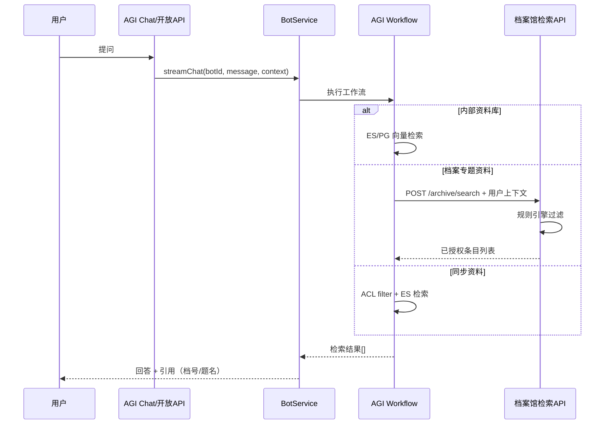

# 档案专题资料接入 AGI 方案

| 项目 | 说明 |
|------|------|
| 文档版本 | v1.0 |
| 日期 | 2026-06-15 |
| 适用场景 | 数字档案馆专题资料（案卷、条目、附件）接入 AGI 问答/编研流程 |
| 关联文档 | [多租户与外部资料源设计](../superpowers/specs/2026-06-05-agent-knowledge-multi-tenant-generation-design.md)、[数字档案馆集成设计](./digital-archive-integration-design.md) |

---

## 术语约定

| 术语 | 含义 |
|------|------|
| **专题** | 数字档案馆中的一个编研/汇编主题对象，对应 `theme` |
| **专题资料** | 专题下的一条资料，对应 `theme_material` |
| **挂接档案** | 被专题资料引用的案卷/条目/附件 |
| **专题问答入口** | AGI 侧的 Bot / 工作流 / Open API 调用入口 |
| **入口授权** | AGI 侧对专题问答入口的可用性控制，如 `agi_asset_grant`、Bot / 应用授权 |
| **档案馆检索 API** | 数字档案馆提供的已授权检索接口 |
| **HTTP 连接器委托检索** | AGI 通过 `HTTP_TOOL` + 连接器调用档案馆检索 API |

## 1. 背景与问题

数字档案馆专题资料的数据来源主要是档案业务数据，包括：

- **案卷**、**条目**（目录/卡片信息）
- **附件**（原文 PDF、Word 等）
- 每条档案带有**记录级权限**：开放程度、开放范围、密级、全宗、归档部门、单位等
- 外部还有**动态权限规则**（如某角色可查看全部档案），由档案馆规则引擎计算

AGI 平台现有资料接入模型以**附件上传 → 切分 → 向量化**为主，权限仅到**入口/资产级**，无法表达「专题里某条档案谁能看」。

本方案回答两个核心问题：

1. **专题资料结构**怎样设计？
2. **权限**怎样规划、检索时怎样过滤？

> **档案条级权限**的完整设计见专篇：[档案条级权限设计方案](./archive-record-level-permission-design.md)

---

## 2. 现状分析

### 2.1 当前平台资料模型

```
知识库 (agi_knowledge_base)
  └── 文档 (agi_knowledge_document)
        └── 切片 (agi_knowledge_chunk)
              └── 向量 (ES / PostgreSQL)
```

| 层级 | 现有字段 | 局限 |
|------|----------|------|
| 知识库 | name、ownerUnitId、retrievalMode… | 无「来源类型」区分 |
| 文档 | name、datasetType、tags、source、rawContent | 默认 `TEXT_DOCUMENT`，无业务对象 ID |
| 切片 | content、documentName | 无权限 metadata |
| ES 索引 | knowledgeBaseId、documentId、content、embedding | 检索无 ACL filter |

### 2.2 当前权限模型

| 层级 | 机制 | 范围 |
|------|------|------|
| 平台入口授权 | `agi_asset_grant` / Bot / 应用授权 | 问答入口 **能不能用** |
| 集成应用白名单 | `agi_integration_app_scope` | 第三方应用可调哪些资产 |
| 记录级档案权限 | **未实现** | — |

当前平台内置检索能力不负责档案条级过滤。

---

## 3. 设计原则

1. **档案条目 ≠ 附件文件**：一条档案是结构化业务对象，附件只是其子资源。
2. **权限分两层**：平台管“入口级”，档案馆管“条级”。
3. **复杂规则不复制**：「某角色看全部档案」等规则留在档案馆 `AuthorityRuleManageService`，AGI 不重写。
4. **专题资料优先通过 HTTP 连接器委托检索接入**：动态、权限细的数据默认留在档案馆；仅明确需要离线检索时才同步入库。
5. **权限快照可索引**：若同步入库，入库时固化权限字段快照，检索时在 ES `filter` 中叠加。

---

## 4. 数据存储结构

### 4.1 总体模型

```
专题资料来源
  sourceType: INTERNAL | ARCHIVE_THEME | ARCHIVE_SYNC
  externalSourceId: 档案馆专题 ID（可选）
  syncMode: HTTP_CONNECTOR | INCREMENTAL | FULL

  └── 文档（一条档案业务对象 = 一个 document）
        sourceType: ARCHIVE_VOLUME | ARCHIVE_ITEM | ARCHIVE_ATTACHMENT
        externalId: 档案馆侧案卷/条目/附件 ID
        metadata: { 业务字段 + 权限字段 JSON }
        rawContent: 目录/卡片信息拼成的可检索文本
        attachments[]: 附件列表（逻辑关联）

        └── 切片
              content: 条目摘要 / 附件正文片段
              acl: { 权限字段快照，与 metadata 一致 }
```

### 4.2 文档类型说明

| sourceType | 对应业务 | 向量化内容 |
|------------|----------|------------|
| `ARCHIVE_VOLUME` | 案卷 | 案卷级目录信息 |
| `ARCHIVE_ITEM` | 条目（图 1 表格每一行） | 题名、档号、密级、归档部门等拼成文本 |
| `ARCHIVE_ATTACHMENT` | 附件原文 | PDF/Word 解析后的正文切片 |

### 4.3 metadata 字段映射（档案馆 ES → AGI）

| 档案馆 ES 字段 | 含义 | AGI metadata 键 |
|----------------|------|-----------------|
| `efile_idx.kfcd` | 公开程度 | `kfcd` |
| `efile_idx.kffw` | 开放范围 | `kffw` |
| `efile_idx.mj` | 密级 | `mj` |
| `efile_idx.zxfw` | 知悉范围 | `zxfw` |
| `efile_idx.unitid` | 全宗 | `unitId` |
| `efile_idx.DEPTID` | 归档部门 | `archiveDeptId` |
| `efile_idx.deptId` | 部门/分管领导权限 | `deptId` |
| `efile_idx.libcode` | 档案门类 | `libcode` |
| `efile_idx.status` | 状态 | `status` |
| `efile_idx.attr` | 应用权限（0=全文，1=目录） | `attr` |
| `efile_idx.fileid` | 文件 ID 权限 | `fileId` |
| `efile_idx.CREATOR` | 创建者 | `creator` |
| `efile_idx.archivedCategory` | 归档分类 | `archivedCategory` |
| `efile_idx.prjCode` | 项目代码 | `prjCode` |
| 业务字段 | 档号、题名等 | `dh`、`title` 等 |

### 4.4 建议表结构扩展

**agi_knowledge_base 新增：**

```text
source_type          VARCHAR   INTERNAL / ARCHIVE_THEME / ARCHIVE_SYNC
external_source_id   VARCHAR   档案馆专题 ID
sync_mode            VARCHAR   HTTP_CONNECTOR / INCREMENTAL / FULL
sync_config          JSONB     同步策略、连接器编码等
```

**agi_knowledge_document 新增：**

```text
source_type          VARCHAR   ARCHIVE_VOLUME / ARCHIVE_ITEM / ARCHIVE_ATTACHMENT / TEXT_DOCUMENT
external_id          VARCHAR   档案馆业务对象 ID
external_parent_id   VARCHAR   父条目 ID（附件挂条目）
metadata             JSONB     业务字段 + 权限字段
acl_snapshot         JSONB     入库时权限快照（与 metadata 权限子集一致）
last_synced_at       TIMESTAMP 最近同步时间
```

**agi_knowledge_chunk 新增：**

```text
metadata             JSONB     切片级扩展（如附件页码）
acl_snapshot         JSONB     检索过滤用权限快照
```

**ES 索引新增字段（与 acl_snapshot 同步）：**

```text
kfcd, kffw, mj, zxfw, unitId, deptId, archiveDeptId, libcode, status, attr, fileId
```

### 4.5 与普通附件库对比

| 维度 | 普通附件资料 | 档案专题资料 |
|------|----------------|------------|
| document 含义 | 一个上传文件 | 一条案卷/条目/附件 |
| 权限粒度 | 入口级 | 入口级 + 记录级 |
| 数据来源 | 用户上传 | 档案馆 API 同步或运行时拉取 |
| metadata | tags/category 可选 | 档号、密级、全宗等必填 |
| 更新方式 | 手动增删 | 增量同步 / 运行时查询 |

---

## 5. 权限规划

### 5.1 两层权限模型

```
┌─────────────────────────────────────────────────────────┐
│ 第一层：平台资产授权（已有）                              │
│ agi_asset_grant + integration_app_scope                 │
│ 问题：用户能不能使用这个问答入口/智能体？                  │
└──────────────────────────┬──────────────────────────────┘
                           │ 通过
┌──────────────────────────▼──────────────────────────────┐
│ 第二层：档案记录授权（新增）                              │
│ 开放程度/范围、密级、全宗、部门 + 档案馆规则引擎           │
│ 问题：库里的这条档案用户能不能看？                         │
└─────────────────────────────────────────────────────────┘
```

### 5.2 第一层：平台资产授权（已实现）

| 检查点 | 实现 |
|--------|------|
| 用户能否使用问答入口 | 现有资产 / Bot / 应用授权能力 |
| 第三方应用能否调用 | `IntegrationAppScopeService` 白名单 |
| 上下文来源 | `X-AGI-User-Id`、`X-AGI-Unit-Id`、`X-AGI-Department-Ids`、`X-AGI-Role-Ids` |

**只管「能不能进这个库」，不管库内每条档案。**

### 5.3 第二层：档案记录授权

权限字段来源：

| 来源 | 说明 |
|------|------|
| 条目固有属性 | 公开程度、开放范围、密级、全宗、归档部门 |
| 规则引擎计算 | `AuthorityRuleManageService`、`DeptVoter`、`FgldVoter`、`RoleVoter` 等 |
| 动态规则 | 「某角色可看全部档案」——**必须在档案馆侧计算** |

AGI 侧**不复制完整规则引擎**，采用以下策略之一（见第 6 章）。

### 5.4 权限职责划分

| 系统 | 职责 |
|------|------|
| 数字档案馆 | 档案数据主库、记录级权限、规则引擎、已授权检索 API |
| AGI 平台 | 入口授权、工作流编排、连接器调用、引用展示 |
| 档案馆 BFF | 透传用户身份、合并两侧权限判断、API Key 保管 |

---

## 6. 检索与权限查询方案

### 6.1 方案对比

| 方案 | 数据存放 | 权限执行方 | 适用场景 |
|------|----------|------------|----------|
| **A. HTTP 连接器委托检索（推荐）** | 专题资料留在档案馆 | 档案馆规则引擎 | 权限复杂、数据动态、规模大 |
| **B. 同步入库 + ES 过滤** | 同步到 AGI ES | AGI 按 metadata filter | 规模可控、规则以字段过滤为主 |
| **C. 混合模式（推荐落地）** | 规范资料在 AGI，专题资料留在档案馆 | 分层 | 生产环境默认 |

### 6.2 方案 A：HTTP 连接器委托档案馆检索（推荐）

专题资料**不整批同步**（或仅同步无敏感权限的规范资料）。

```
用户提问
  → AGI 智能体 / 知识库检索节点
  → 第一层：assertKnowledgeBaseUseAllowed()
  → HTTP 连接器：档案馆「已授权检索 API」
       入参：query、userId、unitId、departmentIds、roleIds、themeLibraryId
       档案馆内部：AuthorityRuleManageService + Voters 过滤
  → 返回：TopN 条目 + contentText + citation
  → AGI 引用展示
```

档案馆需提供的接口（示例）：

```http
POST /openapi/archive/search
X-AGI-User-Id: ...
X-AGI-Unit-Id: ...

{
  "themeLibraryId": "theme_001",
  "query": "档案著录规范",
  "topK": 10
}
```

响应统一结构：

```json
{
  "items": [
    {
      "sourceType": "ARCHIVE_ITEM",
      "sourceId": "item_001",
      "title": "测试071706",
      "contentText": "题名：... 档号：... 密级：...",
      "metadata": { "dh": "004-A-2025-...", "kfcd": "PTSM", "mj": "NB" },
      "citation": { "title": "测试071706", "locator": "档号 004-A-2025-..." }
    }
  ]
}
```

**优点：** 与档案馆权限 100% 一致；角色「看全部」等复杂规则无需在 AGI 重写。  
**缺点：** 依赖档案馆在线；向量检索在档案馆 ES 完成。

对应通过连接器调用档案馆检索 API 的接入模式。

### 6.3 方案 B：同步入库 + ES ACL 过滤

适合：专题资料规模可控、需 AGI 侧高性能向量检索、权限规则以字段过滤为主。

**入库流程：**

```
档案馆增量同步任务 / 手动同步
  → 拉取条目 + 附件正文 + 权限字段
  → 写入 agi_knowledge_document（metadata + acl_snapshot）
  → 切分 → 向量化 → ES upsert（含 acl 字段）
```

**检索流程：**

```
用户提问 + context(userId, unitId, departmentIds, roleIds)
  → 第一层：assertKnowledgeBaseUseAllowed()
  → 第二层：resolveAclFilter(context)
       方式1：调档案馆 API 返回 filter 条件
       方式2：AGI 本地简化规则（仅全宗/密级/开放程度等字段）
  → ES 查询：
       bool.filter: [ knowledgeBaseId, enabled, ...aclFilters ]
       script_score: cosineSimilarity(embedding)
  → 返回 TopN
```

ES 查询示例：

```json
{
  "query": {
    "script_score": {
      "query": {
        "bool": {
          "filter": [
            { "term": { "knowledgeBaseId": "kb_archive_theme_001" } },
            { "term": { "enabled": true } },
            { "term": { "unitId": "fonds_001" } },
            { "terms": { "kfcd": ["PTSM", "FMGK"] } }
          ]
        }
      },
      "script": {
        "source": "cosineSimilarity(params.queryVector, 'embedding') + 1.0",
        "params": { "queryVector": [ ... ] }
      }
    }
  }
}
```

**局限：** 无法完整复刻 `buildCompleteWhereSql()`、多 Voter 组合规则；权限变更需重新同步快照。

### 6.4 方案 C：混合模式（推荐生产落地）

| 资料类型 | 存储 | 权限 |
|----------|------|------|
| 规范、制度、编研背景知识 | AGI 内部资料库 | 平台入口授权 |
| 档案专题资料（动态、细粒度权限） | 档案馆 ES / 检索 API | 档案馆规则引擎 |
| 用户选定若干条档案编研 | 运行时按 ID 拉取 + 临时切片 | 档案馆按 ID 鉴权 |
| 高频稳定专题（可选） | 增量同步到 AGI + ACL 快照 | 平台 grant + ES filter |

---

## 7. 端到端查询链路

### 7.1 智能体对话场景



### 7.2 开放 API 调用

调用方必须在请求头或 body 携带完整身份上下文：

```http
X-AGI-App-Code: digital-archive
X-AGI-Api-Key: ***
X-AGI-User-Id: user_001
X-AGI-Unit-Id: unit_001
X-AGI-Department-Ids: dept_a,dept_b
X-AGI-Role-Ids: archive_user,archive_admin
```

```http
POST /api/open/knowledge-bases/{id}/search
{ "query": "开放档案著录要求", "topK": 5 }
```

检索内部自动执行两层权限校验。

---

## 8. 同步策略（方案 B 补充）

| 同步方式 | 说明 |
|----------|------|
| `HTTP_CONNECTOR` | 不同步入库，每次通过连接器调档案馆 API |
| `INCREMENTAL` | 按 `lastModified` 增量同步条目与权限快照 |
| `FULL` | 全量重建（专题资料初始化或权限模型变更） |

同步时需处理：

- 条目删除 → 软删 document + 禁用 chunk
- 权限变更 → 更新 `acl_snapshot` 并 re-index ES
- 附件更新 → 重解析、重切片、重向量化

---

## 9. 与现有模块的关系

| 模块 | 关系 |
|------|------|
| 入口授权能力 | 继续管 Bot / 应用可用范围，不变 |
| `HTTP_TOOL` + 连接器 | 方案 A 实现载体 |
| `ElasticsearchVectorStoreClient` | 扩展：search 支持 `aclFilters` 参数 |
| 智能编研 | 专题资料作外部语料，规范资料作内部资料库 |

---

## 10. 实施建议

### 10.1 阶段划分

| 阶段 | 内容 | 优先级 |
|------|------|--------|
| P0 | 档案馆提供「已授权检索 API」；AGI 工作流接入 `HTTP_TOOL` | 高 |
| P1 | Bot / 工作流参数、专题关联字段、返回结果映射 | 高 |
| P2 | ES 索引扩展 ACL 字段 + `resolveAclFilter` | 中 |
| P3 | 增量同步任务、权限变更重索引 | 中 |
| P4 | Admin 专题绑定、同步状态展示 | 低 |

### 10.2 决策建议

| 问题 | 建议 |
|------|------|
| 专题资料要不要整批同步进 AGI？ | **默认不要**；优先方案 A/C |
| 记录级权限谁算？ | **档案馆规则引擎**；AGI 只做 filter 或委托检索 |
| 入口授权还要吗？ | **要**；管「能不能用这个 Bot / 应用入口」 |
| 规范类文档放哪？ | AGI 内部资料库，无条级档案权限 |

---

## 11. 附录

### 11.1 相关文档

- [多租户与外部资料源设计](../superpowers/specs/2026-06-05-agent-knowledge-multi-tenant-generation-design.md)
- [数字档案馆集成设计](./digital-archive-integration-design.md)
- [开放 API 对接指南](../open-api-integration-guide.md)
- [Headless 集成方案](./agi-headless-integration-plan.md)

### 11.2 变更记录

| 日期 | 版本 | 说明 |
|------|------|------|
| 2026-06-25 | v1.2 | 新增术语约定，统一“专题 / 专题资料 / 入口授权 / 档案馆检索 API”等表述 |
| 2026-06-25 | v1.1 | 收敛为 `HTTP_TOOL` + 连接器接入表述，弱化知识库内核化描述 |
| 2026-06-15 | v1.0 | 首版：档案专题资料存储结构与两层权限方案 |
