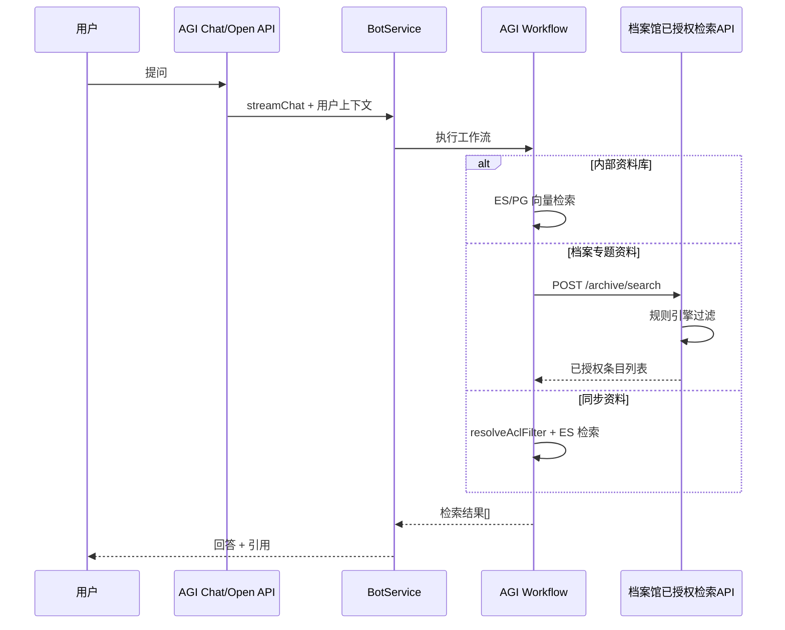

# 档案条级权限设计方案

| 项目 | 说明 |
|------|------|
| 文档版本 | v1.4 |
| 日期 | 2026-06-18 |
| 适用场景 | 数字档案馆专题资料接入 AGI 问答/编研流程后的记录级权限控制 |
| 关联文档 | [档案专题资料接入 AGI 方案](./archive-knowledge-base-design.md)、[数字档案馆集成设计](./digital-archive-integration-design.md)、[开放 API 对接指南](../open-api-integration-guide.md) |

---

## 术语约定

| 术语 | 含义 |
|------|------|
| **专题** | 数字档案馆中的一个编研/汇编主题对象，对应 `theme` |
| **专题资料** | 专题下的一条资料，对应 `theme_material` |
| **挂接档案** | 被专题资料引用的案卷/条目/附件 |
| **专题问答入口** | AGI 侧的 Bot / 工作流 / Open API 调用入口 |
| **入口授权** | AGI 侧对专题问答入口的可用性控制，如 `agi_asset_grant`、Bot / 应用授权 |
| **档案馆检索 API** | 数字档案馆提供的已授权检索接口 |
| **HTTP 连接器委托检索** | AGI 通过 `HTTP_TOOL` + 连接器调用档案馆检索 API |

## 1. 文档目的

说明在 AGI 专题问答/编研场景下，如何实现 **档案条级权限**（案卷 / 条目 / 附件粒度），以及与现有 **入口授权** 的分工关系。

读者：AGI 后端开发、档案馆 BFF 开发、集成联调人员。

---

## 2. 问题定义

### 2.1 业务背景

数字档案馆专题资料包括：

- **案卷**、**条目**（目录/卡片）
- **附件**（PDF、Word 等原文）
- 每条档案带有 **记录级权限属性**
- 另有 **动态权限规则**（如某角色可查看全部档案），由档案馆规则引擎计算

### 2.2 现有能力缺口

| 层级 | 现有机制 | 粒度 |
|------|----------|------|
| 入口授权 | `agi_asset_grant` / Bot / 应用授权 | 专题问答入口 **能不能用** |
| 集成应用白名单 | `agi_integration_app_scope` | 第三方应用 **能不能调** |
| 档案记录授权 | **未完整落地** | 库内 **某条档案能不能看** |

当前平台内置检索能力不负责档案条级过滤。

### 2.3 设计目标

1. 与档案馆权限 **语义一致**，尤其动态规则、角色「看全部」等场景。
2. **不在 AGI 复制** 档案馆完整规则引擎（`AuthorityRuleManageService`、多 Voter 组合）。
3. 与通用工作流平台定位一致：业务权限留在档案馆，AGI 通过 **HTTP 连接器 / 元数据过滤** 接入。
4. 支持 **混合资料**：规范类文档走库级授权；专题档案走条级授权。

---

## 3. 两层权限模型

```text
┌─────────────────────────────────────────────────────────┐
│ 第一层：入口授权（已实现）                                │
│ agi_asset_grant + agi_integration_app_scope              │
│ 回答问题：用户/应用能不能使用这个专题问答入口/智能体？    │
└──────────────────────────┬──────────────────────────────┘
                           │ 通过
┌──────────────────────────▼──────────────────────────────┐
│ 第二层：档案记录授权（本方案）                            │
│ 开放程度/范围、密级、全宗、部门 + 档案馆规则引擎           │
│ 回答问题：库里的这条案卷/条目/附件用户能不能看？           │
└─────────────────────────────────────────────────────────┘
```

### 3.1 职责划分

| 系统 | 职责 |
|------|------|
| **数字档案馆** | 档案主数据、记录级权限、规则引擎、档案馆检索 API |
| **AGI 平台** | 入口授权、工作流编排、引用展示、可选 ACL 快照过滤 |
| **档案馆 BFF** | 用户身份透传、两侧权限串联、API Key 保管 |

### 3.2 第一层：入口授权（已有）

| 检查点 | 实现 |
|--------|------|
| 用户能否使用专题问答入口 | 现有 `agi_asset_grant` / Bot / 应用授权能力 |
| 第三方应用能否调用 | `IntegrationAppScopeService` 白名单 |
| 身份上下文来源 | JWT 或 `X-AGI-User-Id`、`X-AGI-Unit-Id`、`X-AGI-Department-Ids`、`X-AGI-Role-Ids` |

**只管「能不能使用这个入口」，不管专题资料里的每条档案。**

### 3.3 第二层：档案记录授权（本方案）

权限字段来源：

| 来源 | 说明 |
|------|------|
| 条目固有属性 | 公开程度、开放范围、密级、全宗、归档部门 |
| 规则引擎计算 | `AuthorityRuleManageService`、`DeptVoter`、`FgldVoter`、`RoleVoter` 等 |
| 动态规则 | 「某角色可看全部档案」—— **必须在档案馆侧计算** |

---

## 4. 权限数据模型

### 4.1 文档与档案的对应关系

```text
知识库
  sourceType: INTERNAL | ARCHIVE_THEME | ARCHIVE_SYNC

  └── 文档（一条档案业务对象 = 一个 document）
        sourceType: ARCHIVE_VOLUME | ARCHIVE_ITEM | ARCHIVE_ATTACHMENT
        externalId: 档案馆侧业务 ID
        metadata: { 业务字段 + 权限字段 }
        acl_snapshot: 入库时权限快照

        └── 切片 (chunk)
              acl_snapshot: 检索过滤用（与 document 权限子集一致）
```

| sourceType | 业务对象 | 向量化内容 |
|------------|----------|------------|
| `ARCHIVE_VOLUME` | 案卷 | 案卷级目录信息 |
| `ARCHIVE_ITEM` | 条目 | 题名、档号、密级、归档部门等拼成文本 |
| `ARCHIVE_ATTACHMENT` | 附件原文 | PDF/Word 解析后的正文切片 |

### 4.2 权限字段映射（档案馆 → AGI）

| 档案馆 ES 字段 | 含义 | AGI metadata / acl 键 |
|----------------|------|------------------------|
| `efile_idx.kfcd` | 公开程度 | `kfcd` |
| `efile_idx.kffw` | 开放范围 | `kffw` |
| `efile_idx.mj` | 密级 | `mj` |
| `efile_idx.zxfw` | 知悉范围 | `zxfw` |
| `efile_idx.unitid` | 全宗 | `unitId` |
| `efile_idx.DEPTID` | 归档部门 | `archiveDeptId` |
| `efile_idx.deptId` | 部门/分管领导权限 | `deptId` |
| `efile_idx.libcode` | 档案门类 | `libcode` |
| `efile_idx.status` | 状态 | `status` |
| `efile_idx.attr` | 应用权限（0=全文，1=目录） | `attr` |
| `efile_idx.fileid` | 文件 ID 权限 | `fileId` |
| `efile_idx.CREATOR` | 创建者 | `creator` |

业务字段（档号 `dh`、题名 `title` 等）用于检索与引用，不直接参与 ACL 判断。

### 4.3 建议存储扩展

**`agi_knowledge_document`：**

```text
source_type          ARCHIVE_VOLUME | ARCHIVE_ITEM | ARCHIVE_ATTACHMENT | TEXT_DOCUMENT
external_id          档案馆业务对象 ID
external_parent_id   父条目 ID（附件挂条目）
metadata             JSONB  业务 + 权限字段
acl_snapshot         JSONB  入库时权限快照
last_synced_at       最近同步时间
```

**`agi_knowledge_chunk` / ES 索引：**

```text
acl_snapshot / 扁平字段：kfcd, kffw, mj, zxfw, unitId, deptId, archiveDeptId, libcode, status, attr, fileId
```

**设计原则：** 若采用同步入库方案，入库时 **固化权限快照**；权限变更时更新快照并重索引，不在检索时实时调档案馆逐条鉴权。

---

## 5. 三种实现方案

### 5.1 方案对比

| 方案 | 数据存放 | 权限执行方 | 适用场景 |
|------|----------|------------|----------|
| **A. HTTP 连接器委托检索** | 专题资料留在档案馆 | 档案馆规则引擎 | 权限复杂、数据动态、规模大（**推荐**） |
| **B. 同步入库 + ES 过滤** | 同步到 AGI ES | AGI 按 acl 快照 filter | 规模可控、规则以字段过滤为主 |
| **C. 混合模式** | 分层存储 | 分层执行 | **生产环境默认** |

---

### 5.2 方案 A：HTTP 连接器委托档案馆检索（推荐）

专题资料 **不整批同步**（或仅同步无敏感权限的规范资料）。

#### 检索流程

```text
用户提问
  → AGI 智能体 / 知识库检索
  → 第一层：assertKnowledgeBaseUseAllowed()
  → HTTP 连接器：档案馆「已授权检索 API」
       入参：query、userId、unitId、departmentIds、roleIds、themeLibraryId
       档案馆内部：AuthorityRuleManageService + Voters 过滤
  → 返回：TopN 条目 + contentText + citation
  → AGI 引用展示
```

#### 档案馆 API 契约（示例）

```http
POST /openapi/archive/search
X-AGI-User-Id: user_001
X-AGI-Unit-Id: unit_001
X-AGI-Department-Ids: dept_a,dept_b
X-AGI-Role-Ids: archive_user

Content-Type: application/json

{
  "themeLibraryId": "theme_001",
  "query": "档案著录规范",
  "topK": 10
}
```

响应：

```json
{
  "items": [
    {
      "sourceType": "ARCHIVE_ITEM",
      "sourceId": "item_001",
      "title": "测试071706",
      "contentText": "题名：... 档号：... 密级：...",
      "metadata": {
        "dh": "004-A-2025-...",
        "kfcd": "PTSM",
        "mj": "NB"
      },
      "citation": {
        "title": "测试071706",
        "locator": "档号 004-A-2025-..."
      }
    }
  ]
}
```

#### 平台实现方式

- 工作流使用已有 **`HTTP_TOOL`** 节点 + 档案馆连接器，**不新增专用节点类型**。
- 工作流使用已有 **`HTTP_TOOL`** 节点 + 档案馆连接器直接调用检索 API。
- 对应通过连接器调用档案馆检索 API 的接入模式。

#### 优缺点

| 优点 | 缺点 |
|------|------|
| 与档案馆权限 100% 一致 | 依赖档案馆在线 |
| 动态规则、角色「看全部」无需 AGI 重写 | 向量检索在档案馆 ES 完成 |
| 无需维护 ACL 快照同步 | 延迟受档案馆 API 影响 |

---

### 5.3 方案 B：同步入库 + ES ACL 过滤

适合：专题库规模可控、需 AGI 侧高性能向量检索、权限规则 **以字段过滤为主**。

#### 入库流程

```text
档案馆增量/全量同步任务
  → 拉取条目 + 附件正文 + 权限字段
  → 写入 agi_knowledge_document（metadata + acl_snapshot）
  → 切分 → 向量化 → ES upsert（含 acl 扁平字段）
```

#### 检索流程

```text
用户提问 + context(userId, unitId, departmentIds, roleIds)
  → 第一层：assertKnowledgeBaseUseAllowed()
  → 第二层：resolveAclFilter(context)
       方式 1（推荐）：调档案馆 API 返回 ES filter 条件
       方式 2：AGI 本地简化规则（仅全宗/密级/开放程度等）
  → ES 查询：
       bool.filter: [ knowledgeBaseId, enabled, ...aclFilters ]
       script_score: cosineSimilarity(embedding)
  → 返回 TopN
```

#### ES 查询示例

```json
{
  "query": {
    "script_score": {
      "query": {
        "bool": {
          "filter": [
            { "term": { "knowledgeBaseId": "kb_archive_theme_001" } },
            { "term": { "enabled": true } },
            { "term": { "unitId": "fonds_001" } },
            { "terms": { "kfcd": ["PTSM", "FMGK"] } }
          ]
        }
      },
      "script": {
        "source": "cosineSimilarity(params.queryVector, 'embedding') + 1.0",
        "params": { "queryVector": [] }
      }
    }
  }
}
```

#### `resolveAclFilter` 两种实现

| 方式 | 说明 | 适用 |
|------|------|------|
| **委托档案馆** | `POST /openapi/archive/acl-filter`，入参用户上下文，返回 ES filter JSON | 规则复杂但可服务端化 |
| **AGI 本地简化** | 根据 context 的 unitId、roleIds 映射固定 filter | 规则简单、可字段化 |

#### 同步与权限变更

| 事件 | 处理 |
|------|------|
| 条目删除 | 软删 document，禁用 chunk |
| 权限变更 | 更新 `acl_snapshot`，重索引 ES |
| 附件更新 | 重解析、重切片、重向量化 |

#### 优缺点

| 优点 | 缺点 |
|------|------|
| AGI 侧检索性能好 | 无法完整复刻多 Voter 组合、`buildCompleteWhereSql()` |
| 可离线检索 | 权限变更有同步延迟 |
| 与现有 ES 向量链路一致 | 需维护同步任务与重索引 |

---

### 5.4 方案 C：混合模式（推荐生产落地）

| 资料类型 | 存储 | 条级权限 |
|----------|------|----------|
| 规范、制度、编研背景知识 | AGI 内部资料库 | 仅第一层入口授权 |
| 档案专题资料（动态、细粒度） | 档案馆 ES / 检索 API | 方案 A，档案馆规则引擎 |
| 用户选定若干条档案编研 | 运行时按 ID 拉取 + 临时切片 | 档案馆按 ID 鉴权 |
| 高频稳定专题（可选） | 增量同步 AGI + ACL 快照 | 第一层 + 方案 B |

**默认决策：专题资料不整批同步，优先方案 A。**

---

## 6. 端到端查询链路

### 6.1 智能体对话



### 6.2 开放 API 调用

调用方必须透传身份上下文：

```http
X-AGI-App-Code: digital-archive
X-AGI-Api-Key: ***
X-AGI-User-Id: user_001
X-AGI-Unit-Id: unit_001
X-AGI-Department-Ids: dept_a,dept_b
X-AGI-Role-Ids: archive_user,archive_admin
```

```http
POST /api/open/knowledge-bases/{id}/search
Content-Type: application/json

{ "query": "开放档案著录要求", "topK": 5 }
```

检索内部依次执行：**集成应用白名单 → 入口授权 → 条级权限（HTTP 连接器委托或 ACL filter）**。

### 6.3 按 ID 拉取（编研场景）

用户选定具体档案条目编研时：

```text
AGI 工作流 HTTP_TOOL
  → POST /openapi/archive/items/batch-get
  → 入参：itemIds + 用户上下文
  → 档案馆：逐条鉴权后返回正文
  → AGI：临时切片 / 直接送 LLM
```

条级权限在 **档案馆按 ID 鉴权** 完成，AGI 不缓存未授权内容。

---

## 7. 同步策略（方案 B）

| 同步方式 | 说明 |
|----------|------|
| `HTTP_CONNECTOR` | 不同步入库，每次通过连接器调档案馆 API |
| `INCREMENTAL` | 按 `lastModified` 增量同步条目与权限快照 |
| `FULL` | 全量重建（专题资料初始化或权限模型变更） |

---

## 8. 与现有模块的关系

| 模块 | 条级权限中的角色 |
|------|------------------|
| 入口授权能力 | 不变，继续管 Bot / 应用入口可用范围 |
| 工作流编排 | 负责调用 `HTTP_TOOL`、透传身份、组装结果 |
| `KnowledgeRetrievalFilters` | 可承载调用方传入的 `securityLevelAllowed` 等；**非**自动用户 ACL |
| `ElasticsearchVectorStoreClient` | 扩展：`search` 支持 `aclFilters` |
| `HTTP_TOOL` + 连接器 | 方案 A 实现载体 |
| 智能编研 | 专题资料 = 外部语料；规范资料 = 内部资料库 |

---

## 9. 实施路线

| 阶段 | 内容 | 优先级 |
|------|------|--------|
| **P0** | 档案馆提供「已授权检索 API」；AGI 工作流接入 `HTTP_TOOL` | 高 |
| **P1** | 知识库/文档表扩展 `sourceType`、`metadata`、`externalId`、`acl_snapshot` | 高 |
| **P2** | ES ACL 字段 + `resolveAclFilter`（方案 B） | 中 |
| **P3** | 增量同步任务、权限变更重索引 | 中 |
| **P4** | 管理端专题绑定、同步状态展示 | 低 |

### 9.1 关键决策

| 问题 | 建议 |
|------|------|
| 专题资料要不要整批同步进 AGI？ | **默认不要**；优先方案 A / 混合 C |
| 记录级权限谁计算？ | **档案馆规则引擎** |
| 入口授权还要吗？ | **要**；管“能不能用这个专题问答入口” |
| 规范类文档放哪？ | AGI 内部资料库，无条级档案权限 |
| 复杂角色规则放哪？ | **不搬到 AGI** |

---

## 10. 验收清单

### 方案 A（HTTP 连接器委托）

- [ ] 无库权限用户调检索 → 403（第一层）
- [ ] 有库权限但档案馆判定无条权限 → 结果为空或档案馆 403
- [ ] 有库权限且档案馆返回条目 → AGI 正常展示引用
- [ ] 角色「看全部」仅由档案馆规则生效，AGI 侧无特殊逻辑
- [ ] 档案馆不可用时，`HTTP_TOOL` 检索失败可感知（不静默返回全库）

### 方案 B（SYNC + ACL）

- [ ] 入库后 ES 文档含 acl 扁平字段
- [ ] 权限变更后重索引，检索结果随之变化
- [ ] `resolveAclFilter` 与档案馆 filter API 结果一致（抽样对比）
- [ ] 不同 unitId / 密级用户检索结果不同

### 通用

- [ ] Open API 未传 `X-AGI-User-Id` 时行为符合约定
- [ ] 内部规范库不受条级 ACL 影响

---

## 11. 实现现状说明

截至文档编写时：

| 能力 | 状态 |
|------|------|
| 入口级 `agi_asset_grant` | ✅ 已实现 |
| 文档 `metadata` / `securityLevel` 字段 | ✅ 部分已有 |
| `KnowledgeRetrievalFilters.securityLevelAllowed` | ✅ 调用方显式过滤，非自动 ACL |
| `HTTP_TOOL` 委托档案馆检索 | ✅ 可直接落地 |
| `resolveAclFilter` + ES ACL filter | ❌ 设计稿，待 P2 |
| 增量同步 + acl_snapshot 重索引 | ❌ 设计稿，待 P3 |

---

## 12. 方案 A 实现过程

方案 A 的核心：**专题资料留在档案馆，AGI 只做入口授权 + HTTP 委托检索 + 结果标准化**。不新增工作流节点类型，使用已有 `HTTP_TOOL` + 连接器。

### 12.1 总体分工

```text
阶段 1  档案馆提供「已授权检索 API」
阶段 2  AGI 注册连接器与操作
阶段 3  配置专题检索参数与连接器
阶段 4  工作流 / 智能体接入检索链路
阶段 5  开放 API / 对话端透传身份上下文
阶段 6  联调与验收
```

### 12.2 阶段 1：档案馆侧（前置条件）

#### 1.1 提供已授权检索接口

```http
POST /openapi/archive/search
X-User-Id / X-Unit-Id / X-Department-Ids / X-Role-Ids  （按档案馆规范）

{
  "themeLibraryId": "theme_001",
  "query": "档案著录规范",
  "topK": 10
}
```

**档案馆内部必须完成：**

- 解析调用方身份（userId、unitId、departmentIds、roleIds）
- 执行 `AuthorityRuleManageService` + Voters 过滤
- 在档案馆 ES/DB 上完成向量或关键词检索
- **仅返回当前用户有权查看的条目**

详细过程见 [§12.2.1](#1221-档案馆内部已授权检索流水线)。

#### 1.2 统一响应结构

```json
{
  "items": [
    {
      "sourceType": "ARCHIVE_ITEM",
      "sourceId": "item_001",
      "title": "题名",
      "contentText": "可送 LLM 的拼接正文",
      "metadata": { "dh": "档号", "kfcd": "PTSM", "mj": "NB" },
      "citation": { "title": "题名", "locator": "档号 xxx" }
    }
  ]
}
```

#### 1.3 可选：按 ID 批量获取（编研场景）

```http
POST /openapi/archive/items/batch-get
{ "itemIds": ["item_001"], "themeLibraryId": "theme_001" }
```

用于用户选定条目后编研，档案馆逐条鉴权。

### 12.2.1 档案馆内部已授权检索流水线

方案 A 的「已授权检索 API」不是普通全文搜索，而是 **带身份上下文的权限内检索**。AGI 只接收 **已经过滤后的 TopN**，不在 AGI 侧再做条级判断。

#### 总体流水线

```text
POST /openapi/archive/search
        │
        ▼
┌───────────────────┐
│ 1. 解析调用方身份   │  userId / unitId / departmentIds / roleIds
└─────────┬─────────┘
          ▼
┌───────────────────┐
│ 2. 构建安全上下文   │  ArchiveSecurityContext
└─────────┬─────────┘
          ▼
┌───────────────────┐
│ 3. 规则引擎       │  AuthorityRuleManageService + Voters
│    生成权限约束     │  → SQL WHERE / ES bool.filter
└─────────┬─────────┘
          ▼
┌───────────────────┐
│ 4. 检索执行       │  ES/DB：权限 filter AND 业务 filter AND 检索
└─────────┬─────────┘
          ▼
┌───────────────────┐
│ 5. 结果裁剪       │  attr 目录/全文、敏感字段脱敏、组装 contentText
└─────────┬─────────┘
          ▼
     仅返回有权条目 items[]
```

与 AGI 的分工：

```text
AGI 第一层：入口授权 → 能不能使用这个专题问答入口
档案馆第二层：AuthorityRuleManageService → 库里哪几条能看
```

---

#### 步骤 1：解析调用方身份

**请求来源**

| 来源 | 典型头/体 | 说明 |
|------|-----------|------|
| AGI 直连 | `X-AGI-User-Id`、`X-AGI-Unit-Id` 等 | Open API BFF 透传 |
| 档案馆 BFF | Session / 内部 JWT | BFF 从登录态取身份，可不信任 AGI 头 |

**生产推荐**：API 入口在 **档案馆 BFF**，身份以档案馆 session 为准；AGI 传的 userId 仅作审计对照，不作为唯一信任源。

**四个字段含义**

| 字段 | 档案馆用途 |
|------|------------|
| **userId** | 查用户表、创建人权限、个人可见范围、审计 |
| **unitId** | 全宗/单位范围，对应 `efile_idx.unitid` |
| **departmentIds** | 归档部门、分管部门，供 `DeptVoter` / `FgldVoter` |
| **roleIds** | 档案员、分管领导、馆领导等，供 `RoleVoter`；「看全部」靠角色 |

**缺字段策略（建议约定）**

| 缺失 | 建议处理 |
|------|----------|
| userId | 401，无法审计、无法算个人权限 |
| unitId | 从用户主组织补全，补不出则 403 |
| departmentIds / roleIds | 从 organization-service 按 userId 实时补全，不假设 AGI 永远传全 |

**构建内部安全上下文**

```text
ArchiveSecurityContext {
  userId
  unitId / fondsId
  departmentIds[]
  roleIds[]
  maxSecurityLevel      // 用户可看的最高密级
  themeLibraryId        // 本次检索专题库范围
  clientAppId           // 如 digital-archive / agi
}
```

后续规则引擎和 Voter **只认此对象**，不再散落读 HTTP 头。

---

#### 步骤 2：AuthorityRuleManageService + Voters

档案馆已有权限核心，**AGI 不重写**。

**两类权限来源**

| 类型 | 说明 | 示例 |
|------|------|------|
| 条目固有属性 | 存在 ES/DB 每条记录上 | kfcd、kffw、mj、unitId、archiveDeptId |
| 动态规则 | 规则表 + 引擎计算 | 角色看全部、借阅单、编研项目临时授权 |

**条目固有属性（`efile_idx`）**

| 字段 | 含义 | 典型作用 |
|------|------|----------|
| kfcd | 公开程度 | 控制开放/控制/未开放 |
| kffw | 开放范围 | 馆内/单位内/社会开放等 |
| mj | 密级 | 与用户密级权限比对 |
| zxfw | 知悉范围 | 知悉人范围 |
| unitId | 全宗 | 是否属于用户单位 |
| archiveDeptId | 归档部门 | 部门可见性 |
| deptId | 分管部门 | 分管领导可见 |
| libcode | 门类 | 按门类授权 |
| status | 状态 | 在库/借出/销毁等 |
| attr | 0 全文 / 1 目录 | 返回时裁剪正文 |
| fileId | 文件级权限 | 附件是否可看 |
| creator | 创建人 | 本人创建可见 |

**AuthorityRuleManageService 职责**

```text
输入：ArchiveSecurityContext + 检索场景（SEARCH / BATCH_GET / THEME_LIBRARY）
输出：PermissionConstraint
        ├── sqlFragment / esFilters[]     // 给检索层用
        ├── skipPermissionCheck: false   // 仅超级管理员可为 true
        └── postFilters[]               // 少数需内存二次判断的规则
```

内部典型步骤：

1. 加载该用户生效的规则集（角色规则、部门规则、专题库规则、临时授权）
2. 调用各 **Voter** 投票，合并 allow/deny
3. 调用 `buildCompleteWhereSql()`（或 ES 等价物）生成 **完整过滤条件**
4. 与 `themeLibraryId` 业务范围合并（只查该专题库下的条目）

**Voters 分工**

| Voter | 判断什么 | 例子 |
|-------|----------|------|
| **RoleVoter** | 角色 | `archive_admin` 可看全馆；`archive_user` 仅开放条目 |
| **DeptVoter** | 部门 | 用户部门 ∈ 条目归档部门或知悉范围 |
| **FgldVoter** | 分管领导 | 用户是某部门分管领导 → 该部门档案可见 |

投票合并（与现有馆业务保持一致）：

```text
最终可见 = (条目固有属性满足基线规则)
         AND (至少一个 Voter 允许 OR 存在显式授权)
         AND NOT (任一 Voter 明确拒绝)
```

「某角色看全部档案」= **RoleVoter 返回通配 allow**，生成极宽的 filter（或仅限该专题库的 `skipPermissionCheck`），而不是 AGI 传特殊参数。

**生成 ES / SQL 过滤条件**

`buildCompleteWhereSql()` 在 ES 场景对应 **bool.filter**：

```json
{
  "bool": {
    "filter": [
      { "term": { "themeLibraryId": "theme_001" } },
      { "term": { "unitId": "fonds_001" } },
      { "terms": { "kfcd": ["PTSM", "FMGK"] } },
      { "range": { "mj_level": { "lte": 2 } } },
      { "terms": { "archiveDeptId": ["dept_a", "dept_b"] } }
    ],
    "must_not": [
      { "term": { "status": "DESTROYED" } }
    ]
  }
}
```

要点：

- **权限 filter 与 query 在同一请求里**，先 filter 再算相关性
- 禁止「先搜 topK 再代码里 if 判断权限」——会泄露存在性、性能差、易漏

---

#### 步骤 3：在 ES/DB 上执行检索

**推荐：权限内检索（filter + search）**

```text
1. themeLibraryId 限定专题库索引/表
2. 叠加 AuthorityRuleManageService 输出的 esFilters
3. 叠加用户 query：
     - 关键词：multi_match 题名、档号、正文
     - 向量：knn / script_score + 同一 bool.filter
4. topK 排序后取结果

有效查询 = 业务范围(themeLibraryId)
         ∩ 权限约束(Voters 产出)
         ∩ 检索相关度(query)
```

**两种实现形态**

| 形态 | 做法 | 适用 |
|------|------|------|
| ES 一体化 | 权限字段已在 `efile_idx`，filter + knn 一次完成 | 专题库已建 ES 索引 |
| DB 先筛 ID | SQL 带权限 WHERE 得 id 列表，再 ES mget / 二次检索 | 权限逻辑强依赖关系库 |

无论哪种，**权限必须在检索前进入**，不是检索后过滤。

**attr 与正文裁剪**

| attr | 行为 |
|------|------|
| 0 | 可返回 `contentText` 全文片段 |
| 1 | 仅目录级 → `contentText` 只含题名、档号、密级等，不含附件正文 |

在档案馆组装响应时完成；AGI 拿到的已是合规文本。

---

#### 步骤 4：仅返回有权条目

**进入 `items[]` 的条件**

1. 属于请求的 `themeLibraryId`
2. 通过 AuthorityRuleManageService + 全部生效 Voters
3. 用户密级 ≥ 条目密级（或规则允许跨密级）
4. 条目状态允许检索（未销毁、未封存等）
5. 若有临时借阅/审批授权，在有效期内

**不应出现**：无权限条目占位、标题可见正文为空却暗示存在。

**响应组装**

对每条通过权限的命中记录返回统一结构（见 §12.2 阶段 1.2）。注意：

- `metadata` 可含权限字段供 AGI 展示标签，**不要**返回无权限附件下载地址
- 附件级权限：若只有目录权，不要带 `fileId` 可下载链接

**边界行为**

| 场景 | 档案馆应返回 |
|------|--------------|
| 用户无任何条权限 | `items: []`，HTTP 200 |
| 用户无专题库权限 | 403 或 `items: []`（与现有馆系统一） |
| 身份无效 | 401 |
| 命中但 attr=目录 | 有条目，contentText 仅目录信息 |
| 超级管理员/全库角色 | 宽 filter，仍受密级/法规底线约束 |

---

#### 为何不能放到 AGI 做

| 能力 | 档案馆 | AGI |
|------|--------|-----|
| RoleVoter「看全部」 | ✅ 实时 | ❌ 无法静态 filter |
| 借阅/审批临时授权 | ✅ 业务库 | ❌ 无数据 |
| `buildCompleteWhereSql` 多表关联 | ✅ 已有 | ❌ 未实现 |
| 密级与法规组合规则 | ✅ | ❌ |

方案 B 用 `acl_snapshot` 只能近似**字段型**规则；**方案 A 就是为了把上述能力留在档案馆**。

---

#### 档案馆开发 checklist

- [ ] API 入口校验身份，构建 `ArchiveSecurityContext`
- [ ] 缺省字段能从 organization-service / auth-service 补全
- [ ] 检索前调用 `AuthorityRuleManageService`，不走「先搜后滤」
- [ ] Voters（Role / Dept / Fgld）结果合并规则与现有馆业务一致
- [ ] ES/SQL 查询带完整权限 filter + themeLibraryId
- [ ] 按 `attr` 裁剪 `contentText`
- [ ] 响应不含无权限附件链接
- [ ] 审计：userId、query、返回条数、themeLibraryId

---

### 12.3 阶段 2：AGI 连接器配置

在 **系统管理 → 连接器** 注册档案馆 API：

| 字段 | 示例 |
|------|------|
| code | `archive_platform` |
| baseUrl | `http://archive-api:8080` |
| 认证 | `NONE` / `API_KEY` / 按档案馆要求 |

注册操作：

| operationCode | method | path | 说明 |
|---------------|--------|------|------|
| `archive_search` | POST | `/openapi/archive/search` | 已授权检索 |
| `archive_batch_get` | POST | `/openapi/archive/items/batch-get` | 按 ID 拉取（可选） |

**身份透传方式（二选一）：**

| 方式 | 说明 |
|------|------|
| **A. 工作流变量映射** | HTTP_TOOL `inputMapping` 把 `userId`、`unitId` 等写入请求头/体 |
| **B. 档案馆 BFF 网关** | 连接器 baseUrl 指向 BFF，由 BFF 从 session 补全身份 |

推荐生产环境用 **B**：连接器调档案馆 BFF，BFF 持有用户 session，AGI 只传 `themeLibraryId` + `query`。

---

### 12.4 阶段 3：配置 Bot / 工作流检索参数

在 AGI 管理台的 Bot / 工作流配置中维护专题检索参数：

| 配置项 | 值 | 说明 |
|--------|-----|------|
| `connectorCode` | `archive_platform` | 绑定档案馆连接器 |
| `operationCode` | `archive_search` | 对应已授权检索操作 |
| `themeLibraryId` | `theme_001` | 专题范围 |
| `defaultTopK` | `10` | 默认返回条数 |

建议工作流参数结构：

```json
{
  "sourceType": "ARCHIVE_THEME",
  "connectorCode": "archive_platform",
  "operationCode": "archive_search",
  "themeLibraryId": "theme_001",
  "defaultTopK": 10
}
```

若需要控制“哪些人能用这个 Bot/流程”，继续使用现有 Bot/应用授权能力。

---

### 12.5 阶段 4：工作流接入

#### 做法 1：纯 HTTP_TOOL 工作流（**当前即可落地，无需改引擎**）

```text
START
  → HTTP_TOOL（连接器 archive_platform.archive_search）
       inputMapping:
         themeLibraryId: theme_001
         query: {{message}}
         topK: 10
         userId: {{userId}}
         unitId: {{activeUnitId}}
       outputKey: archiveResults
  → LLM
       userPrompt: 用户问题：{{message}}\n\n参考档案：\n{{archiveResults.data.items}}
  → END
       output: answer
```

条级权限在档案馆 API 内完成；AGI 侧仅负责把用户身份透传给工作流。

使用 `HTTP_TOOL` 直接调用连接器即可，无需扩展 `KnowledgeBaseService` / `KNOWLEDGE_RETRIEVAL` 内核。

---

### 12.6 阶段 5：智能体与开放 API

#### 5.1 智能体绑定

```text
Bot
  └── 默认工作流（含 HTTP_TOOL）
```

对话时 `ChatGatewayService` 已将 `userId`、`activeUnitId`、`departmentIds` 等注入工作流 `executionInput`（见 `BotService.executionInput`）。

#### 5.2 开放 API

```http
POST /api/open/bots/{botId}/chat/sessions/{sessionId}/messages/stream
X-AGI-App-Code: digital-archive
X-AGI-Api-Key: ***
X-AGI-User-Id: u_001
X-AGI-Unit-Id: unit_001
X-AGI-Department-Ids: dept_a
X-AGI-Role-Ids: archive_user
```

链路：

```text
Open API 鉴权（集成应用白名单）
  → Bot 运行工作流
  → HTTP 调档案馆已授权检索（条级）
  → 流式返回回答 + 引用
```

#### 5.3 身份上下文传递清单

| 变量 | 来源 | 档案馆用途 |
|------|------|------------|
| userId | JWT / X-AGI-User-Id | 用户身份 |
| unitId / activeUnitId | JWT / X-AGI-Unit-Id | 全宗/单位范围 |
| departmentIds | JWT / X-AGI-Department-Ids | 部门 Voter |
| roleIds | JWT / X-AGI-Role-Ids | 角色 Voter |

工作流透传身份上下文时，应确保同时传入 `userId`、`unitId`、`departmentIds`、`roleIds`。

---

### 12.7 阶段 6：结果映射与引用展示

档案馆 `items[]` → AGI 内部结构：

| 档案馆字段 | AGI `KnowledgeSearchResult` |
|-----------|----------------------------|
| contentText | content |
| title | documentName / sourceTitle |
| sourceId | metadata.sourceId |
| metadata.dh | citation.locator |
| citation | SSE citation 卡片 |

`ChatSseEventSupport` / `WorkflowStreamCitationSupport` 已有 `sourceType: KNOWLEDGE` 引用事件，HTTP 检索结果映射后可直接复用。

---

### 12.8 阶段 7：联调与验收

| 步骤 | 操作 | 预期 |
|------|------|------|
| 1 | 无 Bot/应用权限用户检索 | 403 |
| 2 | 有库权限、档案馆判定无条权限 | items 为空 |
| 3 | 有库权限、档案馆返回条目 | AGI 正常回答并带档号引用 |
| 4 | 换 userId/roleIds | 结果随档案馆规则变化 |
| 5 | 档案馆 API 不可用 | 明确报错，不返回未授权全文 |
| 6 | Open API 缺 X-AGI-User-Id | 按接口约定 400/403 |

---

### 12.9 实施任务拆分（AGI 开发）

| 任务 | 说明 | 依赖 |
|------|------|------|
| T1 | Bot / 工作流参数约定文档化 + 管理端表单 | 无 |
| T2 | 工作流 `HTTP_TOOL` 输入/输出模板 | 档案馆 API |
| T3 | 连接器调用复用（可选抽 `ConnectorInvocationService`） | 已有 HttpToolNodeExecutor |
| T4 | 返回结果映射 metadata/citation | T2 |
| T5 | 身份上下文透传补齐 `roleIds` | 无 |
| T6 | 演示工作流 + Bot 样例（Bootstrap） | T1 |

**可立即演示的子集（不改引擎）：** 仅完成 T1 配置约定 + 用 **HTTP_TOOL 工作流** 调连接器（参考「连接器演示助手」模式）。

---

### 12.10 与方案 B 的边界

| 项 | 方案 A | 方案 B |
|----|--------|--------|
| 向量索引 | 在档案馆 | 在 AGI ES |
| 条级权限 | 档案馆实时计算 | acl_snapshot + filter |
| 离线检索 | 不支持 | 支持 |
| 实现复杂度 | 低（优先 HTTP 委托） | 高（同步 + 重索引） |

**默认先 A，确有离线/性能需求再对稳定专题库启用 B。**

---

## 13. 专题资料知识问答方案

> **完整设计已独立成文**：[专题资料知识问答设计方案](./archive-theme-qa-design.md)（含 `theme_search_idx`、`ARCHIVE_REF` 从 `efile_idx` 拷贝正文与向量的实现、两种方案对比、API 与 AGI 接入）。

本节保留摘要；细节以专篇为准。

### 13.1 现状与目标

| 组成部分 | 存储 | 全文/向量索引 |
|----------|------|----------------|
| ① 专题名称 + 正文 | 档案馆 DB（`theme` 表） | ❌ 暂无 |
| ② 挂接档案（案卷/文件） | 档案馆 DB + `efile_idx` | ✅ 已有 |
| ③ 手工录入资料 | 档案馆 DB（`theme_material`） | ❌ 暂无 |

| 已有 | 缺口 |
|------|------|
| 专题、专题资料、档案均在数字档案馆 | 专题维度 **无统一检索入口** |
| `efile_idx` 档案全文 + 向量 | ①③ 无法仅靠 `efile_idx` 覆盖 |
| 权限、规则引擎在档案馆 | AGI 需问答，但不复制 Voters |

**目标**：用户对「某个专题」提问 → 答案综合 **① 专题说明 + ② 有权查看的挂接档案 + ③ 有权查看的手工资料** → 带引用。

### 13.2 两种实现方案对比

| 维度 | **方案一：统一专题检索索引** | **方案二：分层三路合并** |
|------|------------------------------|--------------------------|
| ES 改造 | 新建 `theme_search_idx`，三类资料统一入索引 | 复用 `efile_idx.themeIds` + DB 读专题 + 新建 `theme_manual_idx`（仅手工资料） |
| 检索次数 | **1 次** ES（`filter themeId + query`） | **2～3 路** 并行后合并排序 |
| ① 专题正文 | `TOPIC_PROFILE` 文档，可向量检索 | DB 固定返回 `theme.summary` 注入 LLM；长专题无法按问检索段落 |
| ② 挂接档案 | `ARCHIVE_REF` 拷贝 `efile_idx` 正文+向量 | `efile_idx` 打 `themeIds`，直接搜原索引 |
| ③ 手工资料 | `TOPIC_MATERIAL` 入 `theme_search_idx` | `theme_manual_idx` 独立小索引 |
| 权限 | 专题 ACL + 档案 Voters，在统一召回后鉴权 | 三路分别鉴权后 merge |
| 改造量 | 中（一个新 index + 入专题流水线） | 小（不动 `efile_idx` 结构，仅 append 字段 + 小 index） |
| 检索质量 | **高**（统一向量空间、统一 topK） | 中（三路分数需归一化，专题正文不参与向量召回） |
| 适用 | **生产默认、三类资料都要 RAG** | 快速上线、专题正文较短、手工资料量不大 |

**AGI 侧两种方案相同**：通过 `HTTP_TOOL` + 连接器调用档案馆 **同一个** `POST /openapi/archive/theme/search`，不在 AGI 复制数据。

---

### 13.3 方案一：统一专题检索索引（theme_search_idx，推荐）

#### 13.3.1 架构

```text
用户提问
  → AGI（Bot / 工作流）
  → POST /openapi/archive/theme/search
       档案馆内部：theme_search_idx 一次检索
         ├── TOPIC_PROFILE    ← ① 专题名称+正文
         ├── ARCHIVE_REF      ← ② 挂接档案（向量从 efile_idx 拷贝）
         └── TOPIC_MATERIAL   ← ③ 手工资料
       权限：专题 ACL + AuthorityRuleManageService + Voters
  → TopN items + theme 摘要
  → LLM 问答 + 引用
```

```text
Elasticsearch 集群
├── efile_idx           ← 已有，档案主索引（不改检索入口）
└── theme_search_idx    ← 新建，专题问答专用
      ├── TOPIC_PROFILE
      ├── ARCHIVE_REF
      └── TOPIC_MATERIAL
```

#### 13.3.2 三类资料入索引

| docType | 对应组成部分 | 何时写入 | 正文/向量来源 |
|---------|--------------|----------|----------------|
| `TOPIC_PROFILE` | ① 专题名称+正文 | 专题保存 | 专题表 embed |
| `ARCHIVE_REF` | ② 挂接档案 | 档案加入专题 | 从 `efile_idx` **拷贝** contentText + embedding + 权限扁平字段 |
| `TOPIC_MATERIAL` | ③ 手工资料 | 手工录入/上传/修改 | 专题资料表正文 embed |

`TOPIC_PROFILE` 示例：

```json
{
  "themeId": "测试040201",
  "docType": "TOPIC_PROFILE",
  "materialId": "theme_profile",
  "title": "测试040201",
  "contentText": "专题说明正文...",
  "embedding": []
}
```

`ARCHIVE_REF` 示例：

```json
{
  "themeId": "测试040201",
  "docType": "ARCHIVE_REF",
  "materialId": "mat_001",
  "archiveObjectType": "ITEM",
  "archiveObjectId": "item_xxx",
  "title": "西配楼主体工程卷",
  "contentText": "...",
  "embedding": [],
  "mj": "HXSM",
  "unitId": "fonds_001",
  "kfcd": "PTSM"
}
```

`TOPIC_MATERIAL` 示例：

```json
{
  "themeId": "测试040201",
  "docType": "TOPIC_MATERIAL",
  "materialId": "mat_099",
  "title": "编研补充说明",
  "contentText": "手工录入正文...",
  "embedding": [],
  "mj": "NB"
}
```

#### 13.3.3 维护时机

```text
专题保存               → upsert TOPIC_PROFILE
添加/移除挂接档案      → insert/delete ARCHIVE_REF
档案正文/权限变更      → 刷新 efile_idx 同时，更新关联 ARCHIVE_REF
手工资料增删改         → upsert/delete TOPIC_MATERIAL
```

#### 13.3.4 检索

```text
filter: themeId = ?
filter: 可扁平化权限字段
knn + keyword: query
topK
→ 对 ARCHIVE_REF 候选走 AuthorityRuleManageService（§12.2.1）
→ 对 TOPIC_* 候选走专题 ACL + 密级
```

**禁止**：先查专题全部 materialId，再 terms 查 `efile_idx`。

#### 13.3.5 优缺点

| 优点 | 缺点 |
|------|------|
| 一次查询、三类统一排序 | 需新建 index + 入专题流水线 |
| 专题正文可按问检索 | `ARCHIVE_REF` 与 `efile_idx` 有冗余，需同步刷新 |
| 手工资料完整纳入 RAG | 初期开发量略高于方案二 |

---

### 13.4 方案二：分层三路合并（最小改造 efile_idx）

#### 13.4.1 架构

三类资料 **各用最适合的存储与检索方式**，由检索 API **合并结果**：

```text
POST /openapi/archive/theme/search
  │
  ├─ 路 1（① 专题正文）  DB 读取 theme.title + theme.content
  │                      → 响应 theme.summary（全文注入 LLM，不参与 ES 排序）
  │
  ├─ 路 2（② 挂接档案）  ES 查 efile_idx
  │                      filter: themeIds contains themeId
  │                      + 权限 filter + knn/keyword
  │                      → AuthorityRuleManageService 鉴权
  │
  └─ 路 3（③ 手工资料）  ES 查 theme_manual_idx（新建，仅手工资料）
                         filter: themeId + 专题 ACL + knn/keyword
  │
  └─ 合并：路 2 + 路 3 按 score 归一化后取 topK，附 theme.summary
```

```text
Elasticsearch 集群
├── efile_idx              ← 已有；挂接档案入专题时 append themeIds
└── theme_manual_idx       ← 新建（体量小）；仅 ③ 手工资料

档案馆 DB
└── theme 表               ← ① 专题名称+正文，检索 API 直读
```

#### 13.4.2 三类资料处理

| 组成部分 | 存储 | 入专题/保存时 | 问答时 |
|----------|------|---------------|--------|
| ① 专题名称+正文 | `theme` 表 | 无 ES 操作 | API **固定返回** `theme.summary`；LLM 系统提示全文带入 |
| ② 挂接档案 | `efile_idx` | `themeIds: ["专题ID"]` append/remove | 单路 ES 检索 + 档案 Voters |
| ③ 手工资料 | `theme_manual_idx` | 录入时 embed 写入 | 单路 ES 检索 + 专题 ACL |

**路 2 写入示例**（`efile_idx` 原文档追加字段）：

```json
{
  "objectType": "ITEM",
  "objectId": "item_xxx",
  "themeIds": ["测试040201", "其他专题"],
  "contentText": "...",
  "embedding": []
}
```

**路 3 文档示例**（`theme_manual_idx`）：

```json
{
  "themeId": "测试040201",
  "materialId": "mat_099",
  "title": "编研补充说明",
  "contentText": "手工录入正文...",
  "embedding": [],
  "mj": "NB"
}
```

#### 13.4.3 检索 API 合并逻辑

```text
1. 校验专题级 ACL；无权限 → 403
2. 从 DB 读 theme.title、theme.content → theme.summary
3. 并行：
     futureA = searchEfileIdx(themeId, query, topK*2)
     futureB = searchManualIdx(themeId, query, topK*2)
4. futureA 结果走 AuthorityRuleManageService 过滤
5. futureB 结果走专题资料密级 + ACL 过滤
6. mergeRank(futureA, futureB, topK)  // score 归一化或 RRF
7. 返回 { theme, items[] }
```

响应示例：

```json
{
  "theme": {
    "themeId": "测试040201",
    "title": "测试040201",
    "summary": "从 DB 读取的专题全文，始终给 LLM"
  },
  "items": [
    {
      "docType": "ARCHIVE_REF",
      "sourceId": "mat_001",
      "archiveObjectId": "item_xxx",
      "title": "西配楼主体工程卷",
      "contentText": "...",
      "score": 0.88,
      "citation": { "locator": "档号 004-KJ-..." }
    },
    {
      "docType": "TOPIC_MATERIAL",
      "sourceId": "mat_099",
      "title": "编研补充说明",
      "contentText": "...",
      "score": 0.81,
      "citation": { "locator": "专题资料" }
    }
  ]
}
```

注意：`items` 中 **不含** `TOPIC_PROFILE` 类型——① 通过 `theme.summary` 单独传递。

#### 13.4.4 分数合并建议

三路中仅 ②③ 参与 ES 排序，合并常用：

- **RRF**（Reciprocal Rank Fusion）：不依赖不同 index 分数尺度
- 或 min-max 归一化后加权：`0.6 * 档案 + 0.4 * 手工`

#### 13.4.5 优缺点与局限

| 优点 | 缺点 |
|------|------|
| 不复制档案正文，② 直接复用 `efile_idx` 向量 | ① 无法按问检索专题内段落（全文塞 context） |
| 新建 index 体量小（仅手工资料） | 两路 ES + merge，实现与调参更复杂 |
| 改造 `efile_idx` 仅 append `themeIds` | 专题正文很长时占满 LLM token |
| 可分期：先上路 1+2，后补 `theme_manual_idx` | 统一 topK 质量通常不如方案一 |

**不可行做法**：仅 `efile_idx.themeIds` 而不处理 ①③——**无法覆盖专题正文与手工资料**。

---

### 13.5 方案选型建议

```text
需要三类资料都参与向量检索、专题正文较长、长期生产
  → 方案一 theme_search_idx

希望尽快上线、专题正文 < 2000 字、手工资料条数少
  → 方案二 分层合并；P0 可先 ①DB + ②themeIds，P1 再补 theme_manual_idx
```

两种方案 **对外 API 路径与 AGI 接入方式一致**（§13.8、§13.9），仅档案馆内部检索实现不同。

### 13.6 专题与档案的关联模型（共用）

专题不直接改 `efile_idx` 结构，通过 **专题资料**（`theme_material`）指针关联：

```text
efile_idx（ES，已有）              专题业务（DB）
─────────────────                  ─────────────────
案卷 / 条目 / 附件                  专题 theme
                                   └── 专题资料 theme_material（汇编列表每一行）
                                         ├── materialId
                                         ├── themeId
                                         ├── materialSourceType
                                         │     ARCHIVE_VOLUME | ARCHIVE_ITEM | ARCHIVE_ATTACHMENT | MANUAL ...
                                         ├── archiveObjectType + archiveObjectId  → 指向 efile_idx 业务主键
                                         └── title, mj, dh ...（展示冗余）
```

| 列表「文件类型」 | materialSourceType | archiveObjectId 指向 |
|------------------|--------------------|----------------------|
| 案卷 | ARCHIVE_VOLUME | 案卷 ID |
| 文件/条目 | ARCHIVE_ITEM | 条目 ID |
| 附件 | ARCHIVE_ATTACHMENT | 附件 ID |
| 手工录入/上传 | MANUAL / UPLOAD | 无，正文在专题资料自身 |

**引用档案**：专题资料 = 成员关系指针，**不复制**档案主数据；权限以 **原档案** 为准，专题 membership **不能放大** 档案权限。

**自建资料**：无 `archiveObjectId`，权限走专题资料自身密级 + 专题 ACL，不走 `efile_idx` Voter。

### 13.7 权限（两种方案共用）

```text
候选命中
    │
    ├─ docType = ARCHIVE_REF
    │       → AuthorityRuleManageService + Voters（原档案）
    │       → 专题 membership 不能放大权限
    │
    ├─ docType = TOPIC_PROFILE / TOPIC_MATERIAL（手工资料）
    │       → 专题 ACL + 资料密级 mj ≤ 用户密级
    │
    └─ 专题级入口
            → 用户能否访问该专题（编研组、单位、专题密级）
```

与 §3 两层模型关系：

```text
AGI Bot / 应用授权  → 能不能使用这个专题问答入口
档案馆专题 ACL      → 能不能进这个专题
档案馆档案规则引擎  → 挂接档案能不能看
```

### 13.8 档案馆对外 API（两种方案共用）

AGI 与开放 API **只调此接口**（可命名为 `theme_search`，与通用 `archive/search` 并存或合并）：

```http
POST /openapi/archive/theme/search
X-User-Id: user_001
X-Unit-Id: unit_001
X-Department-Ids: dept_a,dept_b
X-Role-Ids: archive_user

Content-Type: application/json

{
  "themeId": "测试040201",
  "query": "这个专题主要讲什么？西配楼工程有哪些材料？",
  "topK": 8
}
```

响应：

```json
{
  "theme": {
    "themeId": "测试040201",
    "title": "测试040201",
    "summary": "专题说明（全文或摘要）"
  },
  "items": [
    {
      "docType": "TOPIC_PROFILE",
      "sourceId": "theme_profile",
      "title": "测试040201",
      "contentText": "专题说明...",
      "score": 0.92,
      "citation": { "title": "专题说明", "locator": "专题概述" }
    },
    {
      "docType": "ARCHIVE_REF",
      "sourceId": "mat_001",
      "materialSourceType": "ARCHIVE_ITEM",
      "archiveObjectType": "ITEM",
      "archiveObjectId": "item_xxx",
      "title": "西配楼主体工程卷",
      "contentText": "...",
      "metadata": { "dh": "004-KJ-..." },
      "citation": { "title": "西配楼主体工程卷", "locator": "档号 004-KJ-..." }
    }
  ]
}
```

| 字段 | 说明 |
|------|------|
| `sourceId` | 专题资料 `materialId`；编研选材、batch-get 用此 ID |
| `archiveObjectId` | 有则「查看原文」跳档案馆档案详情（仍走原档案权限） |
| `theme.summary` | 可固定注入 LLM，短专题可不必参与向量检索 |

档案馆内部处理见 §12.2.1；**方案一**走 `theme_search_idx`，**方案二**走路 1 DB + 路 2 `efile_idx` + 路 3 `theme_manual_idx` 合并（§13.4）。

### 13.9 AGI 侧接入

#### 13.7.1 Bot / 工作流参数

```json
{
  "connectorCode": "archive_platform",
  "operationCode": "theme_search",
  "themeId": "测试040201",
  "defaultTopK": 8
}
```

+ 若需限制入口范围，继续使用现有 Bot / 应用授权能力。

连接器注册：

| operationCode | method | path |
|---------------|--------|------|
| `theme_search` | POST | `/openapi/archive/theme/search` |

#### 13.7.2 问答链路

```text
Bot 绑定专题问答工作流
  → ChatGateway 注入 userId / unitId / departmentIds / roleIds
  → HTTP_TOOL
       调 theme/search
  → LLM：

     【专题】{{theme.title}}：{{theme.summary}}

     【参考资料】
     [{{citation.locator}}] {{contentText}}
     ...

     用户问题：{{message}}
```

| 阶段 | AGI 做法 |
|------|----------|
| **P0 演示** | HTTP_TOOL 工作流 + 连接器 |
| **P1 产品化** | 将连接器、Prompt 模板、返回结果映射沉淀为可复用工作流模板 |

#### 13.7.3 与 AGI 同步字段对应（方案 B 可选）

若部分自建资料走开放接口同步进 AGI（见 [专题编研知识库数据集化改造设计文档](../专题编研知识库数据集化改造设计文档.md)）：

| 档案馆 | AGI |
|--------|-----|
| `materialId` | `source_ref_id` |
| `archiveObjectId` | `source_archive_file_id` |
| `themeId` | `topicId` / `ARCHIVE_TOPIC` 分类 |

**引用档案** 仍优先方案 A 委托检索；**仅自建、权限简单** 的资料可考虑同步入库。

### 13.10 专题正文较短时的简化（偏方案二）

若专题 `content` 通常 &lt; 2000 字，可在 **方案一** 中暂不建 `TOPIC_PROFILE` 向量，改与 **方案二** 相同：API 固定返回 `theme.summary` 注入 LLM，索引仅覆盖 ②③。

### 13.11 不推荐做法

| 做法 | 问题 |
|------|------|
| 专题档案整库同步进 AGI ES | 权限难对齐、双份索引、更新滞后 |
| 仅 `efile_idx.themeIds`，不处理 ①③ | 漏专题正文与手工资料 |
| 运行时捞专题全部 ID 再 terms 查 ES | ID 多、慢、易超限 |

### 13.12 实施分期

| 阶段 | 方案一 | 方案二 |
|------|--------|--------|
| **P0** | `ARCHIVE_REF` + `TOPIC_MATERIAL` 入 `theme_search_idx`；关键词检索 | ① DB summary + ② `efile_idx.themeIds`；手工资料暂不参与 RAG |
| **P1** | `TOPIC_PROFILE` knn；完整 Voters | 补 `theme_manual_idx`；两路 merge + RRF |
| **P2** | 档案变更异步刷新 `ARCHIVE_REF` | 同上；调 merge 权重 |

AGI 两方案 P0 均可：**HTTP_TOOL 工作流 + Bot**；P1 沉淀为可复用工作流模板。

### 13.13 结构一览

**方案一：**

```text
数字档案馆
├── DB：theme、theme_material
├── efile_idx（已有）
├── theme_search_idx（新建：TOPIC_PROFILE + ARCHIVE_REF + TOPIC_MATERIAL）
└── API：POST /openapi/archive/theme/search
```

**方案二：**

```text
数字档案馆
├── DB：theme（① 专题正文直读）
├── efile_idx（② themeIds 打标）
├── theme_manual_idx（③ 手工资料）
└── API：POST /openapi/archive/theme/search（三路合并）
```

**AGI（两方案相同）：**

```text
Bot / 工作流参数（绑 themeId）→ 入口授权 → theme/search → LLM
```

---

## 14. 相关文档

- [专题资料知识问答设计方案](./archive-theme-qa-design.md) — theme_search_idx、efile_idx 拷贝、专题问答 API
- [档案专题资料接入 AGI 方案](./archive-knowledge-base-design.md) — 数据结构与总体方案
- [专题编研知识库数据集化改造设计文档](../专题编研知识库数据集化改造设计文档.md) — 专题资料同步与 AGI 字段映射
- [数字档案馆集成设计](./digital-archive-integration-design.md) — 集成职责与 Open API
- [远程身份接入开发指南](./remote-identity-integration-guide.md) — 用户身份上下文透传
- [开放 API 对接指南](../open-api-integration-guide.md)

---

## 15. 变更记录

| 日期 | 版本 | 说明 |
|------|------|------|
| 2026-06-25 | v1.4.3 | 统一术语：专题 / 专题资料 / 专题问答入口 / 入口授权 |
| 2026-06-18 | v1.4.2 | 去除 `syncMode=RUNTIME` / RUNTIME 分支表述，统一为 `HTTP_TOOL` + 连接器方案 |
| 2026-06-18 | v1.4.1 | §13 摘要化，完整专题问答设计迁至 archive-theme-qa-design.md |
| 2026-06-18 | v1.3.1 | §13.4.4 补充 `efile_idx.themeIds` 无法覆盖专题数据的说明与折中方案 |
| 2026-06-18 | v1.3 | 新增 §13 专题库知识问答方案（theme_search_idx） |
| 2026-06-18 | v1.2 | 新增 §12.2.1 档案馆内部已授权检索流水线 |
| 2026-06-18 | v1.1 | 新增 §12 方案 A 实现过程 |
| 2026-06-18 | v1.0 | 从 archive-knowledge-base-design 拆出条级权限专篇 |
