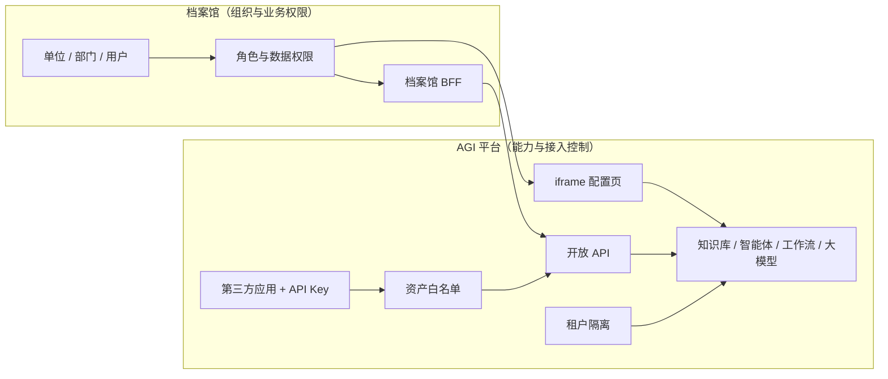
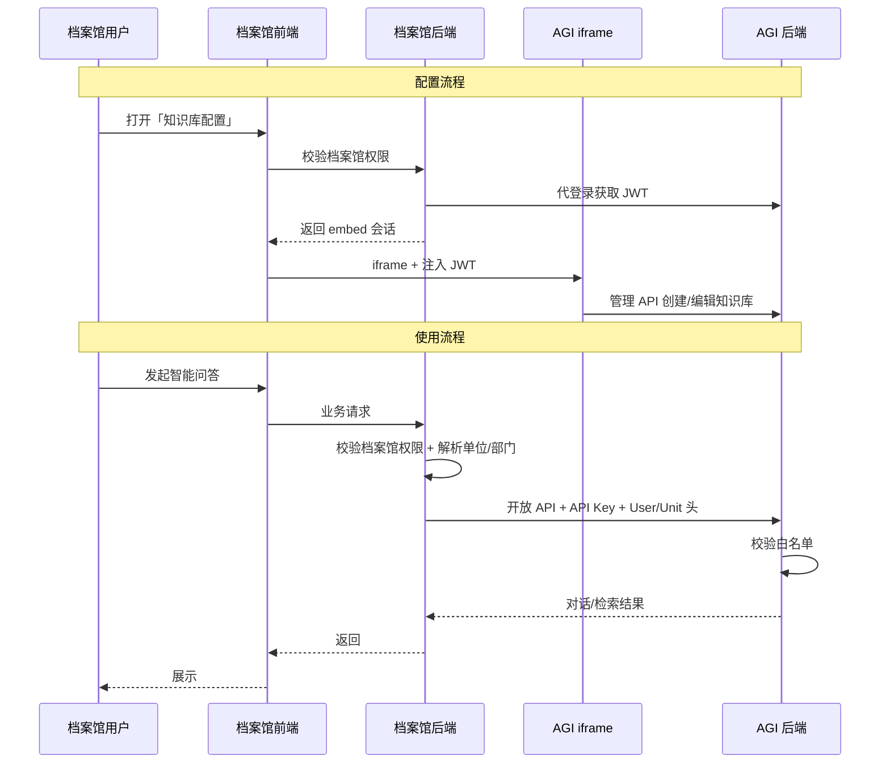
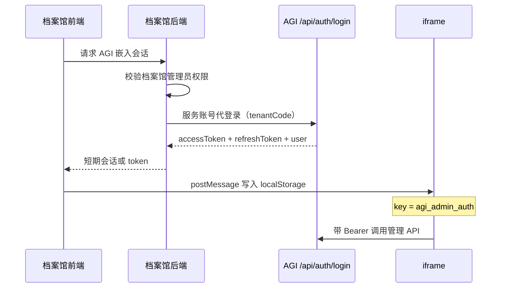

# 数字档案馆 × AI Workflow 集成设计

| 项目 | 说明 |
|------|------|
| 文档版本 | v2.1 |
| 日期 | 2026-06-09 |
| 集成方 | 第三方数字档案馆系统 |
| 集成模式 | 方案一：iframe 页面嵌入（配置） + 开放 API（运行） |

---

## 目录

1. [背景与目标](#1-背景与目标)
2. [部署模式与职责边界](#2-部署模式与职责边界)
3. [权限模型](#3-权限模型)
4. [总体架构](#4-总体架构)
5. [平台侧准备](#5-平台侧准备)
6. [配置集成（iframe）](#6-配置集成iframe)
7. [运行集成（开放 API）](#7-运行集成开放-api)
8. [档案馆侧权限设计](#8-档案馆侧权限设计)
9. [权限生效矩阵](#9-权限生效矩阵)
10. [角色与职责](#10-角色与职责)
11. [部署与网络](#11-部署与网络)
12. [实施步骤](#12-实施步骤)
13. [已知限制与演进](#13-已知限制与演进)
14. [附录](#14-附录)

---

## 1. 背景与目标

数字档案馆需要集成本平台的 **知识库、智能体、工作流、大模型** 能力，要求：

| 目标 | 说明 |
|------|------|
| **配置** | 档案馆管理员在档案馆系统内完成 AI 资产配置，无需单独使用 AGI 全量管理台 |
| **使用** | 终端用户通过档案馆界面进行智能问答、知识检索、工作流调用 |
| **权限** | 组织机构在档案馆维护；**用户能用什么由档案馆控制**，平台只控制 **应用能调什么** |

### 1.1 设计原则

1. **平台是能力层**：提供 AI 资产托管、编排、推理与开放接口。
2. **档案馆是业务层**：拥有组织机构、用户、角色与业务权限。
3. **不在平台重复维护组织树**：档案馆集成场景下，不在 AGI 平台配置单位/部门级资产授权。
4. **配置与运行分离**：iframe 负责配置；开放 API 负责运行；密钥不出档案馆后端。

---

## 2. 部署模式与职责边界

本系统支持两种部署模式，**权限职责不同，不可混用**。

### 2.1 模式 A：AGI 平台独立使用

适用于直接使用 AGI 管理台、组织与用户均在平台内维护的场景。

| 维度 | 负责方 |
|------|--------|
| 租户 | AGI 平台 |
| 组织 / 用户 / 角色 | AGI 平台（系统管理 → 组织用户） |
| 资产使用权限（单位/部门） | AGI 平台（系统管理 → 资产授权） |
| 第三方应用白名单 | 不使用或次要 |

### 2.2 模式 B：数字档案馆集成（本文档重点）

适用于档案馆已有组织体系，平台作为 AI 能力中台嵌入的场景。

| 维度 | 负责方 | 说明 |
|------|--------|------|
| 租户 | AGI 平台 | 档案馆对应一个租户，做数据隔离 |
| 组织 / 用户 / 角色 | **档案馆** | 平台 **不维护** 档案馆组织树 |
| 用户能看/能配/能调哪些资产 | **档案馆** | 档案馆 RBAC + 菜单/按钮/数据范围 |
| 应用能调哪些资产 | **AGI 平台** | 第三方应用 + API Key + 资产白名单 |
| AI 资产配置 UI | AGI iframe 页面 | 嵌入 `/knowledge` `/bots` `/workflows` `/models` |
| AI 资产运行 | AGI 开放 API | 档案馆 BFF 代调 `/api/open/*` |



---

## 3. 权限模型

### 3.1 档案馆集成：两层权限

| 层级 | 名称 | 配置位置 | 控制问题 | 典型配置 |
|------|------|----------|----------|----------|
| L1 | **应用接入权限** | AGI → 第三方应用 → 白名单 | 「档案馆这个应用 **能不能调** 某个智能体/知识库？」 | 按资产勾选，或租户全部 |
| L2 | **用户业务权限** | 档案馆系统 | 「档案馆里 **哪个用户** 能配置/能调用哪个智能体？」 | 档案馆 RBAC、数据权限、菜单 |

**L1 在平台配，L2 在档案馆配，缺一不可，但职责不同。**

### 3.2 平台「资产授权」在集成场景下的定位

| 功能 | 档案馆集成 | AGI 独立使用 |
|------|:----------:|:------------:|
| 系统管理 → 资产授权 | **不使用** | 使用 |
| 系统管理 → 组织用户 | **不使用**（组织在档案馆） | 使用 |

说明：

- 「资产授权」依赖平台组织树（单位/部门），与「组织在档案馆」的架构冲突。
- 档案馆场景 **不应** 要求平台管理员在「资产授权」里选单位/部门。
- 若未来需要平台侧细粒度 USE 校验，应通过 **档案馆组织 ID 与平台 grant 表 API 同步**，而非在平台 UI 手工维护组织。

### 3.3 两种集成通道

| 通道 | 前端/协议 | 认证 | 用途 |
|------|-----------|------|------|
| **管理通道** | iframe + 管理 API `/api/*` | JWT（Bearer） | 配置知识库、智能体、工作流、大模型 |
| **运行通道** | 开放 API `/api/open/*` | API Key + 应用编码 + 用户上下文头 | 对话、检索、工作流运行 |

---

## 4. 总体架构



---

## 5. 平台侧准备

档案馆上线前，AGI 平台管理员仅需完成以下工作（**不含组织维护**）。

### 5.1 创建租户

- 为档案馆分配独立租户（如 `tenant_archive`）。
- 租户用于数据隔离：知识库、智能体、工作流、大模型、第三方应用均在该租户下。

### 5.2 注册第三方应用

路径：**系统管理 → 第三方应用**

| 字段 | 示例 | 说明 |
|------|------|------|
| 应用编码 | `digital-archive` | 档案馆后端固定使用 |
| 应用名称 | 数字档案馆 | 展示用 |
| 应用类型 | `BUSINESS_SYSTEM` | 业务系统 |
| 认证方式 | `API_KEY` | 开放 API 认证 |

操作步骤：

1. 新增应用。
2. 生成 **API Key**（仅展示一次，档案馆后端安全存储）。
3. 配置 **资产白名单**（见 5.3）。

### 5.3 配置资产白名单

路径：**第三方应用 → 配置 → 资产白名单**

| 范围类型 | scopeType | 说明 |
|----------|-----------|------|
| 智能体 | `BOT` | 可多选 |
| 知识库 | `KNOWLEDGE_BASE` | 可多选 |
| 工作流 | `WORKFLOW` | 可多选 |
| 大模型 | `MODEL_PROVIDER` | 可多选 |
| 租户（全部） | `TENANT` | 允许调用租户内全部资产（生产慎用） |

建议：

- 生产环境 **按资产逐项授权**，避免误开「租户全部」。
- 白名单是平台对档案馆的 **能力边界**；档案馆内部再细分给哪些用户用。

### 5.4 平台侧不需要做的事（档案馆集成）

| 不需要 | 原因 |
|--------|------|
| 在「组织用户」维护档案馆组织树 | 组织归属档案馆 |
| 在「资产授权」配置单位/部门 | 同上，用户权限在档案馆 |
| 在 iframe 业务页暴露授权入口 | 已移除，避免第三方页面承载平台级授权 |

### 5.5 平台侧可选：服务账号

iframe 配置页需要 JWT，推荐做法：

- 在 AGI 为档案馆创建 **专用服务账号**（或映射账号），仅用于 iframe 代登录。
- 档案馆后端保管凭证，按档案馆权限决定是否发起代登录。
- 该账号只需具备 **配置类** 操作权限，与终端用户权限分离。

---

## 6. 配置集成（iframe）

### 6.1 可嵌入页面

| 功能 | 路由 | 嵌入 | 说明 |
|------|------|:----:|------|
| 知识库 | `/knowledge` | ✅ | 含文档管理入口 |
| 智能体 | `/bots` | ✅ | 含运行调试 |
| 工作流 | `/workflows` | ✅ | 含设计器 |
| 大模型 | `/models` | ✅ | 模型 Provider 配置 |
| 资产授权 | `/system/asset-grants` | ❌ | 档案馆场景不使用 |
| 第三方应用 | `/system/integration-apps` | ❌ | 仅平台管理员 |
| 组织用户 | `/system/identity` | ❌ | 档案馆场景不使用 |

示例：

```html
<iframe
  id="agi-knowledge"
  src="https://agi.example.com/knowledge"
  style="width:100%;height:calc(100vh - 64px);border:0"
  allow="clipboard-read; clipboard-write"
></iframe>
```

### 6.2 访问控制（档案馆负责）

iframe 打开前，档案馆必须校验：

| 检查项 | 说明 |
|--------|------|
| 用户已登录档案馆 | 档案馆会话有效 |
| 功能权限 | 如 `ai:knowledge:config` |
| 数据范围 | 如仅本馆、本全宗（档案馆自有模型） |

**平台 iframe 页不含档案馆权限逻辑**，档案馆在外层网关/菜单控制。

### 6.3 JWT 注入

管理 API 要求：

```http
Authorization: Bearer <accessToken>
```

推荐流程：



**localStorage 结构**（键名 `agi_admin_auth`）：

```json
{
  "accessToken": "eyJ...",
  "refreshToken": "eyJ...",
  "user": {
    "id": "svc_archive_admin",
    "tenantId": "tenant_archive",
    "displayName": "档案馆配置员",
    "userType": "SERVICE",
    "organizationIds": [],
    "unitIds": [],
    "activeUnitId": null,
    "departmentIds": [],
    "roleIds": ["archive_config"]
  }
}
```

说明：

- 档案馆集成 **不要求** JWT 内携带档案馆 `activeUnitId` / `departmentIds` 来做平台资产授权。
- `tenantId` 必须与档案馆租户一致。
- 若需区分资产归属，可在创建时通过管理 API 传入 `ownerUnitId`（档案馆侧 ID 字符串），供后续扩展；**不作为平台组织树校验依据**。

### 6.4 配置页能力边界

| 能力 | iframe 内 | 平台侧 |
|------|:---------:|:------:|
| 创建/编辑知识库 | ✅ | — |
| 上传文档、切片 | ✅ | — |
| 创建/编辑智能体 | ✅ | — |
| 工作流设计与发布 | ✅ | — |
| 大模型 Provider 配置 | ✅ | — |
| 单位/部门资产授权 | ❌ | 不使用 |
| 第三方应用/API Key | ❌ | 平台管理员 |

---

## 7. 运行集成（开放 API）

### 7.0 微服务接入方式

AGI 平台以 Spring Cloud 微服务形态对外提供服务：

| 项 | 说明 |
|----|------|
| 服务名 | `aiworkflow-server`（Nacos 注册名，与 `spring.application.name` 一致） |
| 开放 API 路径 | `/api/open/*` |
| 注册中心 | Nacos（`spring.profiles.active=nacos` 启用） |
| 档案馆调用方式 | **推荐** 引入 `aiworkflow-open-api-client` Feign Jar |

**两种调用模式：**

| 模式 | 配置 | 适用 |
|------|------|------|
| 直连 | `agi.openapi.base-url=http://agi-api:8080` | 内网固定地址、网关转发 |
| 服务发现 | `agi.openapi.base-url=` 留空 + Nacos + LoadBalancer | 微服务环境 |

### 7.1 Feign Client Jar（档案馆 BFF）

**坐标：**

```xml
<dependency>
  <groupId>com.mw.ai.agi</groupId>
  <artifactId>aiworkflow-open-api-client</artifactId>
  <version>0.1.0-SNAPSHOT</version>
</dependency>
```

**本地安装：**

```bash
mvn -f client/aiworkflow-open-api-client/pom.xml clean install
```

**配置（`application.yml`）：**

```yaml
agi:
  openapi:
    enabled: true
    base-url: http://agi-api.example.com:8080   # 直连模式填 URL；Nacos 模式留空
    service-name: aiworkflow-server
    app-code: digital-archive
    api-key: ${AGI_API_KEY}

spring:
  cloud:
    nacos:
      discovery:
        enabled: true
        server-addr: 127.0.0.1:8848
```

**Feign 接口清单：**

| Client | 能力 |
|--------|------|
| `AgiOpenBotClient` | 智能体列表/详情/运行/对话 |
| `AgiOpenKnowledgeBaseClient` | 知识库列表/详情/检索 |
| `AgiOpenWorkflowClient` | 工作流列表/详情/运行/执行查询 |
| `AgiOpenModelProviderClient` | 大模型列表/详情 |
| `AgiOpenIdentityClient` | 身份解析 |

**用户上下文透传：**

```java
AgiOpenApiRequestContextHolder.runWith(
    AgiOpenApiRequestContext.of(userId, unitId, deptIds, roleIds),
    () -> {
        var bots = AgiOpenApiSupport.requireData(botClient.listBots()).items();
        var reply = AgiOpenApiSupport.requireData(
            botClient.chatBot(botId, new OpenBotChatRequest(null, message, userId, unitId, deptIds, null, Map.of()))
        );
    }
);
```

`app-code` / `api-key` 由配置注入；`user-id` / `unit-id` / `department-ids` / `role-ids` 由 `AgiOpenApiRequestContextHolder` 按请求注入。

### 7.2 调用原则

```
档案馆前端 → 档案馆 BFF → AGI /api/open/*
```

- API Key **仅存档案馆后端**，禁止下发浏览器。
- 档案馆 BFF 在转发前做 **用户业务权限** 校验。
- 请求头携带用户上下文，供审计与后续扩展。

### 7.3 请求头规范

| Header | 必填 | 说明 |
|--------|:----:|------|
| `X-AGI-App-Code` | 是 | 第三方应用编码，如 `digital-archive` |
| `X-AGI-Api-Key` | 是 | 应用密钥 |
| `X-AGI-User-Id` | 推荐 | 档案馆用户 ID，审计 |
| `X-AGI-Unit-Id` | 推荐 | 档案馆单位 ID |
| `X-AGI-Department-Ids` | 否 | 逗号分隔，档案馆部门 ID |
| `X-AGI-Role-Ids` | 否 | 逗号分隔，档案馆角色 ID |

说明：

- 上述 Unit/Department/Role ID 为 **档案馆侧 ID**，平台用于审计与上下文传递，**不要求** 在平台组织表中存在。
- 若白名单非「租户全部」且未配置任何资产 scope，部分认证策略可能要求传入 `X-AGI-Unit-Id`；具体以联调为准。

### 7.4 接口清单

Base URL：`https://agi.example.com`

| 能力 | 方法 | 路径 |
|------|------|------|
| 智能体列表 | GET | `/api/open/bots` |
| 智能体详情 | GET | `/api/open/bots/{id}` |
| 智能体运行 | POST | `/api/open/bots/{id}/run` |
| 智能体对话 | POST | `/api/open/bots/{id}/chat` |
| 知识库列表 | GET | `/api/open/knowledge-bases` |
| 知识库详情 | GET | `/api/open/knowledge-bases/{id}` |
| 知识库检索 | POST | `/api/open/knowledge-bases/{id}/search` |
| 工作流列表 | GET | `/api/open/workflows` |
| 工作流详情 | GET | `/api/open/workflows/{id}` |
| 工作流运行 | POST | `/api/open/workflows/{id}/runs` |
| 工作流执行详情 | GET | `/api/open/workflow-runs/{executionId}` |
| 大模型列表 | GET | `/api/open/model-providers` |
| 大模型详情 | GET | `/api/open/model-providers/{id}` |
| 身份解析 | POST | `/api/open/identity/resolve` |

约束：

- 工作流列表仅返回 **PUBLISHED** 状态。
- 大模型开放视图 **不含** `baseUrl`、`apiKeyRef` 等敏感字段。
- 大模型无独立推理开放接口；推理通过智能体/工作流内部调用。
- 已废弃占位路径 `/openapi/v1/*`，统一使用 `/api/open/*`。

### 7.5 响应与错误

统一信封：

```json
{
  "success": true,
  "data": { },
  "error": null
}
```

常见错误码：

| code | HTTP | 含义 |
|------|------|------|
| `OPEN_API_AUTH_REQUIRED` | 401 | 缺少 App-Code / Api-Key |
| `APP_SECRET_INVALID` | 401 | 密钥错误 |
| `APP_DISABLED` | 403 | 应用已停用 |
| `APP_ASSET_SCOPE_DENIED` | 403 | 不在应用白名单 |
| `IDENTITY_CONTEXT_MISSING` | 400 | 缺少必要上下文 |

### 7.6 调用示例

**列出可调智能体：**

```http
GET /api/open/bots HTTP/1.1
Host: agi.example.com
X-AGI-App-Code: digital-archive
X-AGI-Api-Key: agi_****
X-AGI-User-Id: archive-user-1001
X-AGI-Unit-Id: unit_beijing_archive
X-AGI-Department-Ids: dept_reading_room
```

**智能体对话：**

```http
POST /api/open/bots/bot_xxx/chat HTTP/1.1
Content-Type: application/json
X-AGI-App-Code: digital-archive
X-AGI-Api-Key: agi_****

{
  "sessionId": "sess_optional",
  "message": "这份档案的保管期限是什么？",
  "userId": "archive-user-1001",
  "unitId": "unit_beijing_archive",
  "departmentIds": ["dept_reading_room"],
  "input": {}
}
```

**知识库检索：**

```http
POST /api/open/knowledge-bases/kb_xxx/search HTTP/1.1
Content-Type: application/json
X-AGI-App-Code: digital-archive
X-AGI-Api-Key: agi_****

{
  "query": "保管期限",
  "topK": 5,
  "userId": "archive-user-1001",
  "unitId": "unit_beijing_archive",
  "departmentIds": ["dept_reading_room"]
}
```

**运行工作流：**

```http
POST /api/open/workflows/wf_xxx/runs HTTP/1.1
Content-Type: application/json
X-AGI-App-Code: digital-archive
X-AGI-Api-Key: agi_****

{
  "input": { "question": "请总结该全宗档案" },
  "userId": "archive-user-1001",
  "unitId": "unit_beijing_archive",
  "departmentIds": ["dept_reading_room"]
}
```

**查询工作流执行：**

```http
GET /api/open/workflow-runs/exec_xxx HTTP/1.1
X-AGI-App-Code: digital-archive
X-AGI-Api-Key: agi_****
```

---

## 8. 档案馆侧权限设计

### 8.1 建议权限模型

| 权限点 | 类型 | 说明 |
|--------|------|------|
| `ai:knowledge:config` | 功能 | 可打开知识库 iframe |
| `ai:bot:config` | 功能 | 可打开智能体 iframe |
| `ai:workflow:config` | 功能 | 可打开工作流 iframe |
| `ai:model:config` | 功能 | 可打开大模型 iframe |
| `ai:bot:chat` | 功能 | 可调用智能体对话 |
| `ai:kb:search` | 功能 | 可调用知识库检索 |
| `ai:workflow:run` | 功能 | 可触发工作流 |
| `ai:asset:{type}:{id}` | 数据 | 可选，细粒度到单个资产 |

### 8.2 BFF 转发逻辑（Feign 版）

```java
@Service
@RequiredArgsConstructor
public class ArchiveAgiService {
    private final AgiOpenBotClient botClient;

    public OpenBotChatResponse chat(String botId, String message, ArchiveUser user) {
        assertPermission(user, "ai:bot:chat");
        assertAsset(user, "bot", botId);
        return AgiOpenApiRequestContextHolder.callWith(
            AgiOpenApiRequestContext.of(user.getId(), user.getUnitId(), user.getDeptIds(), user.getRoleIds()),
            () -> AgiOpenApiSupport.requireData(
                botClient.chatBot(botId, new OpenBotChatRequest(null, message, user.getId(), user.getUnitId(), user.getDeptIds(), null, Map.of()))
            )
        );
    }
}
```

### 8.3 BFF 转发逻辑（HTTP 伪代码，备选）

```
function chat(botId, message, archiveUser):
  assert archiveUser.hasPermission("ai:bot:chat")
  assert archiveUser.canUseAsset("bot", botId)   // 档案馆数据权限

  response = POST /api/open/bots/{botId}/chat
    headers:
      X-AGI-App-Code: digital-archive
      X-AGI-Api-Key: ${secret}
      X-AGI-User-Id: archiveUser.id
      X-AGI-Unit-Id: archiveUser.unitId
      X-AGI-Department-Ids: join(archiveUser.deptIds)
    body: { message, userId, unitId, departmentIds, input: {} }

  return response
```

### 8.4 资产可见性双层过滤

终端用户可见资产 = **档案馆权限过滤** ∩ **平台白名单内的资产**

```
档案馆展示列表：
  platformList = GET /api/open/bots        // 已被白名单过滤
  userList     = filter(platformList, archiveUser.canUse)
  return userList
```

---

## 9. 权限生效矩阵

### 9.1 档案馆集成场景

| 操作 | 档案馆权限 | 平台白名单 | 平台资产授权 | 认证 |
|------|:----------:|:----------:|:------------:|------|
| 打开配置 iframe | ✅ | — | — | JWT |
| iframe 内 CRUD 资产 | ✅（外层） | — | — | JWT |
| 开放 API 列资产 | ✅（BFF） | ✅ | — | API Key |
| 开放 API 对话/检索/运行 | ✅（BFF） | ✅ | — | API Key |
| 平台「资产授权」页 | — | — | **不使用** | — |
| 平台「组织用户」页 | — | — | **不使用** | — |

### 9.2 AGI 独立使用场景（对照）

| 操作 | 平台资产授权 | 平台白名单 |
|------|:------------:|:----------:|
| 管理台列表/操作 | ✅ | — |
| 开放 API | 可选 | ✅ |

---

## 10. 角色与职责

| 角色 | 所属 | 职责 |
|------|------|------|
| AGI 平台管理员 | 平台 | 租户、第三方应用、API Key、白名单；**不维护档案馆组织** |
| 档案馆系统管理员 | 档案馆 | 组织机构、用户、角色、档案馆 RBAC |
| 档案馆 AI 配置员 | 档案馆 | 通过 iframe 维护知识库/智能体/工作流/大模型 |
| 档案馆开发 | 档案馆 | iframe 嵌入、JWT 注入、BFF 封装开放 API |
| 档案馆终端用户 | 档案馆 | 问答/检索/办事（无 AGI 感知） |

---

## 11. 部署与网络

| 组件 | 要求 |
|------|------|
| AGI 前端 | HTTPS；`Content-Security-Policy: frame-ancestors` 允许档案馆域名 |
| AGI 后端 | HTTPS；与前端同域或网关统一 |
| 档案馆后端 | 可访问 AGI；API Key 存 KMS/配置中心 |
| 网络 | 推荐档案馆 BFF 与 AGI 内网互通；开放 API 不对公网浏览器暴露 |
| 日志 | 档案馆与 AGI 通过 `X-AGI-User-Id` 关联审计 |

---

## 12. 实施步骤

### 阶段一：平台接入（1–2 天）

- [ ] 创建档案馆租户
- [ ] 注册第三方应用 `digital-archive`
- [ ] 生成并交付 API Key（安全通道）
- [ ] 配置白名单（试点：1 知识库 + 1 智能体 + 1 工作流）
- [ ] 创建 iframe 代登录服务账号

### 阶段二：档案馆配置集成（3–5 天）

- [ ] iframe 嵌入四个配置页
- [ ] 实现 JWT 代登录与 postMessage 注入
- [ ] 档案馆菜单权限：`ai:*:config`
- [ ] 验证配置员可创建知识库、智能体并发布工作流

### 阶段三：档案馆运行集成（3–5 天）

- [ ] BFF 封装 `/api/open/bots`、`/knowledge-bases`、`/workflows`
- [ ] 档案馆 RBAC：`ai:bot:chat`、`ai:kb:search` 等
- [ ] 终端页：先调 BFF 列可用资产，再调对话/检索
- [ ] 联调审计字段（User-Id / Unit-Id）

### 阶段四：试点上线

- [ ] 单馆/单全宗试点
- [ ] 白名单与档案馆权限回归
- [ ] 性能与密钥轮换演练

---

## 13. 已知限制与演进

| 项 | 现状 | 计划 |
|----|------|------|
| iframe Token 注入 | 档案馆自行 postMessage + localStorage | 提供 Embed SDK / SSO |
| 平台资产授权 UI | 仍存在于独立部署模式 | 档案馆租户可隐藏菜单 |
| 大模型开放 API | 仅列表/详情 | 按需增加推理代理 |
| 组织同步 | 平台有 `externalOrgId` 字段，未与档案馆打通 | 可选 API 同步，非集成必需 |
| SSO | 当前代登录为账号密码 | OIDC / 统一身份 |

---

## 14. 附录

### 14.1 AGI 前端路由

| 路由 | 用途 |
|------|------|
| `/knowledge` | 知识库 |
| `/bots` | 智能体 |
| `/workflows` | 工作流 |
| `/models` | 大模型 |
| `/system/integration-apps` | 第三方应用（平台） |
| `/system/asset-grants` | 资产授权（独立模式） |
| `/system/identity` | 组织用户（独立模式） |

### 14.2 后端代码路径

| 模块 | 路径 |
|------|------|
| 开放 API 认证 | `server/.../auth/service/OpenApiAuthFilter.java` |
| 应用白名单 | `server/.../auth/service/IntegrationAppScopeService.java` |
| 开放智能体 | `server/.../bot/api/OpenBotController.java` |
| 开放知识库 | `server/.../knowledge/api/OpenKnowledgeBaseController.java` |
| 开放工作流 | `server/.../workflow/api/OpenWorkflowController.java` |
| 开放大模型 | `server/.../model/api/OpenModelProviderController.java` |
| Feign Client Jar | `client/aiworkflow-open-api-client/` |
| 第三方应用 UI | `web/.../system/IntegrationAppsPage.tsx` |
| 应用配置抽屉 | `web/.../components/IntegrationAppConfigDrawer.tsx` |

### 14.3 数据库

| 迁移 | 说明 |
|------|------|
| V17 | 资产归属与授权表（独立模式） |
| V21–V22 | 集成应用 scope / 资产 ID 长度 |
| V23 | 工作流、大模型 owner_unit_id |

### 14.4 修订记录

| 版本 | 日期 | 说明 |
|------|------|------|
| v2.1 | 2026-06-09 | 补充微服务接入说明与 `aiworkflow-open-api-client` Feign Jar |
| v2.0 | 2026-06-09 | 明确档案馆集成职责边界：组织与用户权限在档案馆，平台仅租户+白名单+开放 API；废弃集成场景下的平台资产授权 |
| v1.1 | 2026-06-09 | 补充工作流、大模型开放 API |
| v1.0 | 2026-06-09 | 初稿 |
